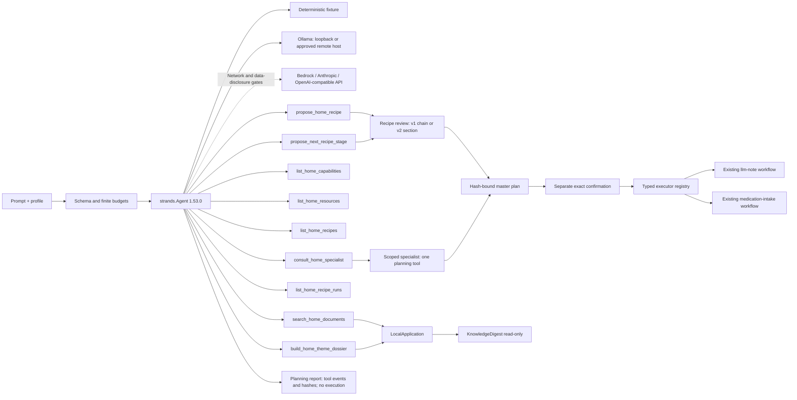
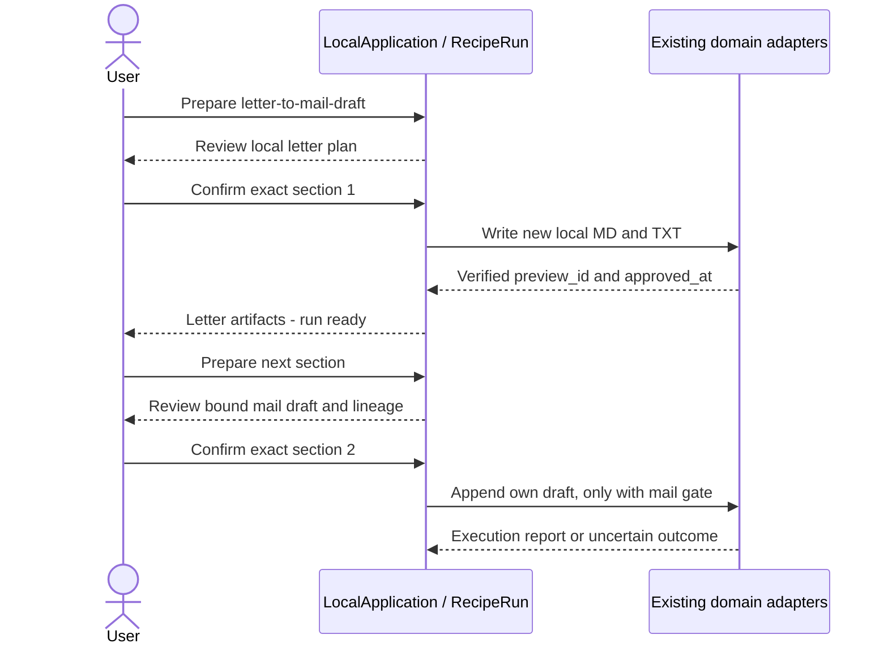

# ARCHITECTURE.md — Architektur und Grenzen

[English](./ARCHITECTURE.md) | **Deutsch**

**Version:** 0.6.1  
**Stand:** 2026-09-14  
**Direkter Vorläufer:**
[`docs/archive/ARCHITECTURE-v0.34.md`](docs/archive/ARCHITECTURE-v0.34.de.md)

> Projektregel: Der ausführliche, phasenweise gewachsene Vorläufer wurde
> unverändert archiviert. Diese Fassung beschreibt den aktuellen Gesamtbau
> und verweist für den Requirement-Nachweis auf den Completion-Audit.

## Systemzweck

FolderHome ist ein lokaler Dokument- und Assistenzservice-Agent. Er verbindet
Dokumentverständnis, reversible Dateiarbeit und gekapselte Haushaltsdomänen,
ohne aus einer Analyse automatisch eine Außenwirkung abzuleiten.

```text
Person / OS account
  ├─ Local GUI / MCP proxy → token-gated HTTP → LocalApplication
  ├─ Interactive agent CLI → LocalApplication
  ├─ Domain CLI → application workflows and explicit approval gates
  └─ Setup GUI → separate token-gated SetupApplication → configuration

LocalApplication → Strands planning / typed workflow execution
Application workflows → contracts / capabilities → pinned provider bridges
Local state → source files (read-only) / SQLite / new output artifacts
```

## Schichten

| Schicht | Ort | Verantwortung |
|---|---|---|
| Bedienung | `cli.py`, `local_server.py`, `web_ui/`, `mcp_server.py`, `demo_site/`, `agentcore_server.py` | Eingaben validieren, schmale Handler, gemeinsame Anwendungsworkflows |
| Einrichtung | `setup_app.py`, `setup_ui/` | Getrennter Loopback-Server; Vorschau, Hash und Bestätigung vor Konfigurationsänderungen |
| Agent | `application/strands_agent.py`, `application/master_agent.py` | Endliche Master-Schleife, semantische Fachwahl, explizite Endpunkte und begrenzte Planungs-Fachagenten |
| Executor-Gateway | `application/workflow_execution.py` | Typisierte einmalige Übergabe eines exakt bestätigten Masterschritts an einen vorhandenen Fach-Executor |
| Anwendung | `application/` | Workflows komponieren, Zustände prüfen, Freigaben erzwingen, Reports erzeugen |
| Verträge | `contracts/` | Unveränderliche, validierende Datenobjekte und Statusbegriffe |
| Fähigkeiten | `capabilities/` | Kleine wiederverwendbare Stores, Transaktionen, Provider-Gateways und Ressourcenbudgets |
| Bridges | `src/folderhome/bridges/`, `bridges/` | Exakte öffentliche API oder dokumentierter read-only Seam zu gepinnten Komponenten |
| Deklaration | `manifests/`, `reused/` | Herkunft, Revision, Capability, Side-Effects und Runtimegrenzen |

Lokale GUI, MCP-Proxy und interaktiver Agent verwenden `LocalApplication`.
Fachliche CLI-Befehle rufen auch gemeinsame Anwendungsworkflows direkt auf;
nicht jeder CLI-Weg führt durch die HTTP-Anwendung. Die Freigaberegeln liegen
in den typisierten Workflows und Provider-Bridges, nicht in Browser-Steuerelementen.

Der **MCP-Proxy besitzt keinen eigenen Dokument- oder Planzustand**. Er leitet
begrenzte Aufrufe an einen vorhandenen App-Prozess auf `127.0.0.1` weiter. Der
**Setup-Server ist getrennt** und kann keine Workflow-Ausführung freigeben.
Er validiert die Konfiguration, bereitet Dateien vor, erhält eigene Ressourcen
und strengere Berechtigungen und stellt nach erkannten Schreibfehlern den
vorherigen Stand wieder her. Sicherungen bleiben verfügbar; Atomarität bei
Stromausfall wird nicht behauptet. Die Provider-Isolierung erläutert
[Provider-Checkouts](./docs/provider-checkouts.de.md).

Die Kalendereinrichtung erreicht die App über `launch.json` (`calendar_config`,
`connector_accounts`). Beim Start werden größenbegrenzte Dateien validiert und
nur fehlende **private, profilgebundene Ressourcen-Defaults im Speicher**
ergänzt. Explizite Registerbindungen und strengere Operationen haben Vorrang;
die App schreibt das Register nicht um. Modellpresets dürfen diese Pfade weder
liefern noch Wirkungen freigeben. Das Setup lädt die aktiven Pfade und schreibt
nur ausdrücklich geänderte Kalenderfelder. Profilkaskaden dürfen eine
Setup-eigene Kontodatei ableiten; benutzerdefinierte Quelldateien bleiben
unverändert. Das Laden von Konten verbindet **kein externes Kalender-Gateway**.
Der lokale Kalender und der optionale ICS-Export benötigen weiterhin die
bestehende exakte Workflow-Bestätigung.

Die interaktive `agent session` ruft denselben Dienst
`LocalApplication.run_agent_chat` wie die GUI auf und bewahrt vorgeschlagene
Pläne nur im aktuellen Prozess. Das Gespräch kann nichts freigeben;
`/confirm <plan_id>` verwendet denselben exakten, hashgebundenen
Bestätigungsdienst wie der HTTP-Endpunkt.

`LocalApplication` bewahrt die SDK-Nachrichtenliste je organisatorischem Profil
ausschließlich im aktuellen Prozess. Ein endliches Sliding Window erhält gültige
Tool-use-Paare und ist standardmäßig auf 24 Nachrichten begrenzt.
`/api/v1/agent/conversation/reset` löscht den Verlauf und die unbestätigten Pläne
eines Profils. Diese Trennung organisiert Kontext; sie ist keine zweite
Autorisierungsgrenze.

## Wettbewerbs-Demooberflächen

`demo accident-serve` erzeugt einen begrenzten synthetischen Arbeitsbereich und
stellt die echte lokale Strands-Geschichte auf Loopback hinter einem zufälligen
Sitzungstoken bereit. Der Browser bereitet einen pfadfreien Plan vor und
verlangt die exakte Plan-ID, bevor vier vorhandene Adapter das synthetische
Kontaktregister, den lokalen Kalender, das Vertragscockpit und die
Korrespondenzausgabe aktualisieren. Der Reset löscht ausschließlich
demoeigene Fixture-Ausgaben.

`site/` bietet einen statischen zweisprachigen Rundgang und eine getrennt
konfigurierte Cloud-Demo über den begrenzten API-Gateway-Proxy. Die Verfügbarkeit
hängt von der veröffentlichten Seitenkonfiguration und der geprüften Runtime ab.

`application/agentcore_runtime.py` verbindet `/ping` und `/invocations` mit
synthetischen Haushaltssitzungen. Jede Sitzung kopiert alle 104 Dateien aus
`examples/`, ergänzt die Unfall-Fixtures und behält eine `LocalApplication`
für echte Master-Agent-Züge samt begrenzten `prior_messages`. Die Suche erfasst
den kopierten Haushalt; für bestätigte Wirkungen sind ausschließlich die vier
bisherigen Adapter für Kontakte, lokalen Kalender, Vertragscockpit und
Korrespondenz verbunden. Der erste vorgeschlagene Plan wird mit
`/confirm <plan_id>` angeboten. Der veröffentlichte Default-Unfall-Prompt behält
seinen als `deterministic_fallback` gekennzeichneten Vier-Schritt-Plan und vier
Ergebnisdateien.

Der additive Vertrag `folderhome.agentcore-response.v1` liefert den Modelltext
`response_text` als `response`, bereinigte Werkzeugnamen und Statuswerte,
`model_turns`, `plan`, `result` sowie `session_state`. Geänderte Dateien in
registrierten Ausgabeordnern erscheinen in `result.generated_results`:
höchstens 12 je Antwort, 262144 Byte Inline-Inhalt je Datei und eine serialisierte
Gesamtantwort strikt unter 1,5 MiB. Größere Inhalte werden zu Metadaten mit
Begründung. Zustandsdatenbanken werden nicht als Downloads ausgegeben.
Sitzungsordner verwenden SHA-256-Fingerabdrücke des Sitzungsheaders. `/reset`
löscht die eigene Cloud-Sitzung; LRU-Verdrängung entfernt die am längsten nicht
verwendete freie Sitzung. Beschäftigte Sitzungen werden nie verdrängt. Links
werden vor Kopieren, Ausgabelesen und Reset abgewiesen. Die lokale Unfall-Demo
auf Loopback behält ihr bisheriges engeres Reset-Verhalten.

Paketierte Runtimes benötigen den vollständigen `examples/`-Baum unter
`folderhome/demo_data/household/`. Quellcode-Läufe können `examples/` im Repo
verwenden; fehlende Fixtures blockieren. Direct-Code-ZIP und Docker-Build
benötigen diese Paketierungsergänzung vor dem Deployment der Änderung noch.
Kostenprofilwerte werden hier nicht verändert. `specialist_model_provider`
bezeichnet die Spezialisten der Unfallbestätigung; planende Fachagenten im
freien Chat erben den Master-Provider, getrennt ausgewiesen als
`planning_specialist_model_provider`. Ihre Aufrufe und der gespeicherte Kontext
müssen vor einer Erhöhung der Turnzahl in einen neuen Kostenreview eingehen.
Ein lokaler Fixture-Test oder ein konfigurierter Provider belegt keine Live-Abnahme.

## Strands-Agent

Der [Diagrammleitfaden](./docs/submission/ARCHITECTURE_DIAGRAM.md) trennt die
synthetische Unfall-Demo mit vier Adaptern von der
[Produktarchitektur](./docs/submission/PRODUCT_ARCHITECTURE.svg).
Beide besitzen editierbare SVG-Quellen, PNG-Exporte und einen versionierten
Renderer mit schreibfreier Driftprüfung. Keine Sicht belegt eine Live-Abnahme.



Der Master-Agent besitzt **neun begrenzte Werkzeuge**: Dokumentensuche,
Themendossiers, Fähigkeits- und Ressourcenkatalog, Fachagenten-Konsultation,
Rezeptliste und Rezeptvorbereitung sowie die beiden v2-Werkzeuge
`list_home_recipe_runs` und `propose_next_recipe_stage`. Keines kann fachliche
Wirkungen freigeben oder ausführen. Die Rezeptvorbereitung erhält die geprüfte
v1-Kette oder den konkreten v2-Abschnitt. Die Konsultation erzeugt einen kurzlebigen Fachagenten mit genau
einem Planungswerkzeug. Der Fachagent kann weder freigeben noch ausführen. Nach
einer getrennten exakten Bestätigung darf der typisierte Executor-Katalog nur
eine vorbereitete Ausführungshülle aufrufen und liefert den vorhandenen
Fachbericht zurück. **Die Verbindung hängt von der Konfiguration ab**: Der
Executor-Katalog meldet die für diese App verfügbaren Adapter, keine feste
Deployment-Anzahl. Verbundene Fachagenten erhalten das
exakte geschlossene JSON-Anfrageschema ihres einzelnen Endpunkts; unbekannte
Felder und beliebige Pfade werden blockiert. Alle 22 ressourcenabhängigen
Endpunkte, die lokale Kalenderalternative und der reine Entwurfsendpunkt für
Mail sind umgesetzt. Der Mailendpunkt verbindet sich nur, wenn das Register ein
Entwurfspostfach deklariert; sonst bleibt er ehrlich unverbunden. Die normale
Factory verbindet auch Google-Kalenderausführung und Scheduler-Registrierung,
wenn deren private Ressourcen konfiguriert sind. Getrennte Start- und
Bestätigungsgates bleiben Pflicht; vorhandener Code belegt weder einen echten
Kalenderschreibvorgang noch einen laufenden Consumer.

Der Mailendpunkt besitzt keinen Versandweg. Er legt ein vorbereitetes Schreiben
im Entwurfsordner des eigenen IMAP-Postfachs des Nutzers ab, hinter der
getrennten Live-Effekt-Freigabe `--approve-mail-draft`. Kein Empfänger wird
kontaktiert, das Postfachpasswort wird erst zur Ausführung aus seinem
konfigurierten lokalen Fundort gelesen, und ein lokales Ledger hält die Ablage
höchstens einmal.

Ein Fähigkeitsrezept macht aus einer echten Geschichte eine geprüfte Ausführung. Es ist
deklarativ (`folderhome/recipes/*.json`, im Paket ausgeliefert), verleiht keine
neue Fähigkeit, und jeder Schritt bleibt ein vorhandener typisierter Endpunkt mit
eigenem Adapter und eigenen Gates. Bei **v1** löst der Master die ganze Kette in einen
hashgebundenen `MasterAgentPlan` auf, dessen Schritte jeweils die Fachrolle
tragen, der der Endpunkt wirklich gehört; ein Rezept darf deshalb mehrere
Domänen umspannen, ohne die Eigentumsregel aufzuweichen — sie wird pro Schritt
geprüft statt einmal pro Plan. Daten fließen nur als logische Ressourcen-IDs;
kein Wert aus einem Schrittbericht wird in eine spätere Anfrage eingesetzt,
wodurch jede Anfrage vollständig und hashbar bleibt, bevor irgendetwas läuft.
Zuerst läuft eine deterministische Abnahme, die jede beteiligte Fachrolle
zeichnet und die Teil des Planhashes wird. Die Ausführung geht die Schritte der
Reihe nach durch und hält beim ersten Fehler an; der Bericht nennt, was lief, was
brach und was nie versucht wurde.

Bei **v2** bereitet `RecipeRun` nur einen konkreten Abschnitt mit verfügbaren
Eingaben vor. Typisierte Werte dürfen aus verifizierten Ausführungsberichten
zuvor bestätigter Abschnitte desselben Laufs stammen. Sie dürfen keine
Ressourcen-IDs, Zugangsdaten, Pfade oder Berechtigungen wählen. Der neue Plan
bindet aufgelöste Werte und deren Herkunft; **jeder Abschnitt braucht eine neue
exakte Bestätigung**. Weder der nächste Abschnitt noch eine Wiederholung nach
unklarer Wirkung startet automatisch.



Das mitgelieferte Rezept `letter-to-mail-draft` weist veränderte Briefeingaben
zwischen Abschnitten über `expected_preview_id` ab; der erste Freigabezeitpunkt
liefert das Entwurfsdatum. Es versendet keine Mail. GUI, direkte Sitzungsbefehle
und Modellwerkzeuge verwenden denselben Laufdienst. Läufe bleiben **prozesslokal**,
begrenzt und profilgebunden; Reset/Schließen verwirft offene Arbeit, ohne
bestätigte Wirkungen zurückzunehmen. Es gibt weder JSON-Berichtimport noch
Wiederaufnahme nach einem Neustart. Details:
[`docs/capability-recipes.md`](./docs/capability-recipes.de.md).

### Scheduler und externe Kalendergrenzen

**Registrierung ist kein Consumer-Start.** `scheduler-handoff` registriert einen
gebundenen Job über den gepinnten Provider `ellmos-scheduler` nur mit
`--approve-scheduler-write` und exakter Workflow-Bestätigung. Der App-eigene
Consumer braucht `--approve-scheduler-consumer`, eine getrennt bestätigte aktuelle
Vorschau und einen vorhandenen passenden Job. Der Status beobachtet nur diese
App-Instanz. Stop/Schließen signalisiert eigenen Workern; eine laufende begrenzte
Prüfung kann die kurze Wartezeit beim Schließen überdauern. Der Consumer erzeugt
nur lesende Dokumentqueues und Betriebsbelege, keine automatischen
Dokumentänderungen und keinen installierten Betriebssystemdienst.
Siehe [Scheduler-Steuerung](./docs/phase15-scheduler-handoff-plan.de.md).

**Google-Wirkungen brauchen eigene Berechtigungen.** Konfigurierte
`calendar-connectors` unterstützen Neuanlage und bedingtes Ändern/Löschen zuvor
bestätigter eigener Termine. Private OAuth-Auflösung erfolgt erst nach dem
getrennten Schreibgate und exakter Bestätigung. Dauerhaftes Ledger, starke ETags
und Provider-Readback verhindern blindes Wiederholen; Ungewissheit ist kein
Rollback. Der GUI-Editor bereitet Änderungen aus gespeicherten Sitzungsbelegen
vor, nicht aus einem uneingeschränkten Live-Terminkatalog. Erster OAuth-Login,
Live-Konto- und echte Browserabnahme bleiben getrennt.
Siehe [Kalenderausführung](./docs/phase27-calendar-connector-plan.de.md).

Ein Fähigkeitsindex beschreibt jeden Endpunkt genau einmal. Er führt den
Master-Fähigkeitskatalog (Fachrolle, Ausführungsmodus, Gates), die
Adapter-Anfrageschemata (Pflicht- und optionale Eingaben, statisch aus den
Adapterklassen gelesen) und einen kurzen zweisprachigen Zweck zusammen. Derselbe
Index erzeugt die kompakte Endpunktübersicht im Systemprompt des Master-Agenten
und das generierte [`CAPABILITY-INDEX.md`](./CAPABILITY-INDEX.md);
`_tools/capability-index --check` verhindert ein Auseinanderlaufen. Der Index
sagt, was im Code existiert, nie was eine konkrete Installation konfiguriert hat
— die Laufzeitverbindung bleibt die Antwort des Executor-Katalogs.

Der lokale Kalenderendpunkt kann die festgehaltenen Termine auf Wunsch als eine
private RFC-5545-Datei in ein registergebundenes Ausgabeverzeichnis exportieren.
Der Dateiinhalt ist durch dieselbe Bestätigung hashgebunden wie der
Statusschreibvorgang, eine vorhandene Zieldatei bricht den Lauf ab, und ein
fehlgeschlagener Statusschreibvorgang nimmt die publizierte Datei zurück;
Status und Datei entstehen gemeinsam oder gar nicht. FolderHome schreibt eine
lokale Datei; der Nutzer importiert sie von Hand in sein Kalenderprogramm, ein
Kalender-Connector ist also nicht beteiligt. Turnzahl,
Toolaufrufe, Prompt, Antwort, Toolresultat und
Ausgabetokens sind endlich begrenzt. Der deterministische Fixture-Adapter
durchläuft den echten Strands-Agenten und den echten Tool-Executor ohne
Zugangsdaten oder Netzwerk. Bedrock verlangt Modell-ID, AWS-Region, ein
ausdrückliches Netzwerkgate und eine davon getrennte Freigabe für die
Weitergabe lokaler Suchergebnisse; ein Live-Lauf ist nicht Teil der lokalen
Abnahme.
Status-API und GUI unterscheiden die Modellzustände `fixture_only`,
`configured_not_verified` und `verified_in_process`. Erst ein erfolgreicher
Turn mit dem konfigurierten echten Modell setzt den Zustand auf verifiziert.
Der Fixture-Modus bleibt `local_only_fixture`; Loopback-Ollama meldet
`local_model` / `local_only_model`. Entferntes Ollama und fremdgehostete Provider
melden `network_model` / `local_first_hybrid`, ergänzt um unterscheidbare
Provider- und Inferenzort-Felder. FolderHome, Dokumentzustand, Freigaben und
Workflow-Ausführung bleiben lokal. Eine konfigurierte Adresse belegt noch
keinen erfolgreichen Modellaufruf.

## Dokumentenfluss

```text
bereitgestellter Ordner
  → Sensitivitäts- und Schreibgate
  → doc-services Extraktion
  → FolderHome-Dokumentverträge
  → KnowledgeDigest-Index im angegebenen State-Ordner
  → read-only Suche / Themendossier / Ordnerbericht / Versionen
```

Quelldokumente werden beim Ingest nicht verändert. Suche öffnet den Index
read-only. Berichte geben Fundstellen, Quellstatus und Abdeckungsgrenzen aus.
„Neueste Fassung“ ist eine erklärte Heuristik: explizite Vertragsdaten haben
Vorrang, danach folgen schwächere Metadaten. Ältere Fassungen werden nur über
einen getrennten, freigabepflichtigen FCSA-Plan archiviert.

## Dateiaktionsfluss

```text
Profil + Bereich + Quelldatei
  → feste Regelvererbung
  → read-only Plan
  → Provider-/Konfliktprüfung
  → exakte Approval-ID + erwarteter SHA-256
  → frische Gesamtprüfung
  → neue Ausgabe oder reversible Aktion
  → Ablagebeleg + Audit + optionales Undo
```

Die Vererbung lautet global → Bereich → Profil → Profilbereich. Gleichrangige
Widersprüche blockieren. Hard-Delete ist keine zulässige Regel. Batch- und
Routinenläufe prüfen gemeinsame Ziele ordner- beziehungsweise watchübergreifend
und rollen nur eigene, nachweislich erzeugte Änderungen zurück.

## Dokumenttransformation

Der neue Kern unter `capabilities/document_transform/` erzeugt TXT- und
PDF-Bündel sowie ein Dokument pro Dateityp in einem deterministischen ZIP.
PDF-Seiten bleiben erhalten; Bilder werden gerastert; Textquellen werden neu
gesetzt und mit einem sichtbaren Verlusthinweis versehen. Videos werden nicht
in PDF-Inhalt umgedeutet. Jede Ausgabe ist neu, hashgebunden und
Never-overwrite. Andere Zielformate bleiben ohne geprüften Renderer blockiert.

## Domänenpakete

| Paket | Lokaler Kern | Harte Grenze |
|---|---|---|
| Kontakte | Evidenzkandidaten, Register, Objektbezug, Wechsel | keine automatische Löschung oder Kontaktaufnahme |
| Kalender | Kandidaten, lokaler Store, ICS, Connectorplan | kein stiller Live-Sync; UpToday/Routinika/Google getrennt |
| FindCall | Zeit-/Preisgrenzen, serielle Fixtures, früher Stopp | keine Telefonie, keine Buchung |
| Finanzen | Auszüge, virtuelle Konten, Lücken, wiederkehrende Kosten | kein Banking, keine Zahlungsbehauptung |
| Haushalt | append-only Bestand, Mindeststand, Ablaufkandidaten | keine Bestellung, keine Vollständigkeitsgarantie |
| Medikation | dokumentierter Plan, bestätigte Einnahme | keine Dosisentscheidung oder Einnahmebehauptung ohne Bestätigung |
| Gesundheit | extraktive Zeitlinie, Konflikte, Fragen, Handoff | keine Diagnose, Therapie oder Vollständigkeitsgarantie |
| Verträge | objektgebundene Versionen, Kontakte, Kosten, Termine | keine Deckungs- oder Rechtswirkungsaussage |
| Korrespondenz | Vorlagen, Designs, Vorschau, neue Ausgabe | kein Versand ohne getrennten Mailworkflow |
| Office/Medien | Artefaktplan, Designset, SVG-Visitenkarte | Spezialrenderer bleiben eigene Provider |
| Mail | Ingestplan, Entwurf, Approval, Idempotenz | Live-Postfach bleibt ein eigenes Gate |
| Notizen | geführte Anfrage, Freigabe, Versionen | nur profilspezifischer Providerstore |
| Steuern | Belegstore, private ZIP-Arbeitsunterlage | keine Beratung oder Portalübermittlung |
| Daily Brief | lokale Snapshots, Frische, Render, Desktopkopie | keine Live-Feeds oder Schedulerregistrierung |
| Bescheide | Typen, beschriftete Fakten, Konflikte | keine Rechtsprüfung oder erfundene Fristberechnung |
| Entwürfe | Antwort-, Widerspruchs-, Antragsvorlagen | kein Rechtsurteil oder Versand |
| Leistungen | datierter Katalog, amtliche Prüfschritte | kein Anspruch, keine Höhe, kein automatischer Webaufruf |
| Rechtsänderung | lokale Snapshot-Diffs, Review-Kandidaten | keine Betroffenheitsfeststellung oder Benachrichtigung |

## Daten- und Identitätsmodell

- Das Betriebssystemkonto und seine Dateirechte bilden die Sicherheitsgrenze.
- Profile wie Lukas, Hanna und Simon sind Organisations- und
  Präferenzobjekte innerhalb eines Kontos, keine Zugriffskontrollen.
- Reale personenbezogene Daten gehören nicht in Repository, Demo oder
  öffentliche Evidenz.
- Finanz-, Gesundheits-, Medikations-, Kontakt- und Bescheiddaten erfordern
  ein ausdrückliches lokales Lesegate.
- Schreibende Stores verwenden append-only Ereignisse oder neue Dateien;
  vorhandene Ausgaben werden nicht überschrieben.

## Persistenz

| Zustand | Technik | Eigenschaft |
|---|---|---|
| Dokumentindex | KnowledgeDigest/SQLite | Suche ausschließlich read-only |
| Snapshots/Checkpoints | JSON | unveränderlich, inhaltsarm, hashgebunden |
| Kontakte/Kalender/Finanzen/Bestand/Medikation | lokale SQLite-Stores | profilspezifisch, validiert, überwiegend append-only |
| Audit/Reports | JSON/Markdown | atomar erzeugt, Provenienz und Status sichtbar |
| Ausgaben | TXT/PDF/ZIP/SVG/HTML/ICS | neue Pfade, Never-overwrite, Hashnachweis |

## Sicherheitsmodell

Die ausführliche Richtlinie steht in [`SECURITY.md`](SECURITY.de.md).

- Default deny für Datei-, Netzwerk-, Mail-, Kalender-, Telefon- und
  Veröffentlichungswirkungen.
- Exakte Schemas, kanonische Pfade, Allowlisten und Quellhashes.
- Ressourcenbudgets für Dateizahl, Bytes, Laufzeit, Agententurns,
  Toolaufrufe, HTTP-Verbindungen und Ausgabegröße.
- Loopback bindet ausschließlich `127.0.0.1`, verwendet ein kurzlebiges Token
  sowie exakte Host- und Origin-Prüfung und begrenzt parallele Verbindungen.
- Amtliche Leistungslinks verwenden HTTPS und eine publishergebundene
  Host-Whitelist; Umleitungen oder ähnlich aussehende Hosts werden abgewiesen.
- Approval ist eng, zeitlich und inhaltlich gebunden; vor der Ausführung wird
  der Zustand erneut geprüft.

Master- und Kalenderconnector-Ausführung berechnen den vollständigen Planinhalt
neu, statt gespeicherten Hashstrings zu vertrauen. Kalender-Eingabesnapshots und
Gateway-Effekte sind ebenfalls gebunden. Ein Fehler nach einem Wirkungsversuch
belegt weder eine Rücknahme noch die Erlaubnis zur Wiederholung. Der Google-v3-
Gateway bietet jetzt dauerhafte Idempotenz, feldweises Rücklesen und typisierte
unklare/teilweise Ergebnisse über den Kalenderplan-Executor. Ein ressourcengebundener
App-/CLI-Adapter lädt eine bestehende private OAuth-Zustimmung erst nach
`--approve-calendar-write` und exakter Bestätigung. Er prüft Quellen und
Ressourcenrechte vor/nach Provideraufrufen erneut. Das Setup kann vorhandene
private Zugangsdaten binden; erstmalige Anmeldung und Live-Abnahme bleiben offen; siehe
[Kalendergrenzen](./docs/phase27-calendar-connector-plan.de.md).

Der optionale AWS-Demo-Proxy besitzt jetzt einen lokalen Vertrag zur geprüften
Mikro-USD-Reservierung: kumulierende UTC-Tagesmittel, atomare Geld-/Tageszähl-
Zulassung, dauerhaftes Ledger sowie gebundene Runtime-Version und Kostenprofil.
Dies steuert zugelassene Forwards, nicht die gesamte AWS-Rechnung. Die bestehende
Demo wurde am 14.09.2026 als Runtime 26 migriert und verifiziert; die menschliche
Browserabnahme bleibt getrennt. Siehe
[AWS-Deploymentgrenzen](./deploy/aws_demo/README.de.md).

## Provider- und Wiederverwendungsgrenze

Bestandsmodule bleiben in ihren eigenen Repositories. FolderHome kopiert
keinen Providerquellcode. Ein Bridge-Lauf verlangt die deklarierte Revision,
einen sauberen Checkout, kompatible Runtime und eine erlaubte Capability.
Fremde Änderungen, fehlende Lizenzen oder Versionsdrift blockieren. Die
vollständige Zuordnung steht in
[`COMPETITION_CODE_MAP.md`](COMPETITION_CODE_MAP.de.md) und
[`THIRD_PARTY_LICENSES.md`](THIRD_PARTY_LICENSES.de.md).

## Phasen- und Abnahmenachweis

Die historischen Einzelflüsse der Phasen 1–34 bleiben im archivierten
Vorläufer erhalten. Die kanonische 36-Zeilen-Matrix, Codeevidenz, Testergebnis,
Demo-Hashes und verbleibenden Außenwirkungsgates stehen in
[`docs/phase36-completion-audit.md`](docs/phase36-completion-audit.de.md).

Die öffentliche Repositoryanlage, Videoveröffentlichung, AWS-Registrierung
und Devpost-Einreichung sind keine Architekturautomatik und benötigen jeweils
eine ausdrückliche menschliche Freigabe.

---
<!-- REMEMBER: ENDUSERTEXTE BEKOMMEN ECHTE UMLAUTE Ü Ö Ä -->
