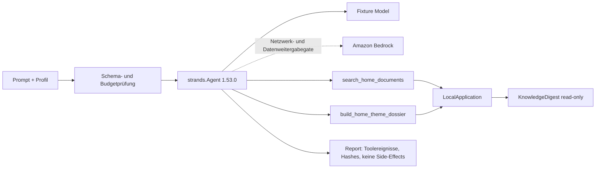

# ARCHITECTURE.md — Architektur und Grenzen

[English](./ARCHITECTURE.md) | **Deutsch**

**Version:** 0.36  
**Stand:** 2026-08-22  
**Direkter Vorläufer:**
[`docs/archive/ARCHITECTURE-v0.34.md`](docs/archive/ARCHITECTURE-v0.34.de.md)

> Projektregel: Der ausführliche, phasenweise gewachsene Vorläufer wurde
> unverändert archiviert. Diese Fassung beschreibt den aktuellen Gesamtbau
> und verweist für den Requirement-Nachweis auf den Completion-Audit.

## Systemzweck

FolderHome ist ein lokaler Dokument- und Assistenzservice-Agent. Er verbindet
Dokumentverständnis, reversible Dateiarbeit und gekapselte Haushaltsdomänen,
ohne aus einer Analyse automatisch eine Außenwirkung abzuleiten.

```text
Mensch / OS-Konto
  ├─ CLI
  ├─ responsive lokale GUI
  └─ Strands-Agent
       ↓
LocalApplication — einzige gemeinsame Anwendungsgrenze
       ↓
Application Workflows — Orchestrierung, Gates, Evidence, Reports
       ↓
Contracts + Capabilities — stabile Datenmodelle und kleine lokale Stores
       ↓
Bridges / Provider — revisionsgebunden, kleinste nötige Berechtigung
       ↓
lokale Dateien / SQLite / neue Ausgabeartefakte
```

## Schichten

| Schicht | Ort | Verantwortung |
|---|---|---|
| Bedienung | `cli.py`, `local_server.py`, `web_ui/` | Eingabe validieren, schmale Handler anbieten, keine zweite Fachlogik |
| Agent | `application/strands_agent.py` | Endliche Strands-Schleife und Auswahl profilspezifischer read-only Tools |
| Anwendung | `application/` | Workflows komponieren, Zustände prüfen, Freigaben erzwingen, Reports erzeugen |
| Verträge | `contracts/` | Unveränderliche, validierende Datenobjekte und Statusbegriffe |
| Fähigkeiten | `capabilities/` | Kleine wiederverwendbare Stores, Transaktionen, Provider-Gateways und Ressourcenbudgets |
| Bridges | `src/folderhome/bridges/`, `bridges/` | Exakte öffentliche API oder dokumentierter read-only Seam zu gepinnten Komponenten |
| Deklaration | `manifests/`, `reused/` | Herkunft, Revision, Capability, Side-Effects und Runtimegrenzen |

Direkte Zugriffe von UI oder Agent auf Provider sind unzulässig. Beide gehen
durch `LocalApplication`, damit CLI, API, GUI und Agent dieselben Regeln
verwenden.

## Strands-Agent



Der Wettbewerbsagent besitzt absichtlich nur zwei Tools. Beide sind
profilspezifisch, read-only und verwenden die vorhandene lokale
Anwendungsgrenze. Turnzahl, Toolaufrufe, Prompt, Antwort, Toolresultat und
Ausgabetokens sind endlich begrenzt. Der deterministische Fixture-Adapter
durchläuft den echten Strands-Agenten und den echten Tool-Executor ohne
Zugangsdaten oder Netzwerk. Bedrock verlangt Modell-ID, AWS-Region, ein
ausdrückliches Netzwerkgate und eine davon getrennte Freigabe für die
Weitergabe lokaler Suchergebnisse; ein Live-Lauf ist nicht Teil der lokalen
Abnahme.

## Dokumentenfluss

```text
bereitgestellter Ordner
  → Sensitivitäts- und Schreibgate
  → doc-services Extraktion
  → FolderHome-Dokumentverträge
  → KnowledgeDigest-Index im angegebenen State-Ordner
  → read-only Suche / Themendossier / Ordnerbericht / Versionen
```

Quelldokumente werden beim Ingest nicht verändert. Suche öffnet den Index
read-only. Berichte geben Fundstellen, Quellstatus und Abdeckungsgrenzen aus.
„Neueste Fassung“ ist eine erklärte Heuristik: explizite Vertragsdaten haben
Vorrang, danach folgen schwächere Metadaten. Ältere Fassungen werden nur über
einen getrennten, freigabepflichtigen FCSA-Plan archiviert.

## Dateiaktionsfluss

```text
Profil + Bereich + Quelldatei
  → feste Regelvererbung
  → read-only Plan
  → Provider-/Konfliktprüfung
  → exakte Approval-ID + erwarteter SHA-256
  → frische Gesamtprüfung
  → neue Ausgabe oder reversible Aktion
  → Ablagebeleg + Audit + optionales Undo
```

Die Vererbung lautet global → Bereich → Profil → Profilbereich. Gleichrangige
Widersprüche blockieren. Hard-Delete ist keine zulässige Regel. Batch- und
Routinenläufe prüfen gemeinsame Ziele ordner- beziehungsweise watchübergreifend
und rollen nur eigene, nachweislich erzeugte Änderungen zurück.

## Dokumenttransformation

Der neue Kern unter `capabilities/document_transform/` erzeugt TXT- und
PDF-Bündel sowie ein Dokument pro Dateityp in einem deterministischen ZIP.
PDF-Seiten bleiben erhalten; Bilder werden gerastert; Textquellen werden neu
gesetzt und mit einem sichtbaren Verlusthinweis versehen. Videos werden nicht
in PDF-Inhalt umgedeutet. Jede Ausgabe ist neu, hashgebunden und
Never-overwrite. Andere Zielformate bleiben ohne geprüften Renderer blockiert.

## Domänenpakete

| Paket | Lokaler Kern | Harte Grenze |
|---|---|---|
| Kontakte | Evidenzkandidaten, Register, Objektbezug, Wechsel | keine automatische Löschung oder Kontaktaufnahme |
| Kalender | Kandidaten, lokaler Store, ICS, Connectorplan | kein stiller Live-Sync; UpToday/Routinika/Google getrennt |
| FindCall | Zeit-/Preisgrenzen, serielle Fixtures, früher Stopp | keine Telefonie, keine Buchung |
| Finanzen | Auszüge, virtuelle Konten, Lücken, wiederkehrende Kosten | kein Banking, keine Zahlungsbehauptung |
| Haushalt | append-only Bestand, Mindeststand, Ablaufkandidaten | keine Bestellung, keine Vollständigkeitsgarantie |
| Medikation | dokumentierter Plan, bestätigte Einnahme | keine Dosisentscheidung oder Einnahmebehauptung ohne Bestätigung |
| Gesundheit | extraktive Zeitlinie, Konflikte, Fragen, Handoff | keine Diagnose, Therapie oder Vollständigkeitsgarantie |
| Verträge | objektgebundene Versionen, Kontakte, Kosten, Termine | keine Deckungs- oder Rechtswirkungsaussage |
| Korrespondenz | Vorlagen, Designs, Vorschau, neue Ausgabe | kein Versand ohne getrennten Mailworkflow |
| Office/Medien | Artefaktplan, Designset, SVG-Visitenkarte | Spezialrenderer bleiben eigene Provider |
| Mail | Ingestplan, Entwurf, Approval, Idempotenz | Live-Postfach bleibt ein eigenes Gate |
| Notizen | geführte Anfrage, Freigabe, Versionen | nur profilspezifischer Providerstore |
| Steuern | Belegstore, private ZIP-Arbeitsunterlage | keine Beratung oder Portalübermittlung |
| Daily Brief | lokale Snapshots, Frische, Render, Desktopkopie | keine Live-Feeds oder Schedulerregistrierung |
| Bescheide | Typen, beschriftete Fakten, Konflikte | keine Rechtsprüfung oder erfundene Fristberechnung |
| Entwürfe | Antwort-, Widerspruchs-, Antragsvorlagen | kein Rechtsurteil oder Versand |
| Leistungen | datierter Katalog, amtliche Prüfschritte | kein Anspruch, keine Höhe, kein automatischer Webaufruf |
| Rechtsänderung | lokale Snapshot-Diffs, Review-Kandidaten | keine Betroffenheitsfeststellung oder Benachrichtigung |

## Daten- und Identitätsmodell

- Das Betriebssystemkonto und seine Dateirechte bilden die Sicherheitsgrenze.
- Profile wie Lukas, Hanna und Simon sind Organisations- und
  Präferenzobjekte innerhalb eines Kontos, keine Zugriffskontrollen.
- Reale personenbezogene Daten gehören nicht in Repository, Demo oder
  öffentliche Evidenz.
- Finanz-, Gesundheits-, Medikations-, Kontakt- und Bescheiddaten erfordern
  ein ausdrückliches lokales Lesegate.
- Schreibende Stores verwenden append-only Ereignisse oder neue Dateien;
  vorhandene Ausgaben werden nicht überschrieben.

## Persistenz

| Zustand | Technik | Eigenschaft |
|---|---|---|
| Dokumentindex | KnowledgeDigest/SQLite | Suche ausschließlich read-only |
| Snapshots/Checkpoints | JSON | unveränderlich, inhaltsarm, hashgebunden |
| Kontakte/Kalender/Finanzen/Bestand/Medikation | lokale SQLite-Stores | profilspezifisch, validiert, überwiegend append-only |
| Audit/Reports | JSON/Markdown | atomar erzeugt, Provenienz und Status sichtbar |
| Ausgaben | TXT/PDF/ZIP/SVG/HTML/ICS | neue Pfade, Never-overwrite, Hashnachweis |

## Sicherheitsmodell

Die ausführliche Richtlinie steht in [`SECURITY.md`](SECURITY.de.md).

- Default deny für Datei-, Netzwerk-, Mail-, Kalender-, Telefon- und
  Veröffentlichungswirkungen.
- Exakte Schemas, kanonische Pfade, Allowlisten und Quellhashes.
- Ressourcenbudgets für Dateizahl, Bytes, Laufzeit, Agententurns,
  Toolaufrufe, HTTP-Verbindungen und Ausgabegröße.
- Loopback bindet ausschließlich `127.0.0.1`, verwendet ein kurzlebiges Token
  sowie exakte Host- und Origin-Prüfung und begrenzt parallele Verbindungen.
- Amtliche Leistungslinks verwenden HTTPS und eine publishergebundene
  Host-Whitelist; Umleitungen oder ähnlich aussehende Hosts werden abgewiesen.
- Approval ist eng, zeitlich und inhaltlich gebunden; vor der Ausführung wird
  der Zustand erneut geprüft.

## Provider- und Wiederverwendungsgrenze

Bestandsmodule bleiben in ihren eigenen Repositories. FolderHome kopiert
keinen Providerquellcode. Ein Bridge-Lauf verlangt die deklarierte Revision,
einen sauberen Checkout, kompatible Runtime und eine erlaubte Capability.
Fremde Änderungen, fehlende Lizenzen oder Versionsdrift blockieren. Die
vollständige Zuordnung steht in
[`COMPETITION_CODE_MAP.md`](COMPETITION_CODE_MAP.de.md) und
[`THIRD_PARTY_LICENSES.md`](THIRD_PARTY_LICENSES.de.md).

## Phasen- und Abnahmenachweis

Die historischen Einzelflüsse der Phasen 1–34 bleiben im archivierten
Vorläufer erhalten. Die kanonische 36-Zeilen-Matrix, Codeevidenz, Testergebnis,
Demo-Hashes und verbleibenden Außenwirkungsgates stehen in
[`docs/phase36-completion-audit.md`](docs/phase36-completion-audit.de.md).

Die öffentliche Repositoryanlage, Videoveröffentlichung, AWS-Registrierung
und Devpost-Einreichung sind keine Architekturautomatik und benötigen jeweils
eine ausdrückliche menschliche Freigabe.

---
<!-- REMEMBER: ENDUSERTEXTE BEKOMMEN ECHTE UMLAUTE Ü Ö Ä -->
