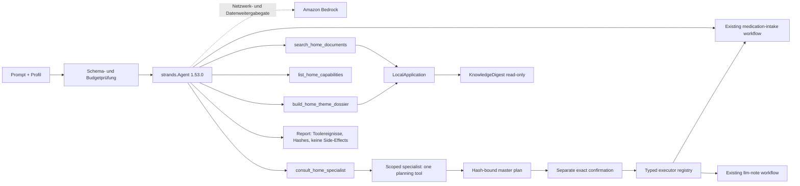

# ARCHITECTURE.md — Architecture and Limits

**English** | [Deutsch](./ARCHITECTURE.de.md)

**Version:** 0.39  
**Date:** 2026-08-23  
**Direct predecessor:**  
[`docs/archive/ARCHITECTURE-v0.34.md`](./docs/archive/ARCHITECTURE-v0.34.md)

> Project rule: The detailed, phase‑grown predecessor has been archived unchanged. This version describes the current overall construction and points to the Completion Audit for the requirement evidence.

## System Purpose

FolderHome is a local document and assistance service agent. It combines document understanding, reversible file operations, and encapsulated household domains, without automatically deriving an external effect from an analysis.

```text
Mensch / OS-Konto
  ├─ CLI
  ├─ responsive lokale GUI
  └─ Strands-Agent
       ↓
LocalApplication — einzige gemeinsame Anwendungsgrenze
       ↓
Application Workflows — Orchestrierung, Gates, Evidence, Reports
       ↓
Contracts + Capabilities — stabile Datenmodelle und kleine lokale Stores
       ↓
Bridges / Provider — revisionsgebunden, kleinste nötige Berechtigung
       ↓
lokale Dateien / SQLite / neue Ausgabeartefakte
```


## Layers

| Layer | Location | Responsibility |
|---|---|---|
| Operation | `cli.py`, `local_server.py`, `web_ui/`, `demo_site/`, `agentcore_server.py` | Validate input, offer narrow handlers, no second business logic |
| Agent | `application/strands_agent.py`, `application/master_agent.py` | Finite master loop, semantic expert selection, explicit endpoints and scoped planning specialists |
| Execution gateway | `application/workflow_execution.py` | Typed, one-time handoff from an exact approved master step to an existing domain executor |
| Application | `application/` | Compose workflows, check states, enforce approvals, generate reports |
| Contracts | `contracts/` | Immutable, validating data objects and status terms |
| Capabilities | `capabilities/` | Small reusable stores, transactions, provider gateways and resource budgets |
| Bridges | `src/folderhome/bridges/`, `bridges/` | Exact public API or documented read‑only seam to pinned components |
| Declaration | `manifests/`, `reused/` | Origin, revision, capability, side‑effects and runtime limits |

Direct accesses from UI or Agent to Provider are prohibited. Both go through `LocalApplication` so that CLI, API, GUI, and Agent use the same rules.

The interactive `agent session` calls the same `LocalApplication.run_agent_chat`
service as the GUI and retains proposed plans only in its current process.
Conversation cannot approve; `/confirm <plan_id>` invokes the same exact,
hash-bound confirmation service used by the HTTP endpoint.

`LocalApplication` retains the SDK message list per organizational profile for
the current process only. A finite sliding window preserves valid tool-use pairs
and defaults to 24 messages. `/api/v1/agent/conversation/reset` clears one
profile's retained messages and its unconfirmed plans. This separation organizes
context; it is not a second authorization boundary.

## Competition demo surfaces

`demo accident-serve` creates a bounded synthetic workspace and serves the
real local Strands journey on loopback behind a random session token. The
browser prepares one path-free plan and requires the exact plan ID before four
existing adapters update the synthetic contact register, local calendar,
contract cockpit and correspondence output. Reset deletes only the demo-owned
fixture outputs.

`site/` is a separate static, bilingual walkthrough for GitHub Pages. It has no
backend, calls no API and is visibly labelled as scripted evidence; it does not
replace the executable local demo.

`application/agentcore_runtime.py` maps the same synthetic journey to the
current Amazon Bedrock AgentCore HTTP contract (`/ping`, `/invocations`). State
is separated by a SHA-256 fingerprint of the runtime session header. The ARM64,
non-root container in `deploy/agentcore/` accepts no uploads, model credentials,
arbitrary resource identifiers or external effects.

## Strands Agent




The master agent intentionally has four bounded tools. Two are profile-specific
and read-only, one lists the verified role and endpoint catalog, and one creates
a short-lived specialist with exactly one planning tool. The specialist cannot
approve or execute. After a separate exact confirmation, the typed executor
registry can invoke only a prepared envelope and returns the existing domain
report. Current coverage is 26 connected workflows, one direct read-only
workflow, three planning-only system endpoints and three visible external
connector gaps.
Connected specialists receive the exact closed JSON request schema for their
single endpoint; unknown fields and arbitrary paths fail closed.
All 22 resource-ID-dependent endpoints and the local-calendar alternative are
implemented. Mail, external calendars and scheduler registration still await
explicitly configured external connectors plus their live-effect approvals.
Turn count, tool invocations, prompt, response, tool result, and output tokens
are finitely limited. The deterministic fixture adapter runs the real Strands
agent and tool executor without credentials or network access. Bedrock requires
a model ID, AWS region, an explicit network gate, and a separate approval for
forwarding local search results; a live run is not part of the local acceptance.
The status API and GUI distinguish fixture-only, configured-not-verified, and
verified-in-process model states. Only a successful Bedrock agent turn advances
the runtime to the verified state. They also expose the runtime topology:
FolderHome, its document state, approvals, and workflow execution stay local;
only model inference uses the AWS cloud when Bedrock is enabled.

## Document Flow

```text
bereitgestellter Ordner
  → Sensitivitäts- und Schreibgate
  → doc-services Extraktion
  → FolderHome-Dokumentverträge
  → KnowledgeDigest-Index im angegebenen State-Ordner
  → read-only Suche / Themendossier / Ordnerbericht / Versionen
```


Source documents are not altered during ingest. Search opens the index read‑only. Reports output locations, source status, and coverage limits. “Latest version” is an explicit heuristic: explicit contract data takes precedence, followed by weaker metadata. Older versions are archived only via a separate, approval‑required FCSA plan.

## File Action Flow

```text
Profil + Bereich + Quelldatei
  → feste Regelvererbung
  → read-only Plan
  → Provider-/Konfliktprüfung
  → exakte Approval-ID + erwarteter SHA-256
  → frische Gesamtprüfung
  → neue Ausgabe oder reversible Aktion
  → Ablagebeleg + Audit + optionales Undo
```


Inheritance follows global → domain → profile → profile‑domain. Peer‑level conflicts block. Hard‑delete is not an allowed rule. Batch and routine runs check shared targets across folders or watches and only roll back their own demonstrably generated changes.

## Document Transformation

The new core under `capabilities/document_transform/` generates TXT and PDF bundles as well as one document per file type in a deterministic ZIP. PDF pages are preserved; images are rasterized; text sources are re‑set and marked with a visible loss notice. Videos are not reinterpreted as PDF content. Each output is new, hash‑bound and Never‑overwrite. Other target formats remain blocked without a verified renderer.

## Domain Packages

| Package | Local Core | Hard Limit |
|---|---|---|
| Contacts | Evidence candidates, register, object reference, turnover | no automatic deletion or contact initiation |
| Calendar | Candidates, local store, ICS, connector plan | no silent live sync; UpToday/Routinika/Google separated |
| FindCall | Time/price limits, serial fixtures, early stop | no telephony, no booking |
| Finance | Statements, virtual accounts, gaps, recurring costs | no banking, no payment claim |
| Household | Append‑only inventory, minimum state, expiry candidates | no ordering, no completeness guarantee |
| Medication | Documented plan, confirmed intake | no dosage decision or intake claim without confirmation |
| Health | Extractive timeline, conflicts, questions, handoff | no diagnosis, therapy or completeness guarantee |
| Contracts | Object‑bound versions, contacts, costs, appointments | no coverage or legal effect statement |
| Correspondence | Templates, designs, preview, new output | no sending without separate mail workflow |
| Office/Media | Artifact plan, design set, SVG business card | special renderers remain own providers |
| Mail | Ingest plan, draft, approval, idempotence | live mailbox remains a separate gate |
| Notes | Guided request, approval, versions | only profile‑specific provider store |
| Taxes | Receipt store, private ZIP tax worksheet | no advice or portal transmission |
| Daily Brief | Local snapshots, freshness, render, desktop copy | no live feeds or scheduler registration |
| Official notices | Types, labeled facts, conflicts | no legal review or invented deadline calculation |
| Drafts | Response, objection, application templates | no legal judgment or dispatch |
| Benefits | Dated catalog, official verification steps | no entitlement, no amount, no automatic web call |
| Legal change | Local snapshot diffs, review candidates | no impact determination or notification |

## Data and Identity Model

- The operating system account and its file permissions constitute the security boundary.
- Profiles such as Lukas, Hanna, and Simon are organization and preference objects within an account, not access controls.
- Real personally identifiable data must not be placed in the repository, demo, or public evidence.
- Finance, health, medication, contact, and official notice data require an explicit local read gate.
- Writing stores use append‑only events or new files; existing outputs are not overwritten.

## Persistence

| State | Technology | Property |
|---|---|---|
| Document index | KnowledgeDigest/SQLite | Search read‑only only |
| Snapshots/Checkpoints | JSON | immutable, content‑light, hash‑bound |
| Contacts/Calendar/Finance/Inventory/Medication | local SQLite stores | profile‑specific, validated, mostly append‑only |
| Audit/Reports | JSON/Markdown | atomically generated, provenance and status visible |
| Outputs | TXT/PDF/ZIP/SVG/HTML/ICS | new paths, Never‑overwrite, hash proof |

## Security Model

The detailed policy is in [`SECURITY.md`](./SECURITY.md).

- Default deny for file, network, mail, calendar, phone, and publishing effects.
- Exact schemas, canonical paths, allowlists and source hashes.
- Resource budgets for file count, bytes, runtime, agent turns, tool invocations, HTTP connections and output size.
- Loopback binds exclusively `127.0.0.1`, uses a short‑lived token as well as exact host and origin verification, and limits parallel connections.
- Official performance links use HTTPS and a publisher‑bound host whitelist; redirects or similarly‑named hosts are rejected.
- Approval is tightly bound in time and content; the state is re‑checked before execution.

## Provider and Reuse Limits

Inventory modules remain in their own repositories. FolderHome does not copy provider source code. A bridge run requires the declared revision, a clean checkout, compatible runtime and an allowed capability. Foreign changes, missing licenses or version drift block it. The full mapping is in [`COMPETITION_CODE_MAP.md`](./COMPETITION_CODE_MAP.md) and [`THIRD_PARTY_LICENSES.md`](./THIRD_PARTY_LICENSES.md).

## Phase and Acceptance Evidence

The historical individual flows of phases 1–34 remain in the archived predecessor. The canonical 36‑line matrix, code evidence, test results, demo hashes and remaining external effect gates are in [`docs/phase36-completion-audit.md`](./docs/phase36-completion-audit.md).

The public repository setup, video release, AWS registration and Devpost submission are not architecture automation and each require an explicit human approval.

---
