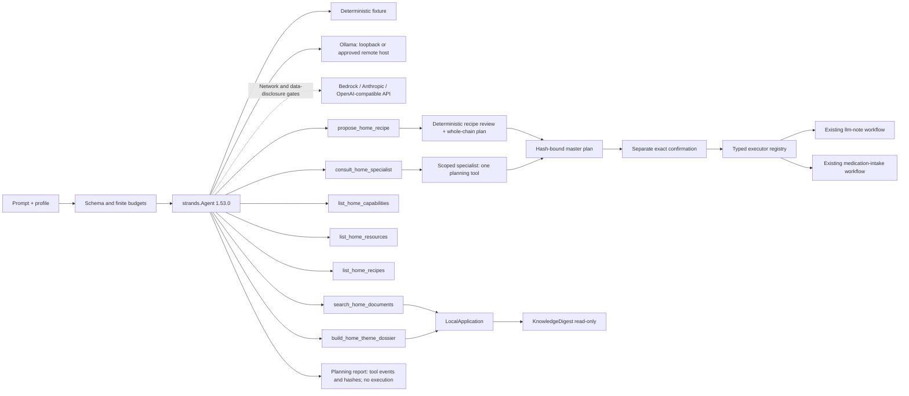

# ARCHITECTURE.md — Architecture and Limits

**English** | [Deutsch](./ARCHITECTURE.de.md)

**Version:** 0.3.0 + acceptance fixes  
**Date:** 2026-09-09  
**Direct predecessor:**  
[`docs/archive/ARCHITECTURE-v0.34.md`](./docs/archive/ARCHITECTURE-v0.34.md)

> Project rule: The detailed, phase‑grown predecessor has been archived unchanged. This version describes the current overall construction and points to the Completion Audit for the requirement evidence.

## System Purpose

FolderHome is a local document and assistance service agent. It combines document understanding, reversible file operations, and encapsulated household domains, without automatically deriving an external effect from an analysis.

```text
Person / OS account
  ├─ Local GUI / MCP proxy → token-gated HTTP → LocalApplication
  ├─ Interactive agent CLI → LocalApplication
  ├─ Domain CLI → application workflows and explicit approval gates
  └─ Setup GUI → separate token-gated SetupApplication → configuration

LocalApplication → Strands planning / typed workflow execution
Application workflows → contracts / capabilities → pinned provider bridges
Local state → source files (read-only) / SQLite / new output artifacts
```


## Layers

| Layer | Location | Responsibility |
|---|---|---|
| Operation | `cli.py`, `local_server.py`, `web_ui/`, `mcp_server.py`, `demo_site/`, `agentcore_server.py` | Validate input, offer narrow handlers, reuse application workflows |
| Setup | `setup_app.py`, `setup_ui/` | Separate loopback server; preview/hash/confirmation before configuration writes |
| Agent | `application/strands_agent.py`, `application/master_agent.py` | Finite master loop, semantic expert selection, explicit endpoints and scoped planning specialists |
| Execution gateway | `application/workflow_execution.py` | Typed, one-time handoff from an exact approved master step to an existing domain executor |
| Application | `application/` | Compose workflows, check states, enforce approvals, generate reports |
| Contracts | `contracts/` | Immutable, validating data objects and status terms |
| Capabilities | `capabilities/` | Small reusable stores, transactions, provider gateways and resource budgets |
| Bridges | `src/folderhome/bridges/`, `bridges/` | Exact public API or documented read‑only seam to pinned components |
| Declaration | `manifests/`, `reused/` | Origin, revision, capability, side‑effects and runtime limits |

The local GUI, MCP proxy and interactive agent use `LocalApplication`.
Domain CLI commands also call shared application workflows directly; they do
not all pass through the HTTP application. Approval rules remain in the typed
workflows and provider bridges, not in browser controls.

The **MCP proxy owns no document or plan state**: it forwards bounded calls to
one existing app process on `127.0.0.1`. The **setup server is separate** and
cannot approve workflow execution. It validates and stages configuration,
preserves custom resources and stricter permissions, and restores prior files
after reported write failures. Backups remain recoverable; power-loss atomicity
is not claimed. Provider isolation is described in
[provider checkouts](./docs/provider-checkouts.md).

Calendar setup connects to the app through `launch.json` (`calendar_config`,
`connector_accounts`). The startup binder validates bounded files and adds only
missing **private, profile-scoped resource defaults in memory**. Explicit
registry bindings and stricter operations take precedence; the app does not
rewrite the registry. Model presets cannot supply these paths or grant effects.
Setup reload reads the active paths and writes only explicitly edited calendar
fields. Profile cascades may derive a setup-owned account file; custom source
files remain unchanged. Loading accounts does **not** connect an external
calendar gateway. The local calendar and optional ICS export still require the
existing exact workflow confirmation.

The interactive `agent session` calls the same `LocalApplication.run_agent_chat`
service as the GUI and retains proposed plans only in its current process.
Conversation cannot approve; `/confirm <plan_id>` invokes the same exact,
hash-bound confirmation service used by the HTTP endpoint.

`LocalApplication` retains the SDK message list per organizational profile for
the current process only. A finite sliding window preserves valid tool-use pairs
and defaults to 24 messages. `/api/v1/agent/conversation/reset` clears one
profile's retained messages and its unconfirmed plans. This separation organizes
context; it is not a second authorization boundary.

## Competition demo surfaces

`demo accident-serve` creates a bounded synthetic workspace and serves the
real local Strands journey on loopback behind a random session token. The
browser prepares one path-free plan and requires the exact plan ID before four
existing adapters update the synthetic contact register, local calendar,
contract cockpit and correspondence output. Reset deletes only the demo-owned
fixture outputs.

`site/` is a separate static, bilingual walkthrough for GitHub Pages. It has no
backend, calls no API and is visibly labelled as scripted evidence; it does not
replace the executable local demo.

`application/agentcore_runtime.py` maps the same synthetic journey to the
current Amazon Bedrock AgentCore HTTP contract (`/ping`, `/invocations`). State
is separated by a SHA-256 fingerprint of the runtime session header. The ARM64,
non-root container in `deploy/agentcore/` accepts no uploads, model credentials,
arbitrary resource identifiers or external effects.

## Strands Agent

The [submission diagram](./docs/submission/ARCHITECTURE_DIAGRAM.md) separates
the four-adapter synthetic accident-demo view from the complete application
map. Its SVG is the editable source; PNG has a pinned local renderer and a
non-writing drift check. Neither diagram establishes current AWS availability.




The master agent has seven bounded tools: document search, topic dossiers,
capability and resource catalogs, recipe listing and preparation, and specialist
consultation. Recipe preparation retains the full chain and deterministic review;
it cannot confirm or execute. Specialist consultation creates a short-lived
specialist with exactly one planning tool. The specialist cannot
approve or execute. After a separate exact confirmation, the typed executor
registry can invoke only a prepared envelope and returns the existing domain
report. With a fully configured registry, coverage is 27 connected workflows,
one direct read-only workflow, three planning-only system endpoints and two
visible external connector gaps.
Connected specialists receive the exact closed JSON request schema for their
single endpoint; unknown fields and arbitrary paths fail closed.
All 22 resource-ID-dependent endpoints, the local-calendar alternative and the
draft-only mail endpoint are implemented. The mail endpoint connects only when
the registry declares a drafts mailbox; otherwise it stays honestly
unconnected. External calendars and scheduler registration still await
explicitly configured external connectors plus their live-effect approvals.

The mail endpoint has no send path. It appends one prepared letter to the
drafts folder of the user's own IMAP mailbox, behind the separate live-effect
approval `--approve-mail-draft`. No recipient is contacted, the mailbox
password is read only from its configured local file at execution time, and a
local ledger keeps the append at most once.

A capability recipe turns a real journey into one plan. It is declarative
(`folderhome/recipes/*.json`, shipped inside the package), it grants no new
capability, and every step stays an existing typed endpoint with its own adapter
and gates. The master resolves the whole chain into one hash-bound
`MasterAgentPlan` whose steps each carry the expert that actually owns the
endpoint, so a recipe may span domains without weakening the ownership rule —
the rule is checked per step instead of once per plan. Data moves only as
logical resource IDs; no value from a step report is substituted into a later
request, which is what keeps every request complete and hashable before anything
runs. A deterministic review runs first, is signed by every involved expert, and
becomes part of the plan hash. Execution walks the steps in order and stops at
the first failure, reporting what ran, what broke and what was never attempted.
Details: [`docs/capability-recipes.md`](./docs/capability-recipes.md).

One capability index describes every endpoint exactly once. It joins the master
capability catalog (expert, execution mode, gates), the adapter request schemas
(required and optional inputs, read statically from the adapter classes) and one
short bilingual purpose. The same index produces the compact endpoint overview in
the master-agent system prompt and the generated
[`CAPABILITY-INDEX.md`](./CAPABILITY-INDEX.md); `_tools/capability-index --check`
keeps them from drifting. The index states what exists in the code, never what a
specific installation has configured — runtime connection stays the executor
catalog's answer.

The local calendar endpoint can optionally export the appointments it records
as one private RFC 5545 file in a registry-bound output directory. The file
content is hash-bound by the same confirmation as the state write, an existing
target aborts the run, and a failed state write rolls the published file back,
so state and file appear together or not at all. FolderHome writes a local
file; the user imports it into their calendar program by hand, so no calendar
connector is involved.
Turn count, tool invocations, prompt, response, tool result, and output tokens
are finitely limited. The deterministic fixture adapter runs the real Strands
agent and tool executor without credentials or network access. Bedrock requires
a model ID, AWS region, an explicit network gate, and a separate approval for
forwarding local search results; a live run is not part of the local acceptance.
The status API and GUI distinguish fixture-only, configured-not-verified, and
verified-in-process model states. Only a successful turn with the configured
real model advances it to the verified state. Fixture mode remains
`local_only_fixture`; loopback Ollama reports `local_model` / `local_only_model`.
Remote Ollama and hosted providers report `network_model` / `local_first_hybrid`,
with separate provider and inference-location fields. FolderHome, document
state, approvals and workflow execution stay local. A configured endpoint is
not proof of a successful model call.

## Document Flow

```text
bereitgestellter Ordner
  → Sensitivitäts- und Schreibgate
  → doc-services Extraktion
  → FolderHome-Dokumentverträge
  → KnowledgeDigest-Index im angegebenen State-Ordner
  → read-only Suche / Themendossier / Ordnerbericht / Versionen
```


Source documents are not altered during ingest. Search opens the index read‑only. Reports output locations, source status, and coverage limits. “Latest version” is an explicit heuristic: explicit contract data takes precedence, followed by weaker metadata. Older versions are archived only via a separate, approval‑required FCSA plan.

## File Action Flow

```text
Profil + Bereich + Quelldatei
  → feste Regelvererbung
  → read-only Plan
  → Provider-/Konfliktprüfung
  → exakte Approval-ID + erwarteter SHA-256
  → frische Gesamtprüfung
  → neue Ausgabe oder reversible Aktion
  → Ablagebeleg + Audit + optionales Undo
```


Inheritance follows global → domain → profile → profile‑domain. Peer‑level conflicts block. Hard‑delete is not an allowed rule. Batch and routine runs check shared targets across folders or watches and only roll back their own demonstrably generated changes.

## Document Transformation

The new core under `capabilities/document_transform/` generates TXT and PDF bundles as well as one document per file type in a deterministic ZIP. PDF pages are preserved; images are rasterized; text sources are re‑set and marked with a visible loss notice. Videos are not reinterpreted as PDF content. Each output is new, hash‑bound and Never‑overwrite. Other target formats remain blocked without a verified renderer.

## Domain Packages

| Package | Local Core | Hard Limit |
|---|---|---|
| Contacts | Evidence candidates, register, object reference, turnover | no automatic deletion or contact initiation |
| Calendar | Candidates, local store, ICS, connector plan | no silent live sync; UpToday/Routinika/Google separated |
| FindCall | Time/price limits, serial fixtures, early stop | no telephony, no booking |
| Finance | Statements, virtual accounts, gaps, recurring costs | no banking, no payment claim |
| Household | Append‑only inventory, minimum state, expiry candidates | no ordering, no completeness guarantee |
| Medication | Documented plan, confirmed intake | no dosage decision or intake claim without confirmation |
| Health | Extractive timeline, conflicts, questions, handoff | no diagnosis, therapy or completeness guarantee |
| Contracts | Object‑bound versions, contacts, costs, appointments | no coverage or legal effect statement |
| Correspondence | Templates, designs, preview, new output | no sending without separate mail workflow |
| Office/Media | Artifact plan, design set, SVG business card | special renderers remain own providers |
| Mail | Ingest plan, draft, approval, idempotence | live mailbox remains a separate gate |
| Notes | Guided request, approval, versions | only profile‑specific provider store |
| Taxes | Receipt store, private ZIP tax worksheet | no advice or portal transmission |
| Daily Brief | Local snapshots, freshness, render, desktop copy | no live feeds or scheduler registration |
| Official notices | Types, labeled facts, conflicts | no legal review or invented deadline calculation |
| Drafts | Response, objection, application templates | no legal judgment or dispatch |
| Benefits | Dated catalog, official verification steps | no entitlement, no amount, no automatic web call |
| Legal change | Local snapshot diffs, review candidates | no impact determination or notification |

## Data and Identity Model

- The operating system account and its file permissions constitute the security boundary.
- Profiles such as Lukas, Hanna, and Simon are organization and preference objects within an account, not access controls.
- Real personally identifiable data must not be placed in the repository, demo, or public evidence.
- Finance, health, medication, contact, and official notice data require an explicit local read gate.
- Writing stores use append‑only events or new files; existing outputs are not overwritten.

## Persistence

| State | Technology | Property |
|---|---|---|
| Document index | KnowledgeDigest/SQLite | Search read‑only only |
| Snapshots/Checkpoints | JSON | immutable, content‑light, hash‑bound |
| Contacts/Calendar/Finance/Inventory/Medication | local SQLite stores | profile‑specific, validated, mostly append‑only |
| Audit/Reports | JSON/Markdown | atomically generated, provenance and status visible |
| Outputs | TXT/PDF/ZIP/SVG/HTML/ICS | new paths, Never‑overwrite, hash proof |

## Security Model

The detailed policy is in [`SECURITY.md`](./SECURITY.md).

- Default deny for file, network, mail, calendar, phone, and publishing effects.
- Exact schemas, canonical paths, allowlists and source hashes.
- Resource budgets for file count, bytes, runtime, agent turns, tool invocations, HTTP connections and output size.
- Loopback binds exclusively `127.0.0.1`, uses a short‑lived token as well as exact host and origin verification, and limits parallel connections.
- Official performance links use HTTPS and a publisher‑bound host whitelist; redirects or similarly‑named hosts are rejected.
- Approval is tightly bound in time and content; the state is re‑checked before execution.

Master and calendar connector execution recompute complete plan content,
instead of trusting stored hash strings. Calendar input snapshots and gateway
effects are bound as well. A failure after an attempted effect is not evidence
of rollback or permission to retry. The Google-v3 gateway now provides persistent
idempotency, field-level readback and typed uncertain/partial outcomes through
the calendar plan executor. App/CLI resource and credential wiring remains open;
see [calendar limits](./docs/phase27-calendar-connector-plan.md).

The optional AWS demo proxy now has a local, reviewed micro-USD reservation
contract: cumulative UTC entitlement, atomic daily-count/money admission,
persistent ledger, and a pinned runtime version/cost profile. This controls
admitted forwards, not the entire AWS bill. Existing-demo migration and actual
funding, prices and cloud operation remain pending joint acceptance; see
[AWS deployment limits](./deploy/aws_demo/README.md).

## Provider and Reuse Limits

Inventory modules remain in their own repositories. FolderHome does not copy provider source code. A bridge run requires the declared revision, a clean checkout, compatible runtime and an allowed capability. Foreign changes, missing licenses or version drift block it. The full mapping is in [`COMPETITION_CODE_MAP.md`](./COMPETITION_CODE_MAP.md) and [`THIRD_PARTY_LICENSES.md`](./THIRD_PARTY_LICENSES.md).

## Phase and Acceptance Evidence

The historical individual flows of phases 1–34 remain in the archived predecessor. The canonical 36‑line matrix, code evidence, test results, demo hashes and remaining external effect gates are in [`docs/phase36-completion-audit.md`](./docs/phase36-completion-audit.md).

The public repository setup, video release, AWS registration and Devpost submission are not architecture automation and each require an explicit human approval.

---
