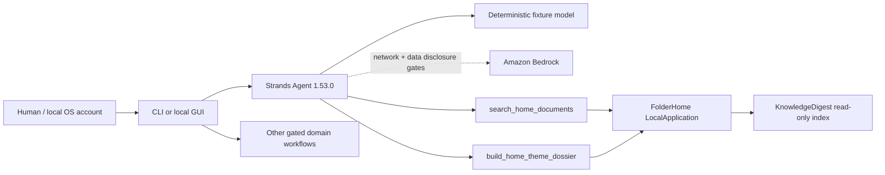

# FolderHome

[English](./README.md) | **Deutsch**

> Assistantify your home.

**Current concise README:** Phase 36 / 2026-08-22  
**Direct predecessor:**
[`docs/archive/README-phase36-draft.md`](docs/archive/README-phase36-draft.de.md)

FolderHome is a local-first Strands agent that turns scattered household
documents into searchable, explainable and safely actionable workflows.

FolderHome ist ein lokaler Dokument- und Assistenzservice-Agent. Er verbindet
Dokumentensuche, reversible Dateiarbeit und gekapselte Alltagsdienste, ohne
einer Analyse automatisch Mail-, Kalender-, Telefon-, Datei- oder
Cloudberechtigungen zu geben.

## Status

- 36 von 36 lokalen Wettbewerbsphasen umgesetzt
- echter `strands.Agent` mit zwei profilspezifischen read-only Tools
- 333 automatisierte Tests bestanden
- synthetische No-network-Demo mit reproduzierbaren Hashes
- vollständiger Baseline-Scan über 12/12 Oberflächen plus aktueller
  66-Dateien-Delta-Audit; vier Befunde behoben
- öffentliches MIT-Repository; kein Video-Upload und kein Devpost-Submit erfolgt

Der kanonische Nachweis steht im
[`Phase-36-Completion-Audit`](docs/phase36-completion-audit.de.md). Während des
Wettbewerbs heißt das Projekt ausschließlich **FolderHome**. Ein späteres
Light-/Sovereign-Rebranding ist nicht Teil dieses Builds.

## Schnelltest für Jurorinnen und Juroren

Windows PowerShell:

```powershell
git clone https://github.com/ellmos-ai/FolderHome.git
cd FolderHome
python -m venv .venv
.venv\Scripts\python.exe -m pip install -e ".[dev,transform]"
.venv\Scripts\python.exe -m folderhome demo run `
  --output-dir .local-demo\competition `
  --approve-output-write --json
```

macOS/Linux verwenden `.venv/bin/python` statt
`.venv\Scripts\python.exe`.

Erwartet werden `status=passed`, `strands-agents 1.53.0`, die Szenarien
`document-search` und `theme-dossier`, `network_used=false`, eine leere
`side_effects`-Liste sowie vier neue Dateien. Ein zweiter Lauf gegen denselben
Ordner blockiert statt zu überschreiben.

Die ausführliche englische Anleitung steht in
[`docs/submission/TESTING_INSTRUCTIONS_EN.md`](./docs/submission/TESTING_INSTRUCTIONS_EN.md).

## Agentenarchitektur



Der Fixture-Adapter durchläuft den echten Strands-Agenten und dessen
sequentiellen Tool-Executor ohne Zugangsdaten. Bedrock verwendet denselben
Agenten, verlangt aber Modell-ID, AWS-Region, `--allow-network` und die
getrennte Freigabe `--approve-sensitive-cloud-data`; ein Bedrock-Live-Lauf
wurde nicht behauptet.

Mehr: [`ARCHITECTURE.md`](./ARCHITECTURE.md) und
[`docs/submission/ARCHITECTURE_DIAGRAM.md`](./docs/submission/ARCHITECTURE_DIAGRAM.md).

## Was FolderHome lokal kann

- Dokumente extrahieren, indexieren, natürlich suchen und als Themendossier
  oder Ordnerbericht zusammenfassen
- Versionen vergleichen und ältere Fassungen nur als freigabepflichtigen,
  reversiblen Archivplan behandeln
- Ordnerregeln, Watches, Korrekturlernen, Aufräumpläne, sichere Ausführung,
  Audit und Undo verbinden
- TXT-/PDF-Bündel sowie deterministische ZIP-Typpakete erzeugen
- Profile für Lukas, Hanna oder Simon und bereichsspezifische Regeln
  organisieren
- Kontakte, Terminkandidaten, lokale Kalender- und ICS-Handoffs verwalten
- Kontoauszüge, virtuelle Konten, Datenlücken, Abos und Vertragscockpits
  evidenzgebunden darstellen
- Haushalt, Lagerbestand, Medikamentenplan und bestätigte Einnahmen führen
- extraktive Gesundheitsdossiers und Arztbericht-Zeitlinien erstellen
- Bescheide strukturieren, Verwaltungsentwürfe vorbereiten und amtliche
  Leistungsvorchecks routen
- lokale Rechtsänderungs-Snapshots zu Review-Kandidaten vergleichen
- Briefdesigns, Designsets, SVG-Visitenkarten und Office-/Medienhandoffs planen
- kontrollierte Mail-, Kalender-, Notiz-, Steuer-, Daily-Briefing- und
  FindCall-Workflows bereitstellen

Die vollständige Zuordnung und alle Grenzen stehen in
[`Feature_Analyse_FolderHome.md`](Feature_Analyse_FolderHome.de.md).

## Sicherheitsmodell

- Default deny für jede Außenwirkung
- Betriebssystemkonto und Dateirechte als Sicherheitsgrenze; Profile sind nur
  Organisation innerhalb eines Kontos
- exakte Schemas, kanonische Pfade, Quellhashes und Never-overwrite
- getrennte Plan-, Approval-, Recheck-, Ausführungs-, Audit- und Undo-Stufen
- endliche Budgets für Dateien, Bytes, Parser, Renderer, HTTP-Verbindungen,
  Agententurns, Toolaufrufe und Ausgaben
- Loopback nur auf `127.0.0.1` mit Token, Host-/Origin-Prüfung und
  Überlastgrenze
- sensible lokale Reads nur nach ausdrücklichem Gate
- amtliche Links nur über HTTPS und publishergebundene Host-Allowlist

FolderHome diagnostiziert nicht, erteilt keine Rechts-, Steuer- oder
Finanzberatung, entscheidet keinen Leistungsanspruch und garantiert weder
Vollständigkeit noch die Erkennung jedes Termins.

Details und Meldungsweg: [`SECURITY.md`](SECURITY.de.md).

## Wichtige Befehle

```powershell
# Validate the agent configuration without invoking a model
.venv\Scripts\python.exe -m folderhome agent plan `
  --profiles-dir examples\profiles --state-dir .local-state --json

# Run the reproducible agent demo
.venv\Scripts\python.exe -m folderhome demo run `
  --output-dir .local-demo\competition --approve-output-write --json

# Plan the local read-only interface
.venv\Scripts\python.exe -m folderhome app plan `
  --profiles-dir examples\profiles --state-dir .local-state `
  --port 8765 --json

# Start the interface only after the explicit listener gate
.venv\Scripts\python.exe -m folderhome app serve `
  --profiles-dir examples\profiles --state-dir .local-state `
  --port 8765 --approve-loopback-server --json

# Show all CLI commands
.venv\Scripts\python.exe -m folderhome --help
```

Die ausführlichen Playbooks liegen unter [`workflows/`](./workflows/) und im
generierten [`WORKFLOWS.md`](WORKFLOWS.de.md).

## Entwicklungsprüfung

```powershell
.venv\Scripts\python.exe -m pytest
.venv\Scripts\python.exe -m ruff check .
.venv\Scripts\python.exe -m compileall -q src tests
.venv\Scripts\python.exe -m folderhome plugins validate --json
.venv\Scripts\python.exe _tools\doc-lint
.venv\Scripts\python.exe _tools\workflows-sync --check
```

Die mitgelieferte Referenzevidenz liegt unter
[`examples/competition/evidence/`](./examples/competition/evidence/).

## Repositorystruktur und Herkunft

```text
src/folderhome/       neuer Wettbewerbs- und Bridgecode
skills/               neue agentisch nutzbare FolderHome-Skills
workflows/            ausführbare Arbeitsverträge
manifests/            Komponenten- und spätere Stackverträge
reused/               gepinnte Bestandsreferenzen, kein umbenannter Quellcode
examples/             ausschließlich synthetische Fixtures und Evidenz
tests/                Vertrags-, Sicherheits- und Integrationstests
docs/submission/      lokal vorbereitete englische Einreichungsunterlagen
docs/archive/         direkte historische Vorgänger langer Projektdokumente
```

FCSA, KnowledgeDigest, doc-services, HungryCall, Ringedingeding, llm-note,
steuer-assistent, law-checker und weitere Bestandskomponenten bleiben
offengelegt und revisionsgebunden. FolderHome kopiert ihren Quellcode nicht.

- Herkunft: [`COMPETITION_CODE_MAP.md`](./COMPETITION_CODE_MAP.md)
- Lizenzen und Pins: [`THIRD_PARTY_LICENSES.md`](THIRD_PARTY_LICENSES.de.md)
- Entscheidungen: [`DECISIONS.md`](./DECISIONS.md)
- Changelog: [`CHANGELOG.md`](./CHANGELOG.md)

## Submission-Grenze

Englische Beschreibung, Diagramm, Tests, Videoskript und Checkliste sind unter
[`docs/submission/`](./docs/submission/) vorbereitet. Das öffentliche
Repository liegt unter <https://github.com/ellmos-ai/FolderHome>. AWS Builder
ID, Videoaufnahme/-upload, Live-Demo und Devpost-Submit benötigen jeweils eine
ausdrückliche menschliche Freigabe.

## Lizenz

FolderHome steht unter der [MIT-Lizenz](./LICENSE). Der Wettbewerbscode wird
öffentlich auf GitHub bereitgestellt; reale Dienste und personenbezogene
Daten bleiben davon ausgeschlossen.

---
<!-- REMEMBER: ENDUSERTEXTE BEKOMMEN ECHTE UMLAUTE Ü Ö Ä -->
