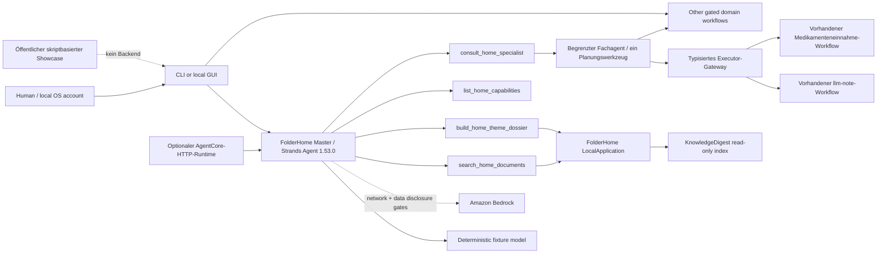

# FolderHome

[English](./README.md) | **Deutsch**

> Assistantify your home.

**Current concise README:** Phase 36 / 2026-08-23  
**Direct predecessor:**
[`docs/archive/README-phase36-draft.md`](docs/archive/README-phase36-draft.de.md)

FolderHome is a local-first Strands agent that turns scattered household
documents into searchable, explainable and safely actionable workflows.

FolderHome ist ein lokaler Dokument- und Assistenzservice-Agent. Er verbindet
Dokumentensuche, reversible Dateiarbeit und gekapselte Alltagsdienste, ohne
einer Analyse automatisch Mail-, Kalender-, Telefon-, Datei- oder
Cloudberechtigungen zu geben.

## Status

- 36 von 36 lokalen Wettbewerbsphasen umgesetzt
- ein echter `strands.Agent`-Master mit vier begrenzten Werkzeugen und bei Bedarf erzeugten Planungs-Fachagenten
- 415 von 418 automatisierten Tests bestanden; drei Live-Checkout-Pinprüfungen blockieren wegen lokaler HungryCall-/Ringedingeding-Revisionsabweichungen
- synthetische No-network-Demo mit reproduzierbaren Hashes
- durchgehende synthetische Unfallgeschichte über vier echte,
  bestätigungspflichtige FolderHome-Workflowadapter
- zweisprachiger öffentlicher Showcase mit Hell-/Dunkelmodus in
  [`site/`](./site/) und ein getesteter, deploymentbereiter
  AgentCore-HTTP-/ARM64-Adapter in [`deploy/agentcore/`](./deploy/agentcore/)
- vollständiger Baseline-Scan über 12/12 Oberflächen plus aktueller
  66-Dateien-Delta-Audit; vier Befunde behoben
- öffentliches MIT-Repository und [dreiminütiges öffentliches Demovideo](https://youtu.be/2LeWU_WJZKM); kein Devpost-Submit erfolgt

Der kanonische Nachweis steht im
[`Phase-36-Completion-Audit`](docs/phase36-completion-audit.de.md). Während des
Wettbewerbs heißt das Projekt ausschließlich **FolderHome**. Ein späteres
Light-/Sovereign-Rebranding ist nicht Teil dieses Builds.

## Schnelltest für Jurorinnen und Juroren

Windows PowerShell:

```powershell
git clone https://github.com/ellmos-ai/FolderHome.git
cd FolderHome
python -m venv .venv
.venv\Scripts\python.exe -m pip install -e ".[dev,transform]"
.venv\Scripts\python.exe -m folderhome demo run `
  --output-dir .local-demo\competition `
  --approve-output-write --json
```

macOS/Linux verwenden `.venv/bin/python` statt
`.venv\Scripts\python.exe`.

Erwartet werden `status=passed`, `strands-agents 1.53.0`, die Szenarien
`document-search` und `theme-dossier`, `network_used=false`, eine leere
`side_effects`-Liste sowie vier neue Dateien. Ein zweiter Lauf gegen denselben
Ordner blockiert statt zu überschreiben.

Die ausführliche englische Anleitung steht in
[`docs/submission/TESTING_INSTRUCTIONS_EN.md`](./docs/submission/TESTING_INSTRUCTIONS_EN.md).

## Interaktive Unfallgeschichte

Die echte lokale Demo startet mit einem Befehl:

```powershell
.venv\Scripts\python.exe -m folderhome demo accident-serve `
  --workspace-dir .local-demo\accident `
  --port 8767 --approve-loopback-server --json
```

Öffne die ausgegebene, tokenhaltige `access_url`. Die standardmäßig englische
Oberfläche bietet eine Deutsch-/Englisch-Umschaltung und Hell-/Dunkelmodus. Sie
durchsucht synthetische aktuelle und ältere Hyundai-i10-Policen, schlägt
Kontakt-, Schadensbrief-, Vertrags- und lokale Kalenderschritte vor und führt
die echten typisierten Adapter erst nach dem exakt angezeigten Befehl
`/confirm <plan_id>` aus. Sie sendet niemals E-Mails, ruft kein Cloudmodell auf
und archiviert die ältere Police nicht automatisch. **Fall zurücksetzen**
stellt das deterministische Fixture wieder her.

Der öffentliche Browser-Rundgang liegt in [`site/`](./site/). Er ist
ausdrücklich als skriptbasierter synthetischer Showcase ohne Backend
gekennzeichnet. Der Repository-Befehl oben ist der ausführbare Nachweis.

Das abgenommene Wettbewerbsvideo ist öffentlich auf YouTube:
<https://youtu.be/2LeWU_WJZKM>.

## Agentenarchitektur



Der Fixture-Adapter durchläuft den echten Strands-Agenten und dessen
sequentiellen Tool-Executor ohne Zugangsdaten. Bedrock verwendet denselben
Agenten, verlangt aber Modell-ID, AWS-Region, `--allow-network` und die
getrennte Freigabe `--approve-sensitive-cloud-data`; ein Bedrock-Live-Lauf
wurde nicht behauptet.
Die semantische Fachwahl gehört zum Modell. Endpoint-Auflösung, Plan-Hashes und
Bestätigung bleiben deterministisch und blockieren im Zweifel; Personas ändern
nur den Stil und erteilen niemals Kompetenzen. Ohne privates Ressourcenregister
zeigt der Live-Executor-Katalog drei verbundene Executoren: persönliche Notizen,
die Bestätigung einer bereits geplanten Medikamenteneinnahme und die strikt
lokale FindCall-Fixture-Kaskade. Mit konfiguriertem Register kommen 23
typisierte Ressourcenadapter für den vollständigen lokalen Dokument-,
Organisations-, Gesundheits-, Finanz-, Sozialrechts-, Bestands-, Steuer-,
Briefing-, Design-, FCSA- und Routinenstack hinzu. Ein Register, das zusätzlich
ein Entwurfspostfach (`mail.draft_account`) deklariert, verbindet auch den
reinen Entwurfsendpunkt für Mail. Damit sind 27 Endpunkte verbunden; hinzu
kommen ein direkter Nur-Lese-Pfad, drei absichtlich nur planende
Systemendpunkte und lediglich zwei sichtbare, fail-closed externe
Connectorlücken: externe Kalender und Scheduler-Registrierung. Ohne
konfiguriertes Postfach bleibt der Mailendpunkt ehrlich unverbunden; der
Katalog meldet dann 26 verbundene Endpunkte und drei Lücken. Jeder
verbundene Adapter veröffentlicht ein geschlossenes Anfrageschema. Eine
Chatnachricht schreibt nie; die exakte Bestätigung liefert für einen
verbundenen Plan einen eigenen Fach-Ausführungsbericht. Externe Effekte behalten
ihre eigene Konfiguration und getrennten Live-Effekt-Freigaben.

Der empfohlene CLI-Einstieg ist eine Sitzung im selben Prozess. Sie bewahrt
vorbereitete Pläne zwischen den Gesprächsschritten und akzeptiert eine Freigabe
ausschließlich über `/confirm <plan_id>`; mit `--json` wird pro Zeile ein
NDJSON-Ereignis für kontrollierte Automatisierung ausgegeben.
Der gleiche begrenzte Strands-Nachrichtenverlauf löst nun Folgebezüge in GUI und
CLI auf. Er ist nach organisatorischem Profil getrennt, standardmäßig auf 24
Nachrichten begrenzt, wird nicht dauerhaft gespeichert und lässt sich zusammen
mit unbestätigten Plänen über **Neue Unterhaltung** oder `/reset` löschen.
Die GUI zeigt den Modellzustand direkt: deterministisches Fixture, konfiguriertes
aber noch nicht verifiziertes Bedrock oder Bedrock nach mindestens einem
erfolgreichen Live-Modellturn im aktuellen Prozess. Eine Konfiguration allein
gilt niemals als Beleg einer funktionierenden Modellverbindung.

Die optionale AgentCore-Oberfläche implementiert den aktuellen AWS-HTTP-Vertrag
auf ARM64 (`GET /ping`, `POST /invocations`, Port 8080). Sie akzeptiert nur
synthetische Fixture-Prompts, trennt den Zustand nach AgentCore-Runtime-Sitzung
und kann weder Haushaltsdateien einlesen noch externe Aktionen ausführen. Der
Vertrag ist lokal getestet; ein AWS-Deployment wird erst nach unabhängig
verifiziertem Image, Runtime-Endpoint und Healthcheck behauptet.

Mehr: [`ARCHITECTURE.md`](./ARCHITECTURE.md) und
[`docs/submission/ARCHITECTURE_DIAGRAM.md`](./docs/submission/ARCHITECTURE_DIAGRAM.md).

## Was FolderHome lokal kann

- Dokumente extrahieren, indexieren, natürlich suchen und als Themendossier
  oder Ordnerbericht zusammenfassen
- Versionen vergleichen und ältere Fassungen nur als freigabepflichtigen,
  reversiblen Archivplan behandeln
- Ordnerregeln, Watches, Korrekturlernen, Aufräumpläne, sichere Ausführung,
  Audit und Undo verbinden
- TXT-/PDF-Bündel sowie deterministische ZIP-Typpakete erzeugen
- Profile für Lukas, Hanna oder Simon und bereichsspezifische Regeln
  organisieren
- Kontakte, Terminkandidaten, lokale Kalender- und ICS-Handoffs verwalten und
  festgehaltene Termine als eine importierbare ICS-Datei exportieren
- Kontoauszüge, virtuelle Konten, Datenlücken, Abos und Vertragscockpits
  evidenzgebunden darstellen
- Haushalt, Lagerbestand, Medikamentenplan und bestätigte Einnahmen führen
- extraktive Gesundheitsdossiers und Arztbericht-Zeitlinien erstellen
- Bescheide strukturieren, Verwaltungsentwürfe vorbereiten und amtliche
  Leistungsvorchecks routen
- lokale Rechtsänderungs-Snapshots zu Review-Kandidaten vergleichen
- Briefdesigns, Designsets, SVG-Visitenkarten und Office-/Medienhandoffs planen
- kontrollierte Mail-, Kalender-, Notiz-, Steuer-, Daily-Briefing- und
  FindCall-Workflows bereitstellen

Die vollständige Zuordnung und alle Grenzen stehen in
[`Feature_Analyse_FolderHome.md`](Feature_Analyse_FolderHome.de.md).

## Sicherheitsmodell

- Default deny für jede Außenwirkung
- Betriebssystemkonto und Dateirechte als Sicherheitsgrenze; Profile sind nur
  Organisation innerhalb eines Kontos
- exakte Schemas, kanonische Pfade, Quellhashes und Never-overwrite
- getrennte Plan-, Approval-, Recheck-, Ausführungs-, Audit- und Undo-Stufen
- endliche Budgets für Dateien, Bytes, Parser, Renderer, HTTP-Verbindungen,
  Agententurns, Toolaufrufe und Ausgaben
- Loopback nur auf `127.0.0.1` mit Token, Host-/Origin-Prüfung und
  Überlastgrenze
- sensible lokale Reads nur nach ausdrücklichem Gate
- amtliche Links nur über HTTPS und publishergebundene Host-Allowlist

FolderHome diagnostiziert nicht, erteilt keine Rechts-, Steuer- oder
Finanzberatung, entscheidet keinen Leistungsanspruch und garantiert weder
Vollständigkeit noch die Erkennung jedes Termins.

Details und Meldungsweg: [`SECURITY.md`](SECURITY.de.md).

## Private logische Ressourcen

FolderHome hält physische Pfade aus modell-sichtbaren Plänen heraus. Kopiere
das anonyme Beispiel nach `%LOCALAPPDATA%\FolderHome\resources.json`, ersetze
nur die lokalen Locator und deklariere für jede stabile Ressourcen-ID die
minimal erforderlichen Operationen. Das Register ist an ein
Betriebssystemkonto, organisatorische Profile und ausdrückliche Zwecke
gebunden. Sein öffentlicher Katalog enthält keine Pfade.

- Schema: [`config/resources.schema.json`](./config/resources.schema.json)
- Anonymes Beispiel:
  [`examples/resources/resources.example.json`](./examples/resources/resources.example.json)

Mit konfiguriertem Register kann der Masteragent vorhandene FolderHome-Dienste
für Dokumentbündel, Kontakte, lokale Korrespondenz, den eigenen
FolderHome-Kalender, Gesundheitsdossiers, Finanzimport, Bescheidberichte,
ungeprüfte Verwaltungsentwürfe und Leistungsvorchecks ausführen. Jeder
Schreibvorgang benötigt weiterhin die getrennte exakte Planbestätigung. Externe
Kalender- und Mailconnectoren bleiben separat gegatet.

## Wichtige Befehle

```powershell
# Validate the private resource registry without disclosing physical paths
.venv\Scripts\python.exe -m folderhome resources validate `
  --profiles-dir examples\profiles --json

# List the model-safe logical catalog for one organizational profile
.venv\Scripts\python.exe -m folderhome resources catalog `
  --profiles-dir examples\profiles --profile lukas --json

# Validate the agent configuration without invoking a model
.venv\Scripts\python.exe -m folderhome agent plan `
  --profiles-dir examples\profiles --state-dir .local-state --json

# Start an interactive session with the same master service used by the GUI
.venv\Scripts\python.exe -m folderhome agent session `
  --profiles-dir examples\profiles --state-dir .local-state `
  --profile-id lukas

# Run one non-interactive chat turn
.venv\Scripts\python.exe -m folderhome agent chat `
  --profiles-dir examples\profiles --state-dir .local-state `
  --profile-id lukas --prompt "Was kannst du?" --json

# Run the reproducible agent demo
.venv\Scripts\python.exe -m folderhome demo run `
  --output-dir .local-demo\competition --approve-output-write --json

# Plan the local loopback chat interface
.venv\Scripts\python.exe -m folderhome app plan `
  --profiles-dir examples\profiles --state-dir .local-state `
  --port 8765 --json

# Start the interface only after the explicit listener gate
.venv\Scripts\python.exe -m folderhome app serve `
  --profiles-dir examples\profiles --state-dir .local-state `
  --port 8765 --approve-loopback-server --json

# Show all CLI commands
.venv\Scripts\python.exe -m folderhome --help
```

Die ausführlichen Playbooks liegen unter [`workflows/`](./workflows/) und im
generierten [`WORKFLOWS.md`](WORKFLOWS.de.md).

## Entwicklungsprüfung

```powershell
.venv\Scripts\python.exe -m pytest
.venv\Scripts\python.exe -m ruff check .
.venv\Scripts\python.exe -m compileall -q src tests
.venv\Scripts\python.exe -m folderhome plugins validate --json
.venv\Scripts\python.exe _tools\doc-lint
.venv\Scripts\python.exe _tools\workflows-sync --check
```

Die mitgelieferte Referenzevidenz liegt unter
[`examples/competition/evidence/`](./examples/competition/evidence/).

## Repositorystruktur und Herkunft

```text
src/folderhome/       neuer Wettbewerbs- und Bridgecode
config/               versionierte Schemas für ausschließlich lokale Konfiguration
skills/               neue agentisch nutzbare FolderHome-Skills
workflows/            ausführbare Arbeitsverträge
manifests/            Komponenten- und spätere Stackverträge
reused/               gepinnte Bestandsreferenzen, kein umbenannter Quellcode
examples/             ausschließlich synthetische Fixtures und Evidenz
tests/                Vertrags-, Sicherheits- und Integrationstests
docs/submission/      lokal vorbereitete englische Einreichungsunterlagen
docs/archive/         direkte historische Vorgänger langer Projektdokumente
```

FCSA, KnowledgeDigest, doc-services, HungryCall, Ringedingeding, llm-note,
steuer-assistent, law-checker und weitere Bestandskomponenten bleiben
offengelegt und revisionsgebunden. FolderHome kopiert ihren Quellcode nicht.

- Herkunft: [`COMPETITION_CODE_MAP.md`](./COMPETITION_CODE_MAP.md)
- Lizenzen und Pins: [`THIRD_PARTY_LICENSES.md`](THIRD_PARTY_LICENSES.de.md)
- Entscheidungen: [`DECISIONS.md`](./DECISIONS.md)
- Changelog: [`CHANGELOG.md`](./CHANGELOG.md)

## Submission-Grenze

Englische Beschreibung, Diagramm, Tests, Videoskript und Checkliste sind unter
[`docs/submission/`](./docs/submission/) vorbereitet. Das öffentliche
Repository liegt unter <https://github.com/ellmos-ai/FolderHome>. AWS Builder
ID bleibt ausschließlich im privaten Devpost-Formular. Das freigegebene
Demovideo ist unter <https://youtu.be/2LeWU_WJZKM> öffentlich; der abschließende
Devpost-Submit benötigt weiterhin eine ausdrückliche menschliche Freigabe.

## Lizenz

FolderHome steht unter der [MIT-Lizenz](./LICENSE). Der Wettbewerbscode wird
öffentlich auf GitHub bereitgestellt; reale Dienste und personenbezogene
Daten bleiben davon ausgeschlossen.

---
<!-- REMEMBER: ENDUSERTEXTE BEKOMMEN ECHTE UMLAUTE Ü Ö Ä -->
