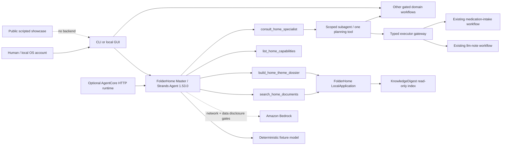

# FolderHome

**English** | [Deutsch](./README.de.md)

> Assistantify your home.

**Current concise README:** Phase 36 / 2026-08-23  
**Direct predecessor:**  
[`docs/archive/README-phase36-draft.md`](./docs/archive/README-phase36-draft.md)

FolderHome is a local-first Strands agent that turns scattered household
documents into searchable, explainable and safely actionable workflows.

FolderHome is a local document and assistance service agent. It combines
document search, reversible file work, and encapsulated everyday services,
without automatically granting mail, calendar, phone, file, or cloud permissions as a result of an analysis.

## Status

- 36 of 36 local competition phases implemented
- one real `strands.Agent` master with four bounded tools and on-demand planning specialists
- 415 of 418 automated tests passed; three live-checkout pin tests fail closed on local HungryCall/Ringedingeding revision drift
- synthetic no-network demo with reproducible hashes
- end-to-end synthetic accident journey over four real, confirmation-gated
  FolderHome workflow adapters
- bilingual light/dark public showcase in [`site/`](./site/) and a tested,
  deployment-ready AgentCore HTTP/ARM64 adapter in
  [`deploy/agentcore/`](./deploy/agentcore/)
- complete baseline scan over 12/12 surfaces plus current 66-file delta audit; four findings resolved
- public MIT repository and [three-minute public demo video](https://youtu.be/2LeWU_WJZKM); no Devpost submission performed

The canonical evidence is in
[`Phase-36-Completion-Audit`](./docs/phase36-completion-audit.md). During the competition the
project is called **FolderHome** exclusively. A later Light-/Sovereign rebranding
is not part of this build.

## Quick test for jurors

Windows PowerShell:

```powershell
git clone https://github.com/ellmos-ai/FolderHome.git
cd FolderHome
python -m venv .venv
.venv\Scripts\python.exe -m pip install -e ".[dev,transform]"
.venv\Scripts\python.exe -m folderhome demo run `
  --output-dir .local-demo\competition `
  --approve-output-write --json
```


macOS/Linux use `.venv/bin/python` instead of
`.venv\Scripts\python.exe`.

Expected are `status=passed`, `strands-agents 1.53.0`, the scenarios
`document-search` and `theme-dossier`, `network_used=false`, an empty
`side_effects` list, and four new files. A second run against the same
folder blocks instead of overwriting.

The detailed English guide is in
[`docs/submission/TESTING_INSTRUCTIONS_EN.md`](./docs/submission/TESTING_INSTRUCTIONS_EN.md).

## Interactive accident journey

Start the real local demo with one command:

```powershell
.venv\Scripts\python.exe -m folderhome demo accident-serve `
  --workspace-dir .local-demo\accident `
  --port 8767 --approve-loopback-server --json
```

Open the emitted token-bearing `access_url`. The English-default interface has
an English/German switch and light/dark themes. It searches synthetic current
and older Hyundai i10 policies, proposes contact, claim-letter, contract and
local-calendar steps, and executes the actual typed adapters only after the
exact displayed `/confirm <plan_id>` command. It never sends mail, calls a
cloud model or archives the older policy automatically. Use **Reset case** to
restore the deterministic fixture.

The public browser walkthrough is in [`site/`](./site/). It is deliberately
labelled as a scripted synthetic showcase with no backend. The repository
command above is the executable evidence.

The accepted competition video is public on YouTube:
<https://youtu.be/2LeWU_WJZKM>.

## Agent architecture




The fixture adapter runs through the real Strands agent and its sequential
tool executor without credentials. Bedrock uses the same agent, but
requires model ID, AWS region, `--allow-network` and the separate approval
`--approve-sensitive-cloud-data`; a Bedrock live run has not been claimed.
Semantic domain selection belongs to the model. Endpoint lookup, plan hashes,
and confirmation remain deterministic and fail closed; personas change style
only and never grant capabilities. Without a private resource registry, the
live executor catalog exposes three connected executors: personal notes,
confirmation of an existing scheduled medication dose, and the strictly local
FindCall fixture cascade. With a configured registry, 23 additional typed
resource adapters connect the complete local document, organization, health,
finance, social-law, inventory, tax, briefing, design, FCSA and routine stack.
A registry that also declares a drafts mailbox (`mail.draft_account`) connects
the draft-only mail endpoint as well. This yields 27 connected endpoints, one
direct read-only path, three intentionally planning-only system endpoints and
only two visible, fail-closed external connector gaps: external calendars and
scheduler registration. Without a configured mailbox, the mail endpoint stays
honestly unconnected and the catalog reports 26 connected endpoints and three
gaps. Each connected adapter publishes a closed request schema. A chat
message never writes; exact confirmation returns a separate domain execution
report for a connected plan. External effects retain their own configuration
and live-effect approvals.

A capability recipe turns a whole journey into one plan. `recipes list` shows
what ships, `recipes plan` resolves one into a single hash-bound multi-step plan,
and `recipes run` executes the confirmed chain in order. The packaged
`accident-aftercare` recipe reads the responsible contact, renders the claim
letter, places exactly that letter as a draft in your own mailbox, and records
the follow-up appointment with an ICS export — four endpoints, one confirmation.
A recipe grants no new capability: each step keeps its own adapter and gates, and
an endpoint that is not connected makes the recipe fail closed instead of
silently skipping it. Details:
[`docs/capability-recipes.md`](./docs/capability-recipes.md).

The recommended CLI entry point is one in-process session. It preserves prepared
plans between turns and accepts approval only through `/confirm <plan_id>`;
`--json` emits one NDJSON event per line for controlled automation.
The same bounded Strands message history now resolves follow-up references in
both GUI and CLI. It is separated by organizational profile, limited to 24
messages by default, never persisted, and cleared together with unconfirmed
plans by **New conversation** or `/reset`.
The GUI exposes the runtime model state directly: deterministic fixture,
configured but not yet verified Bedrock, or Bedrock verified by at least one
successful live model turn in the current process. Configuration alone never
claims a working model connection.

The optional AgentCore surface implements the current AWS HTTP contract on
ARM64 (`GET /ping`, `POST /invocations`, port 8080). It accepts only synthetic
fixture prompts, isolates state by AgentCore runtime session, and cannot ingest
household uploads or perform external actions. The contract is locally tested;
an AWS deployment is not claimed until an image, runtime endpoint and health
check are independently verified.

More: [`ARCHITECTURE.md`](./ARCHITECTURE.md) and
[`docs/submission/ARCHITECTURE_DIAGRAM.md`](./docs/submission/ARCHITECTURE_DIAGRAM.md).

## What FolderHome can do locally

- Extract, index, naturally search documents and summarize them as a topic dossier
  or folder report
- Compare versions and treat older drafts only as an approval‑required,
  reversible archive plan
- Combine folder rules, watches, correction learning, cleanup plans, safe execution,
  audit and undo
- Generate TXT/PDF bundles as well as deterministic ZIP‑type packages
- Organize profiles for Lukas, Hanna or Simon and domain‑specific rules
- Manage contacts, appointment candidates, local calendar and ICS handoffs, and export recorded appointments as one importable ICS file
- Present account statements, virtual accounts, data gaps, subscriptions and contract cockpits with evidence linkage
- Track household inventory, medication schedules and confirmed medication intake
- Create extractive health dossiers and medical report timelines
- Structure official notices, prepare administrative drafts and route official benefit pre‑checks
- Compare local legal‑change snapshots to review candidates
- Plan letter designs, design sets, SVG business cards and office/media handoffs
- Provide controlled mail, calendar, note, tax, daily‑briefing and FindCall workflows

The complete mapping and all limits are in
[`Feature_Analyse_FolderHome.md`](./Feature_Analyse_FolderHome.md).

## Security model

- Default deny for any external effect
- Operating system account and file permissions as security boundary; profiles are only organization within an account
- Exact schemas, canonical paths, source hashes and never‑overwrite
- Separate planning, approval, recheck, execution, audit and undo stages
- Finite budgets for files, bytes, parsers, renderers, HTTP connections,
  agent turns, tool calls and outputs
- Loopback only to `127.0.0.1` with token, host/origin verification and overload limit
- Sensitive local reads only after explicit gate
- Official links only via HTTPS and publisher‑bound host allowlist

FolderHome does not diagnose, does not provide legal, tax or financial advice,
does not determine any benefit entitlement and guarantees neither completeness nor the detection of every appointment.

Details and reporting path: [`SECURITY.md`](./SECURITY.md).

## Private logical resources

FolderHome keeps physical paths outside model-visible plans. Copy the anonymous
example to `%LOCALAPPDATA%\FolderHome\resources.json`, replace only the local
locators and declare the minimum required operations for each stable resource
ID. The registry is bound to one operating-system account, organizational
profiles and explicit purposes. Its public catalog contains no paths.

- Schema: [`config/resources.schema.json`](./config/resources.schema.json)
- Anonymous example:
  [`examples/resources/resources.example.json`](./examples/resources/resources.example.json)

With a configured registry, the master agent can execute existing FolderHome
services for document bundles, contacts, local correspondence, the own
FolderHome calendar, health dossiers, finance import, official-notice reports,
review-only administrative drafts and benefit pre-screening. Every write still
requires the separate exact plan confirmation. External calendar and mail
connectors remain separately gated.

## Important commands

```powershell
# Validate the private resource registry without disclosing physical paths
.venv\Scripts\python.exe -m folderhome resources validate `
  --profiles-dir examples\profiles --json

# List the model-safe logical catalog for one organizational profile
.venv\Scripts\python.exe -m folderhome resources catalog `
  --profiles-dir examples\profiles --profile lukas --json

# Validate the agent configuration without invoking a model
.venv\Scripts\python.exe -m folderhome agent plan `
  --profiles-dir examples\profiles --state-dir .local-state --json

# Start an interactive session with the same master service used by the GUI
.venv\Scripts\python.exe -m folderhome agent session `
  --profiles-dir examples\profiles --state-dir .local-state `
  --profile-id lukas

# Run one non-interactive chat turn
.venv\Scripts\python.exe -m folderhome agent chat `
  --profiles-dir examples\profiles --state-dir .local-state `
  --profile-id lukas --prompt "What can you do?" --json

# Run the reproducible agent demo
.venv\Scripts\python.exe -m folderhome demo run `
  --output-dir .local-demo\competition --approve-output-write --json

# Plan the local loopback chat interface
.venv\Scripts\python.exe -m folderhome app plan `
  --profiles-dir examples\profiles --state-dir .local-state `
  --port 8765 --json

# Start the interface only after the explicit listener gate
.venv\Scripts\python.exe -m folderhome app serve `
  --profiles-dir examples\profiles --state-dir .local-state `
  --port 8765 --approve-loopback-server --json

# Show all CLI commands
.venv\Scripts\python.exe -m folderhome --help
```


The detailed playbooks are located at [`workflows/`](./workflows/) and in the generated [`WORKFLOWS.md`](./WORKFLOWS.md).

## Development verification

```powershell
.venv\Scripts\python.exe -m pytest
.venv\Scripts\python.exe -m ruff check .
.venv\Scripts\python.exe -m compileall -q src tests
.venv\Scripts\python.exe -m folderhome plugins validate --json
.venv\Scripts\python.exe _tools\doc-lint
.venv\Scripts\python.exe _tools\workflows-sync --check
```


The supplied reference evidence is at
[`examples/competition/evidence/`](./examples/competition/evidence/).

## Repository structure and provenance

```text
src/folderhome/       new competition and bridge code
config/               versioned schemas for local-only configuration
skills/               new agent-ready FolderHome skills
workflows/            executable operating playbooks
manifests/            component and future stack contracts
reused/               pinned existing references, no renamed source code
examples/             synthetic fixtures and evidence only
tests/                contract, security and integration tests
docs/submission/      locally prepared English submission materials
docs/archive/         direct historical predecessors of long project documents
```


FCSA, KnowledgeDigest, doc-services, HungryCall, Ringedingeding, llm-note,
steuer-assistent, law-checker and other existing components remain disclosed and revision‑bound. FolderHome does not copy their source code.

- Provenance: [`COMPETITION_CODE_MAP.md`](./COMPETITION_CODE_MAP.md)
- Licenses and pins: [`THIRD_PARTY_LICENSES.md`](./THIRD_PARTY_LICENSES.md)
- Decisions: [`DECISIONS.md`](./DECISIONS.md)
- Changelog: [`CHANGELOG.md`](./CHANGELOG.md)

## Submission limit

English description, diagram, tests, video script and checklist are prepared under
[`docs/submission/`](./docs/submission/). The public
repository is at <https://github.com/ellmos-ai/FolderHome>. AWS Builder
ID remains private to the Devpost form. The approved demo video is public at
<https://youtu.be/2LeWU_WJZKM>; final Devpost submission still requires an
explicit human approval.

## License

FolderHome is under the [MIT license](./LICENSE). The competition code is
made public on GitHub; real services and personal data are excluded.

---
