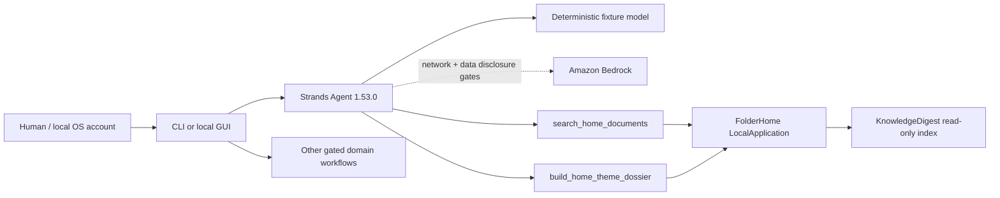

# FolderHome

**English** | [Deutsch](./README.de.md)

> Assistantify your home.

**Current concise README:** Phase 36 / 2026-08-22  
**Direct predecessor:**  
[`docs/archive/README-phase36-draft.md`](./docs/archive/README-phase36-draft.md)

FolderHome is a local-first Strands agent that turns scattered household
documents into searchable, explainable and safely actionable workflows.

FolderHome is a local document and assistance service agent. It combines
document search, reversible file work, and encapsulated everyday services,
without automatically granting mail, calendar, phone, file, or cloud permissions as a result of an analysis.

## Status

- 36 of 36 local competition phases implemented
- real `strands.Agent` with two profile-specific read-only tools
- 333 automated tests passed
- synthetic no-network demo with reproducible hashes
- complete baseline scan over 12/12 surfaces plus current 66-file delta audit; four findings resolved
- public MIT repository; no video upload and no Devpost submission performed

The canonical evidence is in
[`Phase-36-Completion-Audit`](./docs/phase36-completion-audit.md). During the competition the
project is called **FolderHome** exclusively. A later Light-/Sovereign rebranding
is not part of this build.

## Quick test for jurors

Windows PowerShell:

```powershell
git clone https://github.com/ellmos-ai/FolderHome.git
cd FolderHome
python -m venv .venv
.venv\Scripts\python.exe -m pip install -e ".[dev,transform]"
.venv\Scripts\python.exe -m folderhome demo run `
  --output-dir .local-demo\competition `
  --approve-output-write --json
```


macOS/Linux use `.venv/bin/python` instead of
`.venv\Scripts\python.exe`.

Expected are `status=passed`, `strands-agents 1.53.0`, the scenarios
`document-search` and `theme-dossier`, `network_used=false`, an empty
`side_effects` list, and four new files. A second run against the same
folder blocks instead of overwriting.

The detailed English guide is in
[`docs/submission/TESTING_INSTRUCTIONS_EN.md`](./docs/submission/TESTING_INSTRUCTIONS_EN.md).

## Agent architecture




The fixture adapter runs through the real Strands agent and its sequential
tool executor without credentials. Bedrock uses the same agent, but
requires model ID, AWS region, `--allow-network` and the separate approval
`--approve-sensitive-cloud-data`; a Bedrock live run has not been claimed.

More: [`ARCHITECTURE.md`](./ARCHITECTURE.md) and
[`docs/submission/ARCHITECTURE_DIAGRAM.md`](./docs/submission/ARCHITECTURE_DIAGRAM.md).

## What FolderHome can do locally

- Extract, index, naturally search documents and summarize them as a topic dossier
  or folder report
- Compare versions and treat older drafts only as an approval‑required,
  reversible archive plan
- Combine folder rules, watches, correction learning, cleanup plans, safe execution,
  audit and undo
- Generate TXT/PDF bundles as well as deterministic ZIP‑type packages
- Organize profiles for Lukas, Hanna or Simon and domain‑specific rules
- Manage contacts, appointment candidates, local calendar and ICS handoffs
- Present account statements, virtual accounts, data gaps, subscriptions and contract cockpits with evidence linkage
- Track household inventory, medication schedules and confirmed medication intake
- Create extractive health dossiers and medical report timelines
- Structure official notices, prepare administrative drafts and route official benefit pre‑checks
- Compare local legal‑change snapshots to review candidates
- Plan letter designs, design sets, SVG business cards and office/media handoffs
- Provide controlled mail, calendar, note, tax, daily‑briefing and FindCall workflows

The complete mapping and all limits are in
[`Feature_Analyse_FolderHome.md`](./Feature_Analyse_FolderHome.md).

## Security model

- Default deny for any external effect
- Operating system account and file permissions as security boundary; profiles are only organization within an account
- Exact schemas, canonical paths, source hashes and never‑overwrite
- Separate planning, approval, recheck, execution, audit and undo stages
- Finite budgets for files, bytes, parsers, renderers, HTTP connections,
  agent turns, tool calls and outputs
- Loopback only to `127.0.0.1` with token, host/origin verification and overload limit
- Sensitive local reads only after explicit gate
- Official links only via HTTPS and publisher‑bound host allowlist

FolderHome does not diagnose, does not provide legal, tax or financial advice,
does not determine any benefit entitlement and guarantees neither completeness nor the detection of every appointment.

Details and reporting path: [`SECURITY.md`](./SECURITY.md).

## Important commands

```powershell
# Validate the agent configuration without invoking a model
.venv\Scripts\python.exe -m folderhome agent plan `
  --profiles-dir examples\profiles --state-dir .local-state --json

# Run the reproducible agent demo
.venv\Scripts\python.exe -m folderhome demo run `
  --output-dir .local-demo\competition --approve-output-write --json

# Plan the local read-only interface
.venv\Scripts\python.exe -m folderhome app plan `
  --profiles-dir examples\profiles --state-dir .local-state `
  --port 8765 --json

# Start the interface only after the explicit listener gate
.venv\Scripts\python.exe -m folderhome app serve `
  --profiles-dir examples\profiles --state-dir .local-state `
  --port 8765 --approve-loopback-server --json

# Show all CLI commands
.venv\Scripts\python.exe -m folderhome --help
```


The detailed playbooks are located at [`workflows/`](./workflows/) and in the generated [`WORKFLOWS.md`](./WORKFLOWS.md).

## Development verification

```powershell
.venv\Scripts\python.exe -m pytest
.venv\Scripts\python.exe -m ruff check .
.venv\Scripts\python.exe -m compileall -q src tests
.venv\Scripts\python.exe -m folderhome plugins validate --json
.venv\Scripts\python.exe _tools\doc-lint
.venv\Scripts\python.exe _tools\workflows-sync --check
```


The supplied reference evidence is at
[`examples/competition/evidence/`](./examples/competition/evidence/).

## Repository structure and provenance

```text
src/folderhome/       new competition and bridge code
skills/               new agent-ready FolderHome skills
workflows/            executable operating playbooks
manifests/            component and future stack contracts
reused/               pinned existing references, no renamed source code
examples/             synthetic fixtures and evidence only
tests/                contract, security and integration tests
docs/submission/      locally prepared English submission materials
docs/archive/         direct historical predecessors of long project documents
```


FCSA, KnowledgeDigest, doc-services, HungryCall, Ringedingeding, llm-note,
steuer-assistent, law-checker and other existing components remain disclosed and revision‑bound. FolderHome does not copy their source code.

- Provenance: [`COMPETITION_CODE_MAP.md`](./COMPETITION_CODE_MAP.md)
- Licenses and pins: [`THIRD_PARTY_LICENSES.md`](./THIRD_PARTY_LICENSES.md)
- Decisions: [`DECISIONS.md`](./DECISIONS.md)
- Changelog: [`CHANGELOG.md`](./CHANGELOG.md)

## Submission limit

English description, diagram, tests, video script and checklist are prepared under
[`docs/submission/`](./docs/submission/). The public
repository is at <https://github.com/ellmos-ai/FolderHome>. AWS Builder
ID, video capture/upload, live demo and Devpost submission each require an
explicit human approval.

## License

FolderHome is under the [MIT license](./LICENSE). The competition code is
made public on GitHub; real services and personal data are excluded.

---
