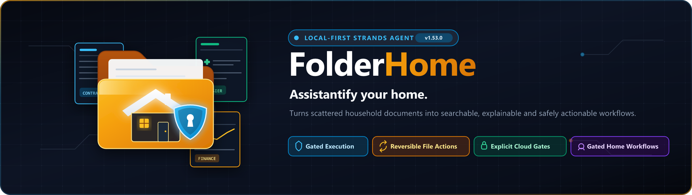
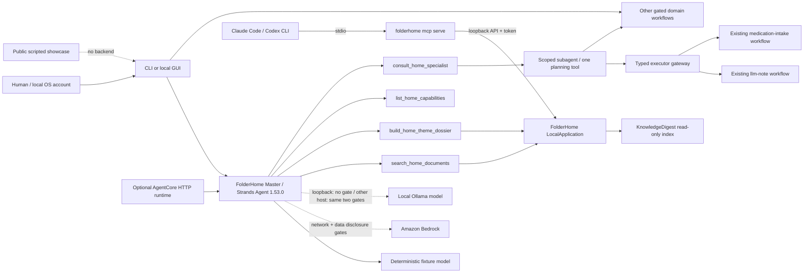

# FolderHome

**English** | [Deutsch](./README.de.md)

> Assistantify your home.

**Current concise README:** Phase 36 / 2026-08-23  
**Direct predecessor:**  
[`docs/archive/README-phase36-draft.md`](./docs/archive/README-phase36-draft.md)

FolderHome is a local-first Strands agent that turns scattered household
documents into searchable, explainable and safely actionable workflows.

FolderHome is a local document and assistance service agent. It combines
document search, reversible file work, and encapsulated everyday services,
without automatically granting mail, calendar, phone, file, or cloud permissions as a result of an analysis.

## Status

- 36 of 36 local competition phases implemented
- one real `strands.Agent` master with four bounded tools and on-demand planning specialists
- full feature suite: 503 passed, zero failed; repeated after the 2026-08-27
  provenance repin with 503/503 passing, while the manifest check passed 10/10
- synthetic no-network demo with reproducible hashes
- end-to-end synthetic accident journey over four real, confirmation-gated
  FolderHome workflow adapters
- bilingual light/dark public showcase in [`site/`](./site/) and a deployed,
  quota-bounded AgentCore HTTP runtime; its public browser path stays disabled
  while Bedrock's applied on-demand quotas remain zero
- complete baseline scan over 12/12 surfaces plus current 66-file delta audit; four findings resolved
- public MIT repository, [three-minute public demo video](https://youtu.be/wPb1wBJcLjQ)
  and a submitted [Agents for Humans entry](https://devpost.com/software/folderhome)

The canonical evidence is in
[`Phase-36-Completion-Audit`](./docs/phase36-completion-audit.md). During the competition the
project is called **FolderHome** exclusively. A later Light-/Sovereign rebranding
is not part of this build.

## Quick test for jurors

Windows PowerShell:

```powershell
git clone https://github.com/ellmos-ai/FolderHome.git
cd FolderHome
python -m venv .venv
.venv\Scripts\python.exe -m pip install -e ".[dev,transform]"
.venv\Scripts\python.exe -m folderhome demo run `
  --output-dir .local-demo\competition `
  --approve-output-write --json
```


macOS/Linux use `.venv/bin/python` instead of
`.venv\Scripts\python.exe`.

Expected are `status=passed`, `strands-agents 1.53.0`, the scenarios
`document-search` and `theme-dossier`, `network_used=false`, an empty
`side_effects` list, and four new files. A second run against the same
folder blocks instead of overwriting.

The detailed English guide is in
[`docs/submission/TESTING_INSTRUCTIONS_EN.md`](./docs/submission/TESTING_INSTRUCTIONS_EN.md).

## Interactive accident journey

Start the real local demo with one command:

```powershell
.venv\Scripts\python.exe -m folderhome demo accident-serve `
  --workspace-dir .local-demo\accident `
  --port 8767 --approve-loopback-server --json
```

Open the emitted token-bearing `access_url`. The English-default interface has
an English/German switch and light/dark themes. It searches synthetic current
and older Hyundai i10 policies, proposes contact, claim-letter, contract and
local-calendar steps, and executes the actual typed adapters only after the
exact displayed `/confirm <plan_id>` command. It never sends a message, calls a
cloud model or archives the older policy automatically. A separately gated
recipe can place the prepared letter as a reviewable draft in the user's own
mailbox without any send path. Use **Reset case** to restore the deterministic
fixture.

The public browser walkthrough is in [`site/`](./site/). It is deliberately
labelled as a scripted synthetic showcase with no backend. The repository
command above is the executable evidence.

The accepted competition video is public on YouTube:
<https://youtu.be/wPb1wBJcLjQ>.

## Agent architecture




The fixture adapter runs through the real Strands agent and its sequential
tool executor without credentials. Bedrock uses the same agent, but
requires model ID, AWS region, `--allow-network` and the separate approval
`--approve-sensitive-cloud-data`; a Bedrock live run has not been claimed. A
local Ollama model is the third provider and was verified live: the model
selected and executed `list_home_capabilities` through the same agent loop.
Semantic domain selection belongs to the model. Endpoint lookup, plan hashes,
and confirmation remain deterministic and fail closed; personas change style
only and never grant capabilities. Without a private resource registry, the
live executor catalog exposes three connected executors: personal notes,
confirmation of an existing scheduled medication dose, and the strictly local
FindCall fixture cascade. With a configured registry, 23 additional typed
resource adapters connect the complete local document, organization, health,
finance, social-law, inventory, tax, briefing, design, FCSA and routine stack.
A registry that also declares a drafts mailbox (`mail.draft_account`) connects
the draft-only mail endpoint as well. This yields 27 connected endpoints, one
direct read-only path, three intentionally planning-only system endpoints and
only two visible, fail-closed external connector gaps: external calendars and
scheduler registration. Without a configured mailbox, the mail endpoint stays
honestly unconnected and the catalog reports 26 connected endpoints and three
gaps. Each connected adapter publishes a closed request schema. A chat
message never writes; exact confirmation returns a separate domain execution
report for a connected plan. External effects retain their own configuration
and live-effect approvals.

A capability recipe turns a whole journey into one plan. `recipes list` shows
what ships, `recipes plan` resolves one into a single hash-bound multi-step plan,
and `recipes run` executes the confirmed chain in order. The packaged
`accident-aftercare` recipe reads the responsible contact, renders the claim
letter, places exactly that letter as a draft in your own mailbox, and records
the follow-up appointment with an ICS export — four endpoints, one confirmation.
A recipe grants no new capability: each step keeps its own adapter and gates, and
an endpoint that is not connected makes the recipe fail closed instead of
silently skipping it. Details:
[`docs/capability-recipes.md`](./docs/capability-recipes.md).

The recommended CLI entry point is one in-process session. It preserves prepared
plans between turns and accepts approval only through `/confirm <plan_id>`;
`--json` emits one NDJSON event per line for controlled automation.
The same bounded Strands message history now resolves follow-up references in
both GUI and CLI. It is separated by organizational profile, limited to 24
messages by default, never persisted, and cleared together with unconfirmed
plans by **New conversation** or `/reset`.
The GUI exposes the runtime model state directly: deterministic fixture,
configured but not yet verified Bedrock, or Bedrock verified by at least one
successful live model turn in the current process. Configuration alone never
claims a working model connection.

Because that surface exposes no file route, a confirmed run returns its result
files inline in the answer, and the browser builds the download from it. Files
above 262 144 bytes, and files whose text contains the workspace path, travel as
metadata only and say why.

The optional AgentCore surface implements the current AWS HTTP contract on
ARM64 (`GET /ping`, `POST /invocations`, port 8080). It accepts only synthetic
fixture prompts, isolates state by AgentCore runtime session, and cannot ingest
household uploads or perform external actions. The quota-bounded runtime was
deployed and most recently read back as `READY` on 2026-08-27; its fixture roundtrip reached
`confirmation_required`. The public CloudFront configuration remains
`enabled: false`, and no successful Bedrock-backed journey is claimed while
Nova Micro's applied on-demand quotas remain zero.

More: [`ARCHITECTURE.md`](./ARCHITECTURE.md) and
[`docs/submission/ARCHITECTURE_DIAGRAM.md`](./docs/submission/ARCHITECTURE_DIAGRAM.md).

## What FolderHome can do locally

- Extract, index, naturally search documents and summarize them as a topic dossier
  or folder report
- Compare versions and treat older drafts only as an approval‑required,
  reversible archive plan
- Combine folder rules, watches, correction learning, cleanup plans, safe execution,
  audit and undo
- Generate TXT/PDF bundles as well as deterministic ZIP‑type packages
- Organize profiles for Lukas, Hanna or Simon and domain‑specific rules
- Manage contacts, appointment candidates, local calendar and ICS handoffs, and export recorded appointments as one importable ICS file
- Present account statements, virtual accounts, data gaps, subscriptions and contract cockpits with evidence linkage
- Track household inventory, medication schedules and confirmed medication intake
- Create extractive health dossiers and medical report timelines
- Structure official notices, prepare administrative drafts and route official benefit pre‑checks
- Compare local legal‑change snapshots to review candidates
- Plan letter designs, design sets, SVG business cards and office/media handoffs
- Provide controlled mail, calendar, note, tax, daily‑briefing and FindCall workflows

The complete mapping and all limits are in
[`Feature_Analyse_FolderHome.md`](./Feature_Analyse_FolderHome.md).

## Security model

- Default deny for any external effect
- Operating system account and file permissions as security boundary; profiles are only organization within an account
- Exact schemas, canonical paths, source hashes and never‑overwrite
- Separate planning, approval, recheck, execution, audit and undo stages
- Finite budgets for files, bytes, parsers, renderers, HTTP connections,
  agent turns, tool calls and outputs
- Loopback only to `127.0.0.1` with token, host/origin verification and overload limit
- Sensitive local reads only after explicit gate
- Official links only via HTTPS and publisher‑bound host allowlist

FolderHome does not diagnose, does not provide legal, tax or financial advice,
does not determine any benefit entitlement and guarantees neither completeness nor the detection of every appointment.

Details and reporting path: [`SECURITY.md`](./SECURITY.md).

## Private logical resources

FolderHome keeps physical paths outside model-visible plans. Copy the anonymous
example to `%LOCALAPPDATA%\FolderHome\resources.json`, replace only the local
locators and declare the minimum required operations for each stable resource
ID. The registry is bound to one operating-system account, organizational
profiles and explicit purposes. Its public catalog contains no paths.

- Schema: [`config/resources.schema.json`](./config/resources.schema.json)
- Anonymous example:
  [`examples/resources/resources.example.json`](./examples/resources/resources.example.json)

With a configured registry, the master agent can execute existing FolderHome
services for document bundles, contacts, local correspondence, the own
FolderHome calendar, health dossiers, finance import, official-notice reports,
review-only administrative drafts and benefit pre-screening. Every write still
requires the separate exact plan confirmation. Draft-only IMAP mail is
available only with a `mail.draft_account` resource and the separate
`--approve-mail-draft` gate. External calendar connectors and scheduler
registration remain unconnected and separately gated.
The full registry reports 27 connected, one direct read-only, three
planning-only and two unconnected endpoints.

## Local model via Ollama

The master agent can run on a local Ollama model instead of the deterministic
fixture or Amazon Bedrock. The gates follow the transport, not the vendor: an
Ollama host on the loopback interface needs no gate at all, because nothing
leaves this machine. Any other host, including one on your own private network,
needs exactly the same two approvals as Bedrock, `--allow-network` and
`--approve-sensitive-cloud-data`.

The word "cloud" in that flag name means "outside this operating system
account", not "outside your home". FolderHome cannot know whether the machine
behind an address belongs to you, so it asks once for the network and once for
the data, in both cases.

```powershell
# Optional extra; the provider is not imported unless you select it
.venv\Scripts\pip.exe install -e ".[ollama]"

# A model on this machine: no gate, because nothing leaves the loopback interface
.venv\Scripts\python.exe -m folderhome agent chat `
  --profiles-dir examples\profiles --state-dir .local-state `
  --model-provider ollama --ollama-model-id qwen3.8:27b-mlx `
  --profile-id lukas --prompt "What can you do?" --json

# A model on another machine: both approvals, exactly like Bedrock
.venv\Scripts\python.exe -m folderhome agent chat `
  --profiles-dir examples\profiles --state-dir .local-state `
  --model-provider ollama --ollama-host http://192.0.2.10:11434 `
  --ollama-model-id qwen3.8:27b-mlx `
  --allow-network --approve-sensitive-cloud-data `
  --profile-id lukas --prompt "What can you do?" --json
```

`--ollama-host` defaults to `http://127.0.0.1:11434`. The model id is always
required and never guessed. The status endpoint and the GUI report a local model
as a local model: `model_inference_location` becomes `local_ollama_host` or
`remote_ollama_host` instead of `aws_cloud`, and no run claims a verified
connection before one successful live turn in the same process.


## Model providers

Five providers, in the order they cost you privacy: `fixture` (deterministic, no
model at all), `ollama` on the loopback interface (a model on this machine),
`ollama` on another host, `bedrock`, `anthropic`, `openai`. Everything from the
third onwards leaves this machine and therefore needs both approvals,
`--allow-network` and `--approve-sensitive-cloud-data`.

```powershell
# Optional extras; a provider is not imported unless you select it
.venv\Scripts\pip.exe install -e ".[anthropic]"
.venv\Scripts\pip.exe install -e ".[openai]"

.venv\Scripts\python.exe -m folderhome agent chat `
  --profiles-dir examples\profiles --state-dir .local-state `
  --model-provider anthropic --anthropic-model-id claude-sonnet-4-5-20250929 `
  --allow-network --approve-sensitive-cloud-data `
  --profile-id lukas --prompt "What can you do?" --json
```

An API key is never a setting. It is read from `ANTHROPIC_API_KEY` or
`OPENAI_API_KEY` when the model is built, and it appears in no plan, status,
report or log. The installer stores it in a `.env` file beside `launch.json`,
which starting with `--launch-config` reads back for those two names only, and
only when the environment does not already carry them. `--openai-base-url` points
the OpenAI provider at a compatible endpoint, which is why the status calls that
location `openai_compatible_api` rather than claiming OpenAI.

Every provider that speaks HTTP shares one finite budget,
`--model-timeout-seconds` (default 120). A model that stays silent past it
fails with that number in the message instead of hanging; Bedrock keeps its own
connect and read pair.

Saved model presets live in `launch.json` under `model_presets`, with
`model_preset` naming the active one. Switching models is activating another
preset and saving; the app reads it at the next start. Precedence when starting:
an explicit command-line flag beats a flat field in the file, and a flat field
beats the active preset.

## Use FolderHome from Claude Code or Codex (MCP)

`folderhome mcp serve` publishes the same bounded surface over the Model Context
Protocol on stdio, so a coding agent can search your documents, ask the master
agent and approve a plan. The server holds no state of its own: it is a proxy
over the loopback API of a running `app serve`. Editor and GUI therefore share
one process, one conversation and one set of proposed plans.

Start the app first and copy its access URL; the token is new on every start.

```powershell
# 1. Start the local app and note the access_url it prints
.venv\Scripts\python.exe -m folderhome app serve `
  --profiles-dir examples\profiles --state-dir .local-state `
  --port 8765 --approve-loopback-server --json

# 2. Print the ready-made integration for both editors
.venv\Scripts\python.exe -m folderhome mcp plan `
  --access-url "http://127.0.0.1:8765/?token=<token>" --json
```

`mcp plan` emits the exact `claude mcp add folderhome -- ...` command and the
matching `[mcp_servers.folderhome]` block for `~/.codex/config.toml`. The
address must be `127.0.0.1`; any other host is refused before the server starts,
as is a missing `--approve-mcp-server`. Eleven tools are exposed:
`folderhome_status`, `_profiles`, `_capabilities`, `_executors`, `_resources`,
`_results`, `_search_documents`, `_topic_dossier`, `_chat`, `_confirm_plan` and
`_reset_conversation`.

Chat over MCP is no more an approval than chat in the GUI. A proposed plan runs
only through `folderhome_confirm_plan` with its exact hash and the selected step
ids; a wrong hash is refused and the refusal reaches the editor verbatim.

Because the token is new on every `app serve` start, the editor entry it was
written into goes stale with it: run `mcp plan` again after each restart and
replace the stored command, or export the current URL as `FOLDERHOME_ACCESS_URL`
and register the server without `--access-url`.

## Results you can pick up

Everything a confirmed plan produces stays reachable in the GUI, even when the
run was started elsewhere. The **Results** panel lists what this process
executed for the selected profile, newest first, with the workflow, the status,
the time and the files the run wrote. One click downloads a file through the
token-protected API; the browser never sees a filesystem path, because the list
carries only the basename, the size and an index.

That closes the gap between the three ways in: a plan confirmed through the API
or through an editor over MCP shows up in the same panel as one confirmed in the
GUI, because all three drive the same process.

Only files inside a registered output resource of that profile are offered, and
only under the name the execution report itself declares. Runs that merely
change local state, for example a confirmed medication dose, appear with no file
and say so.

## Set up FolderHome (local installer)

FolderHome's own GUI never writes configuration. A separate installer does, on
its own loopback port, with its own token and behind the same explicit listener
gate. That split is the point: the program you chat with cannot change where it
is allowed to read and write.

```powershell
# Show what the installer would configure, without starting a listener
.venv\Scripts\python.exe -m folderhome setup plan `
  --profiles-dir examples\profiles --json

# Start the installer and open the printed access_url in a browser
.venv\Scripts\python.exe -m folderhome setup serve `
  --profiles-dir examples\profiles --port 8766 `
  --approve-loopback-server --json
```

The page walks through six steps: folders, model presets, API keys, runtime
values, calendar, and a summary. Nothing is stored automatically. Nothing is
written until you press Save, and the server accepts a save only together with
the hash of exactly the plan it showed you. Folders are checked before that:
they must exist, must not be symbolic links, and one outside your own user
folder needs an explicit tick.

Each folder field has a Choose folder button that asks the operating system for
a real directory, because a browser cannot hand over an absolute path; typing
the path stays possible, and stays the fallback where no dialog toolkit is
installed. A source purpose (`documents.source`, `insurance.source`) takes
several folders: the first one becomes the profile default, and the agent sees
every one of them in its resource catalogue. Output purposes
(`documents.output`, `correspondence.output`, `calendar.export_output`) stay
single, because a write needs one destination.

Saving writes two files into your configuration folder, by default
`%LOCALAPPDATA%\FolderHome\`:

| File | Content |
|---|---|
| `resources.json` | the private resource registry, validated against the same contract the app loads |
| `launch.json` | the start-up values for `app serve`: profiles, state folder, registry, model, presets, port |
| `.env` | the hosted-provider API keys, written only here and never read back into the page |
| `calendar.json` | default calendar backend, time zone and UpToday ICS folder, when you enable that section |
| `calendar-accounts.json` | calendar connector accounts, when you add one |

An existing file is kept as a `.bak-<timestamp>` copy, except `.env`, which
never leaves a backup because a backup of a key is a second copy of a key. Every
file is staged in a temporary file, loaded back through the contract it belongs
to, and only then put in place: a plan that turns out unloadable leaves the
previous state exactly as it was. No file besides `.env` ever holds a secret:
the drafts mailbox and a calendar account both keep a reference to a local
credentials file, not the credentials.

The calendar files are read by the `calendar` commands, not by `app serve`, and
this build has no Outlook backend. The installer says both, and offers only the
four backends that exist.

Saving replaces `resources.json` completely rather than merging into it. If you
extended the registry by hand, for example with a drafts mailbox or a calendar
state folder, those entries are lost on save. The previous version stays next to
it as `.bak-<timestamp>`, so you can copy the additions back.

Start the app with what was written:

```powershell
.venv\Scripts\python.exe -m folderhome app serve `
  --launch-config $env:LOCALAPPDATA\FolderHome\launch.json `
  --approve-loopback-server --json
```

`--launch-config` supplies defaults only. An explicit flag on the command line
always wins, and the gates are deliberately not part of the file: `--allow-network`,
`--approve-sensitive-cloud-data` and `--approve-loopback-server` stay start-up
flags, so no file can grant them.

In the AWS or browser variant there are no local output folders at all. There the
results view is the delivery path, and files land in the browser's own download
folder.

## Direct HTTP API

The same loopback service the GUI uses is a plain JSON API. `app serve` prints
its `access_url`, which carries the session token that changes on every start.
Browser routes read that token from the query string; every `/api/` route reads
it from the `X-FolderHome-Token` header instead.

| Method and route | Purpose |
|---|---|
| `GET /api/v1/status` | runtime boundary and model connection |
| `GET /api/v1/profiles` | organizational profiles |
| `GET /api/v1/capabilities` | capabilities and how each is surfaced |
| `GET /api/v1/agent/executors` | which workflows have a connected executor |
| `GET /api/v1/resources?profile_id=…` | logical resources, no paths |
| `GET /api/v1/agent/results?profile_id=…&limit=…` | what already ran, newest first |
| `GET /api/v1/agent/results/<execution_id>/artifacts/<index>` | one produced file as a download |
| `POST /api/v1/documents/search` | read-only document search |
| `POST /api/v1/documents/dossier` | topic dossier with linked evidence |
| `POST /api/v1/agent/chat` | one bounded master-agent turn |
| `POST /api/v1/agent/confirm` | approve exact steps of one proposed plan |
| `POST /api/v1/agent/conversation/reset` | new process-local conversation |

Every POST body is a closed schema: unknown or missing fields are refused rather
than ignored, and the request limit is 65 536 bytes.

```bash
TOKEN="<token from access_url>"
BASE="http://127.0.0.1:8765"

# Ask the agent; the answer may contain a proposed plan
curl -s "$BASE/api/v1/agent/chat" \
  -H "X-FolderHome-Token: $TOKEN" -H "Content-Type: application/json" \
  -d '{"schema":"folderhome.local-agent-chat-request.v1",
       "profile_id":"lukas","message":"What can you do?"}'

# Approve exactly that plan; chat alone never executes anything
curl -s "$BASE/api/v1/agent/confirm" \
  -H "X-FolderHome-Token: $TOKEN" -H "Content-Type: application/json" \
  -d '{"schema":"folderhome.local-agent-confirmation-request.v1",
       "plan_id":"<plan_id>","plan_sha256":"<plan_sha256>",
       "step_ids":["<step_id>"]}'

# Pick up what it produced
curl -s "$BASE/api/v1/agent/results?profile_id=lukas" \
  -H "X-FolderHome-Token: $TOKEN"
curl -s -OJ "$BASE/api/v1/agent/results/<execution_id>/artifacts/0" \
  -H "X-FolderHome-Token: $TOKEN"
```

The service binds to `127.0.0.1` only, checks the `Host` header against that
binding, rejects a foreign browser `Origin`, and sends no CORS headers. It is an
interface for programs on this machine, not a network service.

## Important commands

```powershell
# Validate the private resource registry without disclosing physical paths
.venv\Scripts\python.exe -m folderhome resources validate `
  --profiles-dir examples\profiles --json

# List the model-safe logical catalog for one organizational profile
.venv\Scripts\python.exe -m folderhome resources catalog `
  --profiles-dir examples\profiles --profile lukas --json

# Validate the agent configuration without invoking a model
.venv\Scripts\python.exe -m folderhome agent plan `
  --profiles-dir examples\profiles --state-dir .local-state --json

# Start an interactive session with the same master service used by the GUI
.venv\Scripts\python.exe -m folderhome agent session `
  --profiles-dir examples\profiles --state-dir .local-state `
  --profile-id lukas

# Run one non-interactive chat turn
.venv\Scripts\python.exe -m folderhome agent chat `
  --profiles-dir examples\profiles --state-dir .local-state `
  --profile-id lukas --prompt "What can you do?" --json

# Run the reproducible agent demo
.venv\Scripts\python.exe -m folderhome demo run `
  --output-dir .local-demo\competition --approve-output-write --json

# Plan the local loopback chat interface
.venv\Scripts\python.exe -m folderhome app plan `
  --profiles-dir examples\profiles --state-dir .local-state `
  --port 8765 --json

# Start the interface only after the explicit listener gate
.venv\Scripts\python.exe -m folderhome app serve `
  --profiles-dir examples\profiles --state-dir .local-state `
  --port 8765 --approve-loopback-server --json

# Show all CLI commands
.venv\Scripts\python.exe -m folderhome --help
```


The detailed playbooks are located at [`workflows/`](./workflows/) and in the generated [`WORKFLOWS.md`](./WORKFLOWS.md).

## Development verification

```powershell
.venv\Scripts\python.exe -m pytest
.venv\Scripts\python.exe -m ruff check .
.venv\Scripts\python.exe -m compileall -q src tests
.venv\Scripts\python.exe -m folderhome plugins validate --json
.venv\Scripts\python.exe _tools\doc-lint
.venv\Scripts\python.exe _tools\workflows-sync --check
```


The supplied reference evidence is at
[`examples/competition/evidence/`](./examples/competition/evidence/).

## Repository structure and provenance

```text
src/folderhome/       new competition and bridge code
config/               versioned schemas for local-only configuration
skills/               new agent-ready FolderHome skills
workflows/            executable operating playbooks
manifests/            component and future stack contracts
reused/               pinned existing references, no renamed source code
examples/             synthetic fixtures and evidence only
tests/                contract, security and integration tests
docs/submission/      locally prepared English submission materials
docs/archive/         direct historical predecessors of long project documents
```


FCSA, KnowledgeDigest, doc-services, HungryCall, Ringedingeding, llm-note,
steuer-assistent, law-checker and other existing components remain disclosed and revision‑bound. FolderHome does not copy their source code.

- Provenance: [`COMPETITION_CODE_MAP.md`](./COMPETITION_CODE_MAP.md)
- Licenses and pins: [`THIRD_PARTY_LICENSES.md`](./THIRD_PARTY_LICENSES.md)
- Decisions: [`DECISIONS.md`](./DECISIONS.md)
- Changelog: [`CHANGELOG.md`](./CHANGELOG.md)

## Submission limit

English description, diagram, tests, video script and checklist are prepared under
[`docs/submission/`](./docs/submission/). The public
repository is at <https://github.com/ellmos-ai/FolderHome>. AWS Builder
ID remains private to the Devpost form. The approved demo video is public at
<https://youtu.be/wPb1wBJcLjQ>. The user submitted FolderHome to Agents for
Humans on 2026-08-23; the authenticated readback records
`submitted_at=2026-08-23T17:14:05.813-04:00`.

## License

FolderHome is under the [MIT license](./LICENSE). The competition code is
made public on GitHub; real services and personal data are excluded.

---
