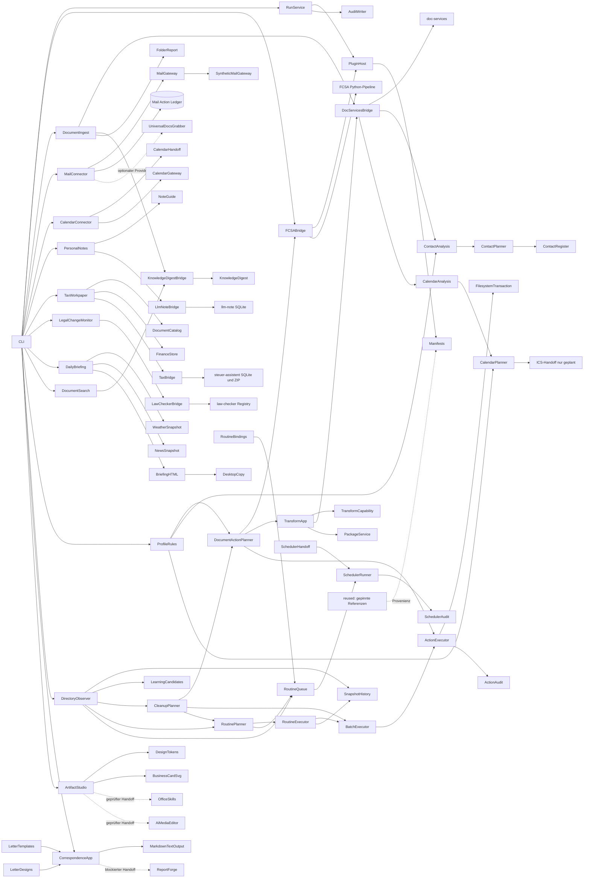

# ARCHITECTURE.md — Architektur und Grenzen

[English](./ARCHITECTURE-v0.34.md) | **Deutsch**

**Version:** 0.34
**Aktualisiert:** 2026-08-22
**Grund:** Gepinnten Rechtsquellen-Provider und lokalen Änderungsmonitor ergänzt
**Zweck:** Beschreibt Komponenten, Datenfluss und Sicherheitsgrenzen.

## Überblick

FolderHome ist ein neuer Integrationskern. Vorbestehende Komponenten werden
nicht verschmolzen, sondern über gepinnte Manifeste beschrieben und durch
neuen Bridge-Code angebunden. Der Plugin-Host validiert Fähigkeiten,
Side-Effects und Gates, bevor eine Ausführung überhaupt geplant werden darf.



## Bereiche

| Pfad | Verantwortung |
|---|---|
| `src/folderhome/contracts/` | stabile Daten- und Statusverträge |
| `src/folderhome/plugin_host/` | Manifestladen und fail-closed Validierung |
| `src/folderhome/application/` | Ablaufsteuerung ohne domänenspezifische Side-Effects |
| `src/folderhome/capabilities/audit/` | atomare, nachvollziehbare Laufberichte |
| `src/folderhome/bridges/` | installierbare Adapter zu separat versionierten Komponenten |
| `bridges/` | Provider-Dokumentation und Integrationsgrenzen |
| `reused/` | maschinenlesbare Referenzen, kein kopierter Quellcode |
| `manifests/` | deklarative Runtime- und Provenienzverträge |
| `skills/` | agentisch steuerbare, gekapselte Fähigkeiten |

## Phase-1-Datenfluss

```text
CLI-Anfrage → Manifestprüfung → Gate-Prüfung → synthetische Ausführung
           → RunReport → atomare JSON-Datei und/oder JSON-stdout
```

## Phase-2-Datenfluss

```text
CLI-Anfrage → FCSA-Manifest und Checkout-Pin prüfen → Konfiguration validieren
           → temporären Schattenzustand erzeugen → FCSA-Dry-Run
           → Aktionen in RunReport übersetzen → atomare JSON-Datei
```

FCSAs Dry-Run legt normalerweise eine Bestätigung in seinem `state_dir` ab.
Die FolderHome-Bridge ersetzt für den Planlauf ausschließlich `state_dir` und
`trash_dir` durch ein temporäres Verzeichnis. Eingangsordner, Zielordner und
produktiver FCSA-State bleiben unverändert; das temporäre Verzeichnis wird
nach dem Lauf entfernt.

## Phase-3-Datenfluss

```text
Ordner + explizites Index-Gate
  → doc-services: Extraktion ohne Lernen und ohne OCR
  → DocumentRecord: Hash, Herkunft, Datenschutz- und Indexstatus
  → KnowledgeDigest.ingest(..., archive=False)
  → lokaler FolderHome-Zustandsordner
  → schreibgeschützte Suche / Themendossier / extraktiver Ordnerbericht
```

Die Quelldatei wird vor dem Indexieren erneut gehasht. Stimmt sie nicht mehr
mit dem Extraktionsstand überein, bricht die Bridge fail-closed ab.
KnowledgeDigest schreibt bei seiner öffentlichen Suchmethode auch
Schema-/WAL-Metadaten. FolderHome verwendet für die Suche deshalb einen eng
gekapselten SQLite-Leseadapter im Modus `ro`/`immutable` und prüft zuvor die
Schema-Version des gepinnten Providers. Nur die Indexierung nutzt die
öffentliche KnowledgeDigest-Ingest-API; direkte Datenbankschreibvorgänge gibt
es in FolderHome nicht.

Der Ordnerbericht ist derzeit deterministisch und extraktiv. Er übernimmt
höchstens zwei oder drei Sätze aus Dokumenten mit Datenschutzstatus `clear`.
Bei `review_required`, `blocked` oder `not_checked` wird kein Inhalt kopiert.
Eine freie LLM-Synthese und formatierte DOCX-/ODT-Ausgabe sind spätere,
gesondert gegatete Provider-Schritte.

## Phase-4-Datenfluss

```text
freigegebener Ingest
  → folderhome-catalog.json ohne Rohtext
  → natürliche Versionsanfrage
  → schreibgeschützte KnowledgeDigest-Suche
  → katalogisierte Quellen erneut hashen und extrahieren
  → explizites Dokumentdatum > Dateiname > Änderungsdatum
  → Satzvergleich zur neuesten Fassung
  → ungefreigte Archivierungsvorschläge
  → echter FCSA-Dry-Run pro älterer Fassung
```

Der FolderHome-Katalog ist eine atomar geschriebene Metadatenbrücke, kein
zweiter Inhaltsindex. Eine nach dem Ingest geänderte Quelle passt nicht mehr
zu Dokument-ID und SHA-256 und blockiert die Versionsaussage. „Neueste
Fassung“ bedeutet nur: nach den offengelegten Datumssignalen am höchsten
geordnet. Es ist keine Aussage über Wirksamkeit, Kündigung oder rechtlichen
Vorrang.

Archivierung bleibt zweistufig: FolderHome schlägt ältere Fassungen mit
Zielordner und Rückweg vor; anschließend muss die gepinnte FCSA-Pipeline im
Dry-Run `duplicate_check` und `move` bestätigen. Beide Ebenen bleiben
`planned`, das Gate bleibt unerteilt. Phase 4 enthält keine Live-Verschiebung.

## Phase-5-Profilmodell

```text
household.json
  global < Bereich

<Name>.json
  Profil < Profilbereich

Auflösung: global → Bereich → Profil → Profilbereich
```

Die spezifischere Stufe gewinnt. Zwei verschiedene Werte für denselben
Regelschlüssel auf derselben Stufe sind ein Konflikt und werden fail-closed
abgelehnt; Dateiname oder Ladefolge entscheiden nie. Unterstützt sind
Benennung, Archivierungsdauer/-ordner, Löschdauer/-modus, Zielformat,
Originalbehandlung, Sortierziel und Scanintervall. `hard_delete` ist nicht
darstellbar; zulässig sind `disabled`, `review_only` und `recycle_bin`.

Alle Profile eines Verzeichnisses müssen dasselbe deklarierte OS-Konto tragen
und `organizational_only=true` ausweisen. Die Profile steuern Präferenzen,
aber keine ACL, Dateiberechtigung oder Geheimhaltung unter Personen im selben
OS-Konto.

## Phase-6-Aktionsplanung

```text
DocumentRecord + ResolvedProfilePolicy + target_root + as_of
  → Benennung sicher auswerten
  → Sortier-, Konvertierungs- und Originalschritte getrennt projizieren
  → Aufbewahrungsfristen gegen expliziten Stichtag prüfen
  → Zielkonflikte fail-closed markieren
  → DocumentPolicyActionPlan mit Regelprovenienz, Gate und Undo
  → unterstützte Archiv-/Papierkorbschritte im echten FCSA-Dry-Run bestätigen
```

Der Planner ist ein gekapselter Application Service. Er erzeugt weder Ordner
noch Dateien und verwendet keine implizite aktuelle Zeit. Jeder verändernde
Schritt trägt `filesystem.write`, einen ungefreigten Gate und einen
Rückweg. Standardserialisierungen übernehmen nur die Metadaten des
`DocumentRecord`, nicht dessen Rohtext.

FCSA ist für `move` sowie `delete-to-trash` gebunden. Die FCSA-Konfiguration
setzt `allow_hard_delete=false` und nutzt wie bisher ausschließlich temporäre
State- und Papierkorbpfade. Benennung ist als neue interne
`folderhome.document-actions`-Capability gekapselt. Konvertierungen werden
nicht FCSA zugeschrieben: PDF und TXT sind an den neuen
`folderhome.document-transform`-Provider gebunden; andere Zielformate bleiben
ohne geprüften Provider auf `blocked`.

Sortierung, Archivierung und Papierkorb können verschiedene Endziele für
dasselbe Dokument verlangen. Sobald solche Regeln gleichzeitig fällig sind,
werden alle betroffenen Schritte blockiert und ein eigener menschlicher
Review-Schritt ergänzt; Dateiname oder Regelreihenfolge lösen den Konflikt
nicht stillschweigend.

## Phase-7-Dokumenttransformation

```text
expliziter Quellordner
  → doc-services für textbasierte Quellen
  → PDF-/Bild-Passthrough ohne OCR
  → DocumentBundlePlan ohne Rohtext
  → expliziter output-write-Gate
  → erneute SHA-256-Prüfung aller Quellen
  → gekapseltes TXT-/PDF-Rendering im Speicher
  → atomare, nie überschreibende Veröffentlichung
  → DocumentBundleResult mit Ausgabehash und Seitenzahl
```

`application.document_transform` verantwortet Auswahl, Providergrenze,
Datenschutz, Planung und Gate. Die wiederverwendbare Capability
`capabilities.document_transform` enthält ausschließlich deterministisches
Rendering und atomare Veröffentlichung. Dadurch kann der neue Kern später
ohne FolderHome-CLI in Sovereign oder ein eigenes Modul übernommen werden.

Für TXT wird ausschließlich der bereits von doc-services extrahierte Inhalt
mit relativen Dokumentpfaden gebündelt. Für PDF werden vorhandene PDF-Seiten
montiert, Bilder lokal gerastert und sonstige Dokumente als neu gesetzter Text
angefügt. Behandlung, Datenschutzstatus und Verlusthinweis sind pro Quelle im
Plan sichtbar. OCR ist kein automatischer Fallback.

Der Provider schreibt nur nach einem expliziten Gate in einen bereits
vorhandenen Ausgabeordner, prüft alle Quellhashes unmittelbar vorher und
verwendet ein temporäres Ziel im selben Verzeichnis mit atomarer
Never-overwrite-Veröffentlichung. Ein `DocumentBundleResult` kann die zuvor
blockierte Originalbehandlung freischalten, wenn Provider, Dokument-ID,
Zielpfad und Ausgabehash übereinstimmen. Es führt sie nicht selbst aus.

## Phase-8-Typpakete

```text
verschachtelter Quellordner
  → Endung deterministisch einer Gruppe zuordnen
  → PDF/Bilder als Passthrough, andere bekannte Typen über doc-services
  → eine Bundle-Planung pro Typgruppe
  → unbekannte Dateien mit Pfad, Hash und Grund festhalten
  → alle Quellen erneut hashen
  → Gruppendokumente im Speicher rendern
  → manifest.json mit Quellen, Verlustgrenzen und Ausgabehashes
  → ZIP mit festen Metadaten und stabiler Reihenfolge
  → atomare Never-overwrite-Veröffentlichung
```

Bilder bilden gemeinsam `Bilder.pdf`, PDFs `PDFs.pdf`, TXT `TXT.txt` und
Markdown `Markdown.txt`. Weitere von doc-services unterstützte Endungen
erhalten eine eigene Textgruppe, beispielsweise `DOCX.txt`. Unbekannte
Endungen werden nicht still verworfen und nicht an einen geratenen Parser
gegeben; sie erscheinen im Manifest als `unsupported`.

Es gibt keinen persistenten Zwischenordner. Gruppenausgaben und Manifest
werden im Speicher erzeugt und als einziges neues ZIP veröffentlicht. Feste
ZIP-Zeitstempel, Reihenfolge, Berechtigungsbits und Kompressionsparameter
machen denselben Plan byte-deterministisch. Der ZIP-Hash steht im externen
Resultat, die Hashes der enthaltenen Dokumente im internen Manifest; ein
selbstreferenzieller ZIP-Hash im ZIP wird bewusst vermieden.

## Phase-9-Ordnerbeobachtung

```text
expliziter Quellordner + caller-supplied captured_at
  → relative Pfade, Größe, mtime_ns und SHA-256 erfassen
  → inhaltsfreien Snapshot deterministisch identifizieren
  → optional nach State-Gate unveränderlich in die Historie schreiben
  → zwei Snapshots desselben Roots vergleichen
  → added / removed / modified / metadata_changed unterscheiden
  → moved nur bei eindeutigem 1:1-Hash-Paar behaupten
  → Nutzerkorrektur nur mit früherem Ablagebeleg als candidate ausgeben
```

Der Snapshot enthält keinen Dokumentrohtext und verwendet keine implizite
Systemzeit. Der Aufrufer muss einen ISO-Zeitpunkt mit Zeitzone angeben. Beim
Lesen wird die Snapshot-ID aus allen Metadaten erneut berechnet. Historien
werden nur nach `--approve-state-write` angelegt, atomar veröffentlicht und
nie überschrieben.

Gleiche Dateiinhalte können mehrfach vorkommen. Deshalb gilt eine entfernte
und an anderer Stelle hinzugefügte Datei nur dann als Verschiebung, wenn der
Hash in beiden Mengen jeweils genau einmal vorkommt. Mehrdeutige Duplikate
bleiben getrennte `removed`-/`added`-Ereignisse.

Ein beobachteter Move ist allein noch kein Lernsignal. Erst ein passender
früherer Ablagebeleg verbindet Dokumenthash, ursprünglichen Pfad, Profil,
Bereich und Regelquellen. Auch dann entsteht ausschließlich ein Kandidat mit
`automatic_promotion=false`; Phase 9 ändert keine Profilregel und verschiebt
keine Datei.

## Phase-10-Scanläufe

```text
watched-folders.json + watch_id + captured_at + state_dir
  → Beobachtung und Intervall strikt validieren
  → letzten identitätsgeprüften Snapshot für denselben Root bestimmen
  → aktuellen inhaltsfreien Snapshot bilden
  → Intervallfälligkeit, Diff und belegte Lernkandidaten berechnen
  → read-only DirectoryScanReport ausgeben
  → optional nach State-Gate genau einen neuen Checkpoint ergänzen
```

Relative Quellpfade werden relativ zur Konfigurationsdatei aufgelöst. Eine
Beobachtung bindet einen Root an Profil und Bereich, schafft aber keine neue
Zugriffsgrenze. Deaktivierte Beobachtungen, unbekannte IDs, nicht monotone
Zeitpunkte, geänderte Rekursionseinstellungen oder mehrdeutige letzte
Checkpoints blockieren den Lauf.

Das Intervall wird gegen die expliziten Zeitpunkte des letzten und aktuellen
Snapshots ausgewertet. Ein vorzeitiger manueller Scan bleibt zulässig, wird
aber mit `interval_due=false` ausgewiesen. Vor einem freigegebenen Schreiben
wird der letzte Checkpoint erneut gelesen; eine zwischenzeitlich geänderte
Historie blockiert die Veröffentlichung. Der Auditbericht enthält weiterhin
keinen Dokumentrohtext und löst keine Dateiaktion aus.

## Phase-11-Aktionsausführung und Undo

```text
Quelle + Profilregeln + as_of
  → Dokumentaktionsplan erneut deterministisch bilden
  → plan_id über alle content-free Planfelder berechnen
  → Freigabe gegen plan_id, Quellhash und geordnete action_ids prüfen
  → Zielkette vollständig preflighten; niemals überschreiben
  → unveränderliches Intent im lokalen State schreiben
  → jeden Move per Same-Volume-Link, Zielhashprüfung und Source-Unlink ausführen
  → Abschlussbericht + Ablagebeleg append-only schreiben
  → Undo nur gegen Ausführungs-ID, Zielpfad und unveränderten Zielhash
```

Die Freigabe darf nur einen lückenlosen Präfix der ausführbaren Planaktionen
umfassen. Phase 11 unterstützt Rename sowie zielgerichtete Move-Schritte;
Konvertierung, Papierkorb, Review und blockierte Schritte unterbrechen die
ausführbare Kette. Jeder Zielpfad wird gegen Planart und `target_root`
kontrolliert. Vorhandene Dateien, Symlinks, geänderte Quellen und
Cross-Volume-Fallbacks blockieren fail-closed.

FCSA bleibt der gepinnte Klassifikations- und Dry-Run-Provider. Sein aktueller
Pipeline-Einstieg scannt ganze Ordner, schreibt Processing Memory und kann bei
Kollisionen den Zielnamen ändern; er ist deshalb kein exakter Live-Executor
für einen bereits freigegebenen Einzeldokumentplan. Der tatsächliche Executor
steht im Bericht separat als `folderhome.filesystem-transaction`. Dieser neue
gekapselte Kern klassifiziert nichts, sondern führt ausschließlich exakt
geplante Einzeldatei-Moves ohne Überschreiben aus.

Der Auditpfad enthält vor der ersten Dateiaktion `000-intent.json` und nach
Erfolg `100-completed.json`. Bei Fehlern wird die bisherige Kette rückwärts
gerollt und ein Fehlerereignis ergänzt. Undo schreibt ein eigenes Intent und
Abschlussereignis. Beim Einlesen wird der Abschlussbericht gegen das frühere
Intent geprüft, sodass nachträglich umgelenkte Pfade blockieren. Alle
Verträge enthalten Hashes und Provenienz, aber keinen Dokumentrohtext.

## Phase-12-Ordnerweiter Aufräumlauf

```text
expliziter Quellordner + Profil + Bereich + target_root + as_of
  → Dateien deterministisch sammeln; Symlinks auslassen
  → bekannte Formate read-only über doc-services extrahieren
  → pro Dokument denselben Phase-6-/Phase-11-Einzelplan bilden
  → unbekannte oder fehlerhafte Quellen sichtbar behalten
  → alle Zwischen- und Endziele ordnerweit vergleichen
  → gemeinsame Ziele, bestehende Ziele und Quelle-Ziel-Abhängigkeiten blockieren
  → FolderCleanupPlan mit SHA-256-Batch-ID ohne Rohtext
  → selektive Approval-Datei gegen Batch-, Plan-, Dokument- und Aktions-IDs
  → Batch-Intent, geordnete Einzeltransaktionen, Batch-Abschluss
```

Der Batchplan ist keine Schleife über ungeprüfte Einzelaktionen. Erst nachdem
alle Dokumentpläne feststehen, werden deren Zielketten gemeinsam analysiert.
Ein Konflikt blockiert jedes beteiligte Dokument, während unabhängige
Dokumente weiterhin einzeln auswählbar bleiben. Die Approval-Datei darf eine
Teilmenge nennen, muss darin aber pro Dokument den exakten Plan, Quellhash und
Aktionspräfix wiederholen.

Die Batchausführung führt selektierte Dokumente in der Reihenfolge der
Freigabe aus. Jeder Eintrag verwendet unverändert die Phase-11-Transaktion und
deren eigenes Audit. Scheitert ein späterer Eintrag, werden frühere
Ausführungen in umgekehrter Reihenfolge über ihre belegten Undo-Verträge
zurückgeführt. Das Batchaudit unterscheidet `executed`, `rolled_back` und
`failed`; aktive Ablagebelege werden nur nach vollständigem Erfolg gesammelt.

## Phase-13-Beobachtungs- und Aufräumroutine

```text
Watch + letzter Checkpoint + Profilregeln + explizite Zeit
  → aktuellen Ordner read-only beobachten
  → changes: nur bei Fälligkeit added/modified/moved auswählen
  → full: vollständigen Bestand unabhängig vom Intervall auswählen
  → gefilterten ordnerweiten Cleanup-Plan bilden
  → FolderRoutinePlan ohne State- oder Dateischreibzugriff
  → exakte Batchfreigabe + Datei-Gate + State-Gate
  → Historie und beobachteten Ordner erneut identitätsprüfen
  → Batch ausführen
  → resultierenden Ordnerzustand als neuen Checkpoint ergänzen
  → Routineabschluss oder belegtes Rollback
```

Der Routinenplan führt keine neue Dateilogik ein. Er komponiert die
Phase-10-Beobachtung mit der Phase-12-Batchplanung und filtert deren Eingaben
über den inhaltsfreien Diff. Ein erster Änderungslauf berücksichtigt den
Ausgangsbestand; ein noch nicht fälliger Lauf und ein fälliger Lauf ohne
relevante Änderungen erzeugen einen leeren Cleanup-Plan. Metadatenänderungen
allein lösen keine Dokumentverarbeitung aus.

Der Vollmodus ist eine ausdrückliche Entscheidung und ignoriert nur die
Intervallfälligkeit, nicht Gates oder Konflikte. Ziele innerhalb des
beobachteten Roots sind unzulässig, damit kein selbstverstärkender
Eingangskreislauf entsteht. Vor der Ausführung werden sowohl der erwartete
letzte Checkpoint als auch die Scan-ID erneut bestätigt. Der Checkpoint wird
erst nach einem vollständig erfolgreichen Batch geschrieben. Scheitert diese
Abschlussbeobachtung, werden die Einzelaktionen über ihre Phase-11-Undo-
Verträge zurückgeführt und der Routinenlauf als `rolled_back` oder `failed`
protokolliert.

## Phase-14-Mehrfach-Watch-Queue

```text
watched-folders.v1 + routine-bindings.v1 + Profile + explizite Zeit
  → alle aktivierten Watches deterministisch sortieren
  → pro Watch Zielwurzel und changes/full-Modus auflösen
  → Phase-13-Routinenplan read-only bilden
  → ready / not_due / empty / blocked zuordnen
  → Eingangsüberlappungen und Cross-Watch-Ziele gemeinsam prüfen
  → FolderRoutineQueue mit side_effects=[] und scheduler_registered=false
```

Die Binding-Datei bleibt vom Watch-Vertrag getrennt: Beobachtung definiert
Quelle, Profil, Bereich und Intervall; das Binding ergänzt ausschließlich
Zielwurzel, Routinenmodus und Aktivstatus. Relative Ziele werden gegen den
Ort der Binding-Datei aufgelöst. Fehlende oder deaktivierte Bindings für einen
aktiven Watch bleiben als blockierter Queue-Eintrag sichtbar. Mehrere
Bindings für denselben Watch und Bindings auf unbekannte Watches sind
Konfigurationsfehler.

Die Queue führt alle Phase-13-Planungen ohne Datei- oder State-Gate aus und
schreibt selbst nichts. Anschließend prüft sie die Gesamtmenge: Überlappende
Eingangsroots, ein Routinenziel im Eingang eines anderen Watch und identische
Zwischen- oder Endziele blockieren alle betroffenen Einträge. Dadurch ist die
Queue für einen späteren Scheduler aufrufbar, ohne Schedulerrechte oder
Aktionsfreigaben zu erben.

## Phase-15-Portabler Scheduler-Handoff

```text
Zeitplan + Konfigurationspfade + Python/Working-Directory
  → stabile schedule_id
  → portable argv-Liste + Windows-Task-XML als read-only Plan
  → registration_performed=false

scheduler run + explizite Laufzeit + Scheduler-State-Gate
  → schedule_id gegen aktuellen Handoff neu berechnen
  → atomaren Lock nur unter scheduler-locks/<schedule_id> anlegen
  → aktuelle Konfigurationen laden
  → Phase-14-Queue read-only ausführen
  → append-only SchedulerRunReport schreiben
  → eigenen Lock entfernen
```

Der Handoff speichert Argumente als einzelne Listenelemente und vermeidet
einen zusammengesetzten Shellbefehl. Das Windows-XML verlangt
`LeastPrivilege`, verwendet `IgnoreNew` und begrenzt einen Lauf auf zehn
Minuten. Es ist dennoch nur ein Artefakt im JSON-Plan: FolderHome bietet in
Phase 15 keinen Installations- oder Registrierungsbefehl an.

Der Runner ist die einzige neue schreibende Grenze. Sein Gate erlaubt nur
operativen State für Lock und Laufbericht; Queue, Dokumente, Zielordner und
Checkpoint-Historie bleiben unverändert. Ein bestehender Lock ergibt Exitcode
30 und bleibt unangetastet. Ein eigener Lock wird nach Erfolg oder Fehler
entfernt. Queue-Ergebnisse werden als Exitcode 0 (`idle`), 10 (`attention`)
oder 20 (`blocked`) nach außen gegeben und bleiben vollständig im Bericht
belegt.

## Phase-16-Dokumentkontakte und Kontaktregister

```text
expliziter Dokumentordner + Profil + Bereich + lokale Sensitivitätsfreigabe
  → doc-services read-only extrahieren
  → nur eindeutig gelabelte Kontaktfelder und Zeilenevidenz normalisieren
  → Kandidaten derselben Zuständigkeit ordnerweit vergleichen
  → aktive Registerkontakte read-only über SQLite ro/immutable lesen
  → create / replace / noop / blocked mit stabiler Plan-ID vorschlagen
  → exakte Approval-Datei + State-Gate
  → Registerrevision und sämtliche ausgewählten Quellhashes erneut prüfen
  → Kontakte und append-only Ereignisse in einer SQLite-Transaktion schreiben
```

Der Zuständigkeitsschlüssel besteht aus organisatorischem Profil, Bereich,
Zweck und optionalem Vertragsobjekt. Nur ein eindeutig neuester Kandidat je
Schlüssel kann ausgeführt werden. Verschiedene Kontakte mit demselben neuesten
Wirksamkeitsdatum blockieren; ältere Kandidaten bleiben als `noop` sichtbar.

`review_required` stammt aus der Weitergabeprüfung des Dokumentproviders. Für
die rein lokale Verarbeitung gibt es deshalb ein zusätzliches enges Gate.
`blocked` und `not_checked` bleiben auch damit gesperrt. Im Register landen nur
normalisierte Kontaktfelder, Dokumentidentität, Hash, Pfad und Evidenzorte,
nicht der übrige Dokumenttext.

Ein Kontaktwechsel ist atomar: Der neue Kontakt wird aktiv angelegt und der
vorherige ausschließlich als `deletion_candidate` markiert. Es gibt weder
SQL-`DELETE` noch eine automatische Löschaktion. Familienprofile organisieren
den Registerinhalt, ändern aber die Sicherheitsgrenze des OS-Kontos nicht.

## Phase-17-Terminkandidaten und Kalender-Handoff

```text
Kalenderkonfiguration + aufgelöste Profilregeln
  → Backend und Zeitzone mit fester Präzedenz bestimmen
expliziter Dokumentordner + lokale Sensitivitätsfreigabe
  → doc-services read-only extrahieren
  → gelabelte Titel-/Datum-/Zeit-/Ort-/Zeitzonenfelder normalisieren
  → Kandidaten mit Dokumenthash und Zeilenevidenz bilden
  → gleiche Startzeit verschiedener Termine als Konflikt blockieren
  → folderhome_local / uptoday_ics planen
  → routinika / google ohne geprüften Connector blockieren
  → exakte Approval-Datei an Plan-ID, Revision und Aktionen binden
  → Quellhash, Kalenderrevision und Ausgabekonflikte erneut prüfen
  → lokales Ereignis + Audit atomar oder ICS-Batch never-overwrite publizieren
```

Der allgemeine Fallback steht in `folderhome.calendar-config.v1` und kann
durch `calendar.backend` beziehungsweise `calendar.timezone` aus der
bestehenden Profilvererbung überstimmt werden. Der Beispiel-Fallback
`uptoday_ics` erzeugt pro Kandidat einen stabilen Zielpfad, eine UID und den
Hash eines deterministischen RFC-5545-Inhalts. Der Plan schreibt nichts. Erst
`calendar apply` mit State- und Output-Gate veröffentlicht neue Dateien und
protokolliert sie; ein UpToday-Import findet nicht statt.

Der Kalender-Skill 0.1.0 liefert das Auswahlprinzip, ist aber mangels Git-Pin,
Approval und sicherem Store kein Runtime-Provider. UpToday belegt den
dateibasierten ICS-Kanal und die UID-Deduplizierung. Seine Datenbank wird nicht
direkt gekoppelt. Die alte RoutineMaster-/Routinika-Bridge ist als ungenutzt
und nachrüstungsbedürftig markiert; FolderHome behauptet daher keine
Routinika-Unterstützung. Der neue lokale Kalenderstore und der ICS-Publisher
sind getrennte Capabilities: SQLite-Ereignisse werden transaktional ergänzt,
ICS-Batches rollen eigene unveränderte Dateien bei Teilfehlern zurück. Beide
Pfade prüfen Kalenderrevision und Dokumenthash erneut und bieten keine
automatische Löschung.

## Phase-18-FindCall und Call-Plugins

```text
HungryCall-/Ringedingeding-Manifest + lokaler Checkout
  → Revision, Git-Sauberkeit und Runtime-Version prüfen
  → ausschließlich DryRunCallClient / FixtureTransport laden
  → CallPluginProbeResult ohne Netzwerk oder Telefon

FindCall-Auftrag + lokale Kandidaten + explizite Fixtures
  → administrative Safety-Grenze prüfen
  → Leistung und Entfernung vorfiltern
  → Priorität, Distanz und ID deterministisch ordnen
  → Fixture-Ergebnisse streng seriell auswerten
  → Status, Zeitfenster und Preisgrenze erhalten
  → beim ersten gültigen Ergebnis stoppen
```

Die öffentlichen FindCall-Verträge enthalten keine HungryCall-Restaurants und
keine Ringedingeding-Polls. Der neue Kern übernimmt nur das belegte serielle
Kaskadenmuster. Jede öffentliche Kandidaten-/Versuchsserialisierung maskiert
die E.164-Rufnummer. Ein Provider wird nur akzeptiert, wenn er sich als lokale
Simulation ohne Netzwerk- und Telefonwirkung ausweist.

Arzttermine sind rein administrativ: Fachrichtung, Ort und Zeitfenster sind
zulässig, Notfall- oder Diagnoseinhalte nicht. `inquiry_only` ist die einzige
V1-Autorität; selbst ein Fixture mit behaupteter Zusage wird abgelehnt.

## Phase-19-Kontoauszüge und wiederkehrende Kosten

```text
expliziter Auszugsordner + Profil + lokale Sensitivitätsfreigabe
  → doc-services read-only extrahieren
  → deklarative Konto-/Saldo-/Buchungszeilen centgenau normalisieren
  → Anfangssaldo + Buchungen = Endsaldo prüfen
  → neue Auszüge gegen Finanzrevision und Referenzkonflikte planen
  → exakte Approval-Datei + State-Gate
  → Quellhash und Revision erneut prüfen
  → Konto, Auszug, Buchungen und Audit in einer SQLite-Transaktion ergänzen

lokaler Finanzstore + Konto + Datumsbereich
  → Auszugsbereiche vereinigen und Lücken sichtbar berechnen
  → angrenzende Saldenketten auf Kontinuität prüfen
  → Bewegungen und nur belegte Grenzsalden ausgeben

lokale Belastungen + Profil + Stichtag
  → centgleiche Gegenüber/Kategorie-Serien gruppieren
  → Monatsintervall konservativ prüfen
  → Abo-/Versicherungs-/Kostenkandidaten samt Beleg-IDs und Prognosefenster
```

Der Finanzstore enthält normalisierte Werte und Provenienz, keinen
Dokumentrohtext. Buchungsreferenzen sind je Konto eindeutig; Auszüge und
Auditzeilen werden ausschließlich ergänzt. Ein angrenzender Auszug mit
widersprechendem Anfangssaldo blockiert bereits den Plan. Nicht abgedeckte
Tage bleiben Lücken, und ein Periodenbericht setzt Grenzsalden auf `null`,
wenn die Kette nicht vollständig belegt ist.

Wiederkehrende Kosten verwenden ganzzahlige Cent und mindestens zwei
monatlich passende Belastungen. `active_candidate` ist nur ein
Stichtagsheuristik-Status. Kündigung, Vertragsbestand oder künftige Abbuchung
sind ausdrücklich nicht bewiesen.

## Phase-20-Haushalts- und Lagerbestand

```text
expliziter Bestandsordner + Profil + lokale Sensitivitätsfreigabe
  → doc-services read-only extrahieren
  → deklarative Bestandsfelder exakt in Tausendstel der Einheit normalisieren
  → Gegenstand aus Profil, Bereich, Name und Einheit stabil identifizieren
  → gleiche Tagesbeobachtungen auf Widerspruch prüfen
  → gegen Inventarrevision planen
  → exakte Approval-Datei + State-Gate
  → Quellhash und Revision erneut prüfen
  → Ereignisse und Audit in einer SQLite-Transaktion ergänzen

Inventarstore + Profil + expliziter Stichtag
  → neueste belegte Beobachtung je Gegenstand bestimmen
  → Mindestbestand und Ablaufhorizont konservativ prüfen
  → Review-Kandidaten samt Ereignis-ID und Fehlmenge ausgeben
```

UpToday liefert die bereits extrahierten Fachbegriffe Artikel, Bereich, Ort,
Einheit, Bestand und Mindestbestand. Sein vorhandener Engine wird wegen
Fließkommazahlen, globalem DB-Singleton, direktem `UPDATE`/`DELETE` und
implizitem Tagesdatum nicht geladen. FolderHome kopiert keinen UpToday-Code,
sondern kapselt den neuen Vertrag unter `contracts.inventory`,
`application.household_inventory` und `capabilities.inventory_store`.

Eine V1-Datei beschreibt genau eine Beobachtung. Dezimalwerte werden ohne
Rundung als ganzzahlige Tausendstel gespeichert. Der Store besitzt keine
Bestandsspalte, die still überschrieben wird: Jede freigegebene Aufnahme ist
ein neues Ereignis mit Dokument-ID, Hash, Pfad und Zeilenevidenz. Die aktuelle
Sicht ist eine Abfrage der letzten belegten Beobachtung je Gegenstand.

Unterbestand, abgelaufen und läuft-bald-ab sind Review-Gründe, keine
Bestellung. Familienprofile filtern Ansichten, bilden innerhalb desselben
Betriebssystemkontos aber keine Zugriffsgrenze.

## Phase-21-Medikamentenplan und bestätigte Einnahme

```text
expliziter Medikamentenordner + Profil + lokale Sensitivitätsfreigabe
  → doc-services read-only extrahieren
  → dokumentierte Dosis, Zeit, Zeitzone, Wochentage und Gültigkeit normalisieren
  → Bestandsbezug über die gemeinsame Inventar-ID herstellen
  → gleiche Startversion desselben Zeitpunkts auf Widerspruch prüfen
  → gegen Medikamentenrevision planen
  → exakte Approval-Datei + State-Gate
  → Quellhash und Revision erneut prüfen
  → Zeitplanversion und Audit append-only ergänzen

Medikamentenstore + Profil + Tag + expliziter Auswertungszeitpunkt
  → gültige Planversionen ohne Schreibzugriff auswählen
  → stabile Dosis-ID und geplanten Zeitzonenzeitpunkt bilden
  → vorhandenes Einnahmeereignis getrennt zuordnen
  → optional lokalen Inventarstand nur als Evidenzkandidat vergleichen

Bestätigungsdatei + State-Gate
  → Revision, Zeitplan, Tag und Dosis-ID erneut prüfen
  → genau ein append-only Einnahmeereignis ergänzen
  → keine Bestands-, Kalender-, Nachrichten- oder Erinnerungsaktion
```

UpToday liefert die Trennung von Medikament, Zeitplan, Tagesdosis und
Einnahmelog sowie das Idempotenzprinzip. Sein bestehender Health Engine wird
nicht geladen, weil Tagesansichten dort Logs erzeugen, Bestätigungen Bestand
direkt aktualisieren und Zeit/State implizit behandeln. Der öffentliche
`gesundheit`-Skill und das deklarative Health-Assist-Bundle liefern die
Grenzen „nur bereitgestellte Informationen“ und „Organisation only“.

FolderHome kapselt neue Verträge unter `contracts.medication`, die
Anwendungslogik unter `application.medication_intake` und den Store unter
`capabilities.medication_store`. Zeitplanversionen und Einnahmeereignisse sind
append-only. Eine Tagesansicht ist eine reine Abfrage. `bei Bedarf` bleibt in
V1 unterminiert und benötigt menschliche Prüfung.

Eine Bestätigung dokumentiert eine ausdrückliche Nutzereingabe, keinen
Wirksamkeits- oder Einnahmenachweis von außen. Diagnose, Verordnung,
Dosierungsentscheidung, Wechselwirkungsprüfung, automatische Erinnerung und
Bestandsreduktion sind ausgeschlossen.

## Phase-25-Office-, Medien- und Designstudio

```text
Sensitivitäts-Gate + Artefaktanfrage + vorhandenes Profil
  → jede Artefaktart einem expliziten Spezialisten zuordnen
  → Runtime, Revision und Qualitätsgates als Status ausweisen
  → keinen Skill, Renderer oder Medienprovider aufrufen

Sensitivitäts-Gate + Designanfrage
  → Schema, Schriftbezeichnungen und Textkontraste prüfen
  → JSON-Tokens, CSS-Variablen und SVG im Speicher vorschauen
  → nach eigenem Output-Gate drei neue Dateien hashgeprüft schreiben
  → jede konkrete SVG vor Druck oder Veröffentlichung visuell prüfen
```

`contracts.artifact_studio` definiert Artefaktanfrage, Routen, Plan,
Designanfrage, Vorschau und Ausgabereport. `application.artifact_studio`
enthält ausschließlich providerneutrales Routing und den neuen lokalen
Designkern. Präsentation, Spreadsheet, DOCX und Medienlogik werden nicht in
FolderHome kopiert.

PPTX, Spreadsheets und DOCX verweisen auf ihre spezialisierten Skills. Ein
fehlender Workspace-Dependency-Loader, fehlendes `soffice`, report-forge-
Versionsdrift oder ein fehlender ODT-Renderer blockiert die jeweilige Route.
ai-media-editor ist revisionsgebunden, wird im Plan jedoch nicht importiert
oder ausgeführt. `provider_invoked=false` und `side_effects=[]` bleiben feste
Planinvarianten.

Der Designkern akzeptiert ausschließlich `#RRGGBB`-Farben, sichere
Schriftbezeichnungen und einzeilige Visitenkartendaten. Textpaare müssen
mindestens 4,5:1 Kontrast erreichen. Nutzerdaten werden vor SVG-Ausgabe
escaped. Der Drei-Dateien-Batch überschreibt nie und entfernt bei einem
eigenen Teilfehler nur noch hashgleiche eigene Dateien.

## Phase-26-Mail-Connector

```text
Mailkonto mit Secret-Referenzen + Profil + Ingest-Anfrage
  → Konto, IMAP-Ordner, Provider-ID und Revision prüfen
  → ausschließlich Header-/Anhangsabruf read-only planen
  → Plan-ID und Planhash mit Lese-/Schreibgates binden
  → Nachrichten und Anhänge als providerneutrale Referenzen übernehmen

aktiver Kontakt + Korrespondenzvorschau + Mailkonto
  → Kontakt-ID, Empfänger, Profil, Vorschau-ID und Texthash exakt abgleichen
  → Entwurf read-only vorschauen
  → Empfänger, Entwurfshash und Idempotenzschlüssel gesondert freigeben
  → Versandversuch vor Transport im lokalen Ledger reservieren
```

`contracts.mail` definiert Konten, Endpunkte, Ordner, Nachrichten, Anhänge,
Ingest, Entwürfe, Freigaben und Reports. `application.mail_connector` lädt
strenge JSON-Verträge und verbindet genau einen Kontakt mit genau einer
Korrespondenzvorschau. `capabilities.mail_gateway` enthält nur den
providerneutralen Seam, einen synthetischen No-Network-Gateway und das lokale
SQLite-Idempotenzledger.

Der Ingest-Vertrag kann weder verschieben noch löschen, markieren oder senden.
Ein realer Gateway muss zusätzlich die read-only Eigenschaft deklarieren und
exakt zum geplanten Provider passen. Der vorgesehene UniversalDocsGrabber-
Checkout ist derzeit wegen Revision und fremder Änderungen blockiert.
MailProcessor bleibt Launcher; UniversalMailCleaner bleibt eine eigene
mutierende Fähigkeit.

Eine Entwurfsvorschau ruft keinen Transport auf. Eine Freigabe kann nur exakt
einen Entwurf an exakt einen Empfänger binden. Das Ledger reserviert vor dem
Transport fail-closed; nach einem unklaren Abbruch wird nicht automatisch
wiederholt. Phase 26 hat ausschließlich `simulated` ohne Netzwerk und ohne
echte E-Mail abgenommen. Ein echter SMTP-Transport bleibt offen.

## Phase-27-Kalenderconnectoren

```text
Phase-17-Handoff + Kalenderkonto + Connectoranfrage
  → Profil, Backend, Kalender-ID und Providerrevision exakt abgleichen
  → Regelquelle, Evidenz, Zeitzone und Ereignis-UID unverändert übernehmen
  → create, update, delete und remind als getrennte Aktionen planen
  → UpToday an ICS delegieren, Routinika blockieren, Google zur Prüfung geben

synthetischer Plan + exakte Freigabe
  → Plan-ID, Planhash, Aktionen und Operationen erneut prüfen
  → nur create und optional remind an den No-Network-Gateway übergeben
  → synthetische Providerreferenz ausgeben, keinen Live-Kalender schreiben
```

`contracts.calendar_connectors` definiert Konto, Erinnerung, Anfrage, Route,
Ereignis, Aktion, Freigabe und Providerreferenz. Die Konfiguration speichert
keine Zugangsdaten. `application.calendar_connectors` setzt ausschließlich auf
dem vollständigen Phase-17-Plan auf und übernimmt `backend_source` sowie
`source_rule_ids`. `capabilities.calendar_connector_gateway` enthält den
Provider-Seam und den synthetischen Abnahmeprovider.

UpToday wird nicht importiert; die Erstellung bleibt beim vorhandenen
RFC-5545-Handoff. Routinika ist nur durch gehashte Bundle-Dateien belegt und
bleibt ohne Live-Vertrag blockiert. Google wird als agentischer Skill-Handoff
mit expliziter Kalender-ID, leeren Teilnehmern, Offsetzeit, Transparenz und
Reminderpayload modelliert, aber nicht aufgerufen.

Update und Löschen bleiben ohne vorhandene Provider-Ereignisreferenz
blockiert. Der synthetische Gateway lehnt doppelte Idempotenzschlüssel in einem
Lauf ab, besitzt keinen Netzwerkpfad und kann niemals einen realen
Kalendereintrag behaupten.

## Phase-28-Persönliche Notizen

```text
menschliche Notizanfrage + explizite Referenzen
  → Profil und striktes Anfrageschema prüfen
  → llm-note-Historie read-only und ohne Schemainitialisierung lesen
  → Fragen und Vorschläge getrennt vom menschlichen Inhalt erzeugen
  → Plan an Inhaltshash und vollständige Store-Revision binden
  → exakte menschliche Freigabe und lokales State-Gate prüfen
  → über llm_note.NoteStore.write() genau eine Version ergänzen
  → Providerdaten read-only zurücklesen und Ausführung belegen
```

`contracts.personal_notes` definiert Anfrage, Referenzen, Guidance, Plan,
Approval, Version und Report. `application.personal_notes` trennt Führung und
Inhalt und erzwingt die Plan-/Statebindung.
`capabilities.personal_note_guide` ist ein providerneutraler Seam mit einem
deterministischen No-Network-Provider. `bridges.llm_note` prüft Checkout,
Revision, Paketversion und Schema.

Die öffentliche `NoteStore`-Klasse initialisiert beim Konstruktor das
SQLite-Schema. Plan, Liste und Historie verwenden deshalb einen engen
read-only Adapter mit `mode=ro&immutable=1`; nur ein freigegebener Apply-Lauf
ruft `NoteStore.write()` auf. FolderHome erzeugt keine zweite Notizdatenbank.
Create, Edit und Revert sind ausschließlich append-only. Ein Revert ist eine
neue Fassung mit dem Inhalt einer früheren Revision.

Der Mensch bleibt Autor. Der Guide darf nur Fragen und Vorschläge liefern und
setzt `confirmed_content_changed=false`. Remote-LLMs und externe
Synchronisierung sind in Phase 28 nicht ausführbar. Dokument- und
Kalenderreferenzen entstehen nur aus der Anfrage. Profile sind organisatorisch;
das Betriebssystemkonto bleibt die Sicherheitsgrenze.

## Phase-29-Steuerarbeitsunterlage

```text
Steuerbeleganfrage + Dokumentkatalog + optionaler Finanzstore + Profil
  → lokale Sensitivitätsfreigabe prüfen
  → Dokument-ID und aktuellen Quellhash belegen
  → optionale Finanzbuchung auf Profil und absoluten Centbetrag prüfen
  → Kandidat von menschlich bestätigter Eingabegruppe trennen
  → read-only Plan an Providercheckout und profilbezogenen Store binden
  → nach exakter Approval und State-Gate genau einen Beleg schreiben
  → privaten ZIP-Export separat planen und freigeben
```

`contracts.tax` definiert Beleganfrage, Belegplan, Approvals und Berichte.
`application.tax_workpaper` orchestriert ausschließlich vorhandenen
Dokumentkatalog, Finanzstore und Profile. `bridges.tax_assistant` lädt den
unveränderten Provider auf der Manifestrevision und nutzt seine öffentliche
Beleg- und Export-API.

Der Provider besitzt selbst kein Profilfeld. FolderHome legt deshalb pro
Profil einen separaten Providerstore unter dem gemeinsamen lokalen State an.
Das verhindert eine fachliche Vermischung von Arbeitsunterlagen, begründet
aber keine Zugriffsbarriere innerhalb desselben Betriebssystemkontos.

Ein Kategorienkandidat ist nicht ausführbar. Erst eine ausdrückliche
`confirmed_category` aus der begrenzten Providerliste kann nach Approval
gespeichert werden. Das ist weiterhin keine Abziehbarkeitsprüfung. Exportziel,
Steuerjahr, Profil und Store-Revision sind im Exportplan gebunden; bestehende
Ziele werden nicht überschrieben. Netzwerk, amtliches Format, Steuerberatung,
ELSTER, ERiC und Portalübermittlung sind nicht implementiert.

## Phase-30-Wetter- und Newspaper-Desktopbrief

```text
Briefinganfrage + Profil + lokale Sensitivitätsfreigabe
  → lokale Wetter- und Nachrichtensnapshots hashen und strikt laden
  → Abruf- und Publikationszeiten gegen explizites as_of prüfen
  → fresh/stale sowie Warnungen bestimmen
  → gewählte Kategorien deterministisch sortieren und begrenzen
  → escaptes HTML ausschließlich im Speicher planen
  → nach Render-Approval eine neue Zwischenausgabe schreiben
  → nach Desktop-Approval exakt diesen Hash in den Desktopordner kopieren
```

`contracts.daily_briefing` definiert Anfrage, Snapshots, Artikel, Plan,
Approvals und Berichte. `application.daily_briefing` lädt die Eingaben,
bewertet den Datenstand, rendert HTML und führt die zwei lokalen Schreibpfade
aus. Es gibt keinen Briefingstore und keinen importierten BACH-Code.

Ein Snapshot ist ein Providerseam, keine Aktualitätsbehauptung. Alter wird
aus `as_of` und Abrufzeitpunkt berechnet; zukünftige Daten blockieren,
veraltete Daten bleiben mit `review_required` sichtbar. Inhalte und URLs
werden vor HTML-Ausgabe escaped, Quellen müssen HTTPS ohne eingebettete
Zugangsdaten verwenden.

Zwischenablage und Desktopziel liegen in getrennten Ordnern und werden nie
überschrieben. Die Desktopzustellung liest ausschließlich die zuvor
gerenderte Datei und prüft ihren HTML-Hash. Live-Wetter, Live-News und eine
wiederkehrende Schedulerberechtigung bleiben explizit unimplementiert.

## Phase-31-Bescheidverständnis

```text
lokaler Bescheid + Profil + Sensitivitätsfreigabe + explizites as_of
  → gepinnten doc-services-Checkout prüfen
  → Text lokal ohne OCR extrahieren und Quellhash bestätigen
  → ausschließlich bekannte, ausdrücklich beschriftete Felder übernehmen
  → jedes Feld an Zeile, Dokument-ID und Quellhash binden
  → fehlende und widersprüchliche Angaben sichtbar halten
  → optional gedrucktes Fristdatum rein kalendarisch gegen as_of zählen
  → read-only Analyse ausgeben
  → nach Output-Gate neue Markdown-/JSON-Berichte schreiben
```

`contracts.official_notices` definiert Feldevidenz, Konflikte, Analyse und
Ausgabebericht. `application.official_notices` hält die Labelmenge eng,
validiert ausdrücklich gedruckte ISO-Daten und rendert einen
Never-overwrite-Bericht. Der vorhandene `DocServicesBridge` liefert nur die
revisionsgebundene lokale Extraktion.

Ein optionales Zugangsdatum ist ausschließlich eine Nutzerangabe. Relative
Fristtexte werden nicht in Daten umgerechnet. Die Differenz zwischen
`as_of` und einem ausdrücklich gedruckten Fristdatum ist nur
Kalenderarithmetik und keine gesetzliche Fristberechnung. Mehrdeutige
Einzelfelder werden nicht willkürlich aufgelöst.

Der damalige OneDrive-Checkout wurde wegen fremder Änderungen,
Upstreamrückstand und unvollständigem allgemeinem Sozialrechtskorpus nicht
geladen. Phase 31 führt weiterhin keine Rechtsprüfung durch und erzeugt weder
Antwort noch Widerspruch. Phase 34 qualifiziert einen getrennten sauberen
Checkout ausschließlich als Registry-/Quellenprovider; diese spätere Bridge
ändert die Grenzen der Bescheidanalyse nicht.

## Phase-32-Verwaltungsentwürfe

```text
Entwurfsanfrage + Profil + Sensitivitätsfreigabe
  → bei Bescheidbezug Phase-31-Analyse aus unveränderter Quelle neu bilden
  → erwarteten Quellhash, Profil, Behörde und Empfänger abgleichen
  → Dokumentevidenz und user_provided-Angaben getrennt erfassen
  → Zweck fest an Widerspruchs-, Antwort- oder Antragsvorlage binden
  → Phase-24-Korrespondenzvorschau und Ausgabehashes wiederverwenden
  → ENTWURF-/Prüfhinweis im eigentlichen Brief erzwingen
  → Plan mit offenen Punkten und review_required ausgeben
  → nach exakter Inhaltsapproval neue Markdown-/TXT-Dateien schreiben
```

`contracts.administrative_drafts` definiert Anfrage, Faktprovenienz, Plan,
Approval und Ausgabereport. `application.administrative_drafts` verbindet
die Bescheidanalyse mit `application.correspondence`; es gibt keinen zweiten
Renderer und keinen Entwurfsstore.

Bescheidentwürfe binden den erwarteten SHA-256 portabel in der Anfrage und
den konkreten Analyse-Lauf im Plan. Ein Widerspruchsentwurf verlangt einen
ausdrücklich gelesenen Rechtsbehelf `Widerspruch`, eindeutige Bescheidfelder
und denselben Empfänger wie die gelesene Behörde. Das ist nur ein
Plausibilitätsgate, keine Rechtsentscheidung.

Vorschauen schreiben nichts. Die lokale Ausgabe benötigt eine Approval für
Plan-ID, Markdownhash, TXThash, Inhaltsprüfung, verstandene fehlende
Rechtsprüfung und lokalen Write. `send_supported`, `sent`,
`eligibility_assessed` und `deadline_legally_calculated` bleiben falsch.

## Phase-33-Leistungs- und Fördervorcheck

```text
Sensitivitätsfreigabe + bekanntes Profil
  → user_provided-Leistungsprofil und complete=false-Katalog laden
  → beide Dateien hashen und amtliche HTTPS-Quellen validieren
  → checked_at gegen explizites as_of und Altersgrenze prüfen
  → grobe Routingkriterien ohne implizite Fakten auswerten
  → Handoff, fehlende Angabe, Mismatch oder veraltete Quelle ausgeben
  → nicht modellierte Anforderungen immer sichtbar halten
  → optional neue Markdown-/JSON-Berichte hinter Output-Gate schreiben
```

`contracts.benefit_screening` definiert Profilfakten, Quellen, Kriterien,
Programme, Katalog, Auswertungen und Berichte.
`application.benefit_screening` lädt die strikten JSON-Snapshots, prüft
Quellenalter und führt ausschließlich lokale Routingvergleiche aus. Es gibt
keinen Profilstore, Regelcrawler oder Portalclient.

Ein passendes Routingmerkmal erzeugt nur
`official_handoff_recommended`. Fehlende Fakten werden nicht geraten; ein
Mismatch heißt nicht „nicht leistungsberechtigt“. Ist eine verwendete Quelle
zu alt, werden ihre Kriterien nicht ausgewertet. Der Katalog muss
`complete=false` und pro Programm alle nicht modellierten Anforderungen
ausweisen.

Die drei Beispielhandoffs verweisen auf Sozialplattform, KiZ-Lotse und
Wohngeld-Plus-Rechner. FolderHome öffnet sie nicht automatisch und überträgt
keine Profildaten. Anspruch, Leistungshöhe, Antrag und Netzwerk bleiben
außerhalb der Komponente.

## Phase-34-Rechtsänderungsmonitor

```text
gepinntes law-checker-Manifest + sauberer Checkout
  → Paket-, Modul- und Registryidentität read-only qualifizieren
  → zwei lokale, datierte und unvollständige Rechtsquellensnapshots laden
  → amtliche Domain, Chronologie, Quellenalter und Wortlauthashes prüfen
  → Normabschnitte technisch als added, modified oder removed vergleichen
  → ausschließlich user_provided-Themen mit Änderungen schneiden
  → Profil-/Vertragsbezug nur als review_candidate ausgeben
  → Entwurf sichtbar von Verkündung und konsolidiertem Stand trennen
  → nach Output-Gate neue Markdown-/JSON-Dateien schreiben
```

`bridges.law_checker` importiert keinen Agentenworkflow und startet keinen
Fetcher. Die Bridge validiert eine saubere Git-Revision, Paketversion,
`ellmos.module.v2`-Identität sowie Registryversion und aktive Schlüssel. Der
Provider bleibt unverändert; es gibt keine behauptete Python-API für eine
automatische Rechtsprüfung.

`contracts.legal_change_monitor` hält Rechtsquelle, Wortlauthash,
Veröffentlichungsstufe, explizites Interesse, technischen Diff,
Prüfkandidat und Ausgabe getrennt. `application.legal_change_monitor` prüft
die drei gebundenen Eingabedateien vor Vergleich und Ausgabe erneut. Nur
amtliche Produktivdomains sind erlaubt. Ein synthetischer Fixturepfad ist
doppelt markiert und benötigt ein eigenes Testgate.

Ein Themen-Treffer ist keine festgestellte Betroffenheit. Entwurf,
Rechtswirkung, Übergangsrecht, Fristberechnung, Bescheidbewertung und
Benachrichtigung bleiben eigenständige Folgeschritte. Der lokale Lauf nutzt
kein Netzwerk und registriert keinen Scheduler.

## Phase-24-Korrespondenzstudio

```text
Sensitivitäts-Gate + Anfrage + Vorlagen + Designs + vorhandenes Profil
  → Konfiguration und alle expliziten Designbindungen validieren
  → Anfragezweck und Vorlage exakt abgleichen
  → einfache Platzhalter gegen Variablenmenge prüfen
  → Design als Standard → Bereich → Zweck → Profil → Profil-Zweck auflösen
  → Markdown/TXT samt Hashes ausschließlich im Speicher vorschauen
  → DOCX/ODT-Handoffs ohne Provideraufruf sichtbar bewerten
  → nach eigenem Output-Gate beide neuen Dateien hashgeprüft schreiben
```

`contracts.correspondence` definiert Parteien, Briefdesign, Vorlage,
Anfrage, Vorschau, Formathandoff und Ausgabereport.
`application.correspondence` lädt die JSON-Konfiguration, löst das Design auf,
füllt ausschließlich validierte Variablen und veröffentlicht den
Never-overwrite-Batch. Der Kern besitzt keinen Store und keine Abhängigkeit
von einem bestimmten Office- oder Versandprovider.

Eine Vorschau ist read-only, enthält `llm_invoked=false` und schreibt nichts.
Der Markdown-/TXT-Ausgabepfad benötigt eine zweite Freigabe, prüft vorab beide
Ziele und löscht bei einem eigenen Teilfehler nur Dateien, deren Inhalt noch
dem erwarteten Hash entspricht. Bestehende Dateien werden nicht verändert.

report-forge wird wegen seiner uneinheitlichen Distribution-/Runtime-Version
nicht aufgerufen. DOCX und ODT sind reine Handoff-Verträge. Versand, Druck,
Upload, Rechtsprüfung und automatische Fristentscheidung liegen außerhalb
dieser Komponente.

## Phase-23-Versicherungs- und Vertragscockpit

```text
explizite Cockpit-Anfrage + gemeinsamer FolderHome-State + Sensitivitäts-Gate
  → Dokumentensuche und Katalogquelle erneut hashprüfen
  → aktuelle/ältere Fassung und Archivierungsvorschläge übernehmen
  → Kontakte über Profil, Bereich und Vertragsobjekt filtern
  → Kosten nur über deklarierte Gegenparteien und Konten zuordnen
  → zukünftige Termine nur über deklarierte Kalenderbegriffe zuordnen
  → Kontoauszugsabdeckung für angegebene Konten und Zeitraum abfragen
  → fehlende oder mehrdeutige Evidenz sichtbar halten
  → JSON und Markdown als neue Dateien außerhalb des State schreiben
```

`contracts.contract_cockpit` definiert den expliziten Join und die
read-only Ausgabe. `application.contract_cockpit` setzt ausschließlich
vorhandene FolderHome-Verträge zusammen. Es gibt keinen neuen Cockpit-Store.

Ein gemeinsamer Name ist kein Vertragsbeweis. Anfragefelder für Objekt,
Gegenpartei, Kalenderbegriffe und Konten sind deshalb Pflicht beziehungsweise
bewusst leere Zuordnungen. Der Report enthält Komponentenrevisionen und
vorhandene Quell- oder Buchungs-IDs, aber keinen extrahierten Dokumentrohtext.
Archivierung, Kontaktwechsel, Kalenderaktion, Zahlung und Bankzugriff bleiben
ausgeschlossen; der Cockpit-Lauf verändert weder State noch Quelldokumente.

## Phase-22-Gesundheitsdossier

```text
expliziter Gesundheitsordner + Profil + Stichtag + Sensitivitätsfreigabe
  → doc-services read-only und ohne OCR extrahieren
  → Providerbefund auf ausschließlich lokale Gesundheitsverarbeitung prüfen
  → Dokumentdatum, Typ, Fachbereich und gelabelte Aussagen erfassen
  → Aussage mit Dokument-ID, Hash, Relativpfad und Zeile verbinden
  → extraktive Zeitlinie deterministisch sortieren
  → direkte Feldkonflikte und Quellenabstände als Review-Kandidaten bilden
  → alle nicht übernommenen Quellen mit Status sichtbar halten
  → Markdown und JSON als neue Dateien außerhalb des Quellordners schreiben
```

Der neue Kern liegt unter `contracts.health` und
`application.health_dossier`. Er besitzt keinen Store und verändert weder
Quelle noch Dokumentindex. Die optionale Capability
`health_report_handoff` beschreibt nur einen möglichen DOCX-/ODT-Handoff;
sie ruft keinen Provider auf und blockiert uneinheitliche Provideridentitäten.

doc-services ROT wird nicht allgemein überstimmt. Nach dem ausdrücklichen
lokalen Gate ist nur ein Providerbefund zugelassen, dessen sämtliche roten
Fundzeilen `Gesundheitsdaten` sind. Ein zusätzlicher IBAN-, Token-,
Zugangsdaten- oder Schlüsselfund blockiert weiterhin.

`Dokumentdatum` ist die einzige Zeitbasis. Dateiname und Dateisystemzeit
werden nicht als medizinische Datierung geraten. Gleich benannte
`Dokumentierte Angabe: Feld = Wert`-Zeilen können direkte Konflikte bilden.
Abstände zwischen datierten Quellen werden als mögliche Dokumentlücken, nie
als Behandlungs- oder Versorgungslücken bezeichnet. Diagnose, Empfehlung und
Vollständigkeit werden ausdrücklich nicht behauptet.

## Lokale Anwendungsgrenze

Phase 35 legt eine schmale Bedienoberfläche über vorhandene Application-
Services. `contracts.local_app` beschreibt Einstellungen, OS-Identität und
HTTP-Antworten; `application.local_app` besitzt die feste Request-Allowlist;
`local_server` übersetzt sie ausschließlich in einen lokalen
`ThreadingHTTPServer`. Suche und Dossier bleiben Aufrufe des vorhandenen
Dokumentkerns.

```text
explizites app-serve-Gate
  → 127.0.0.1 und konkreter Port
  → Prozesskonto + kurzlebiges Sitzungstoken
  → exakter Host und Same-Origin
  → paketierte HTML/CSS/JS/SVG-Assets
  → allowlistete read-only Application-Services
  → keine Shell, freien Pfade, CORS oder externen Ressourcen
```

Das Token begrenzt die lokale Sitzung, ist aber kein Benutzerkonto. Profile
wie Lukas, Hanna und Simon liefern nur Organisationskontext. Dateirechte und
Prozesskonto des Betriebssystems bleiben die dauerhafte Isolation. Schreibende
oder sensible Fachketten werden nicht generisch über HTTP exponiert und
behalten ihre vorhandenen Approvals und Gates.

## Sicherheitsmodell

- Default deny für unbekannte oder ungedeckte Side-Effects.
- Ein Profil innerhalb eines OS-Kontos ist keine Sicherheitsgrenze.
- Die bisherigen End-to-End-Abnahmen verarbeiten ausschließlich synthetische
  Dokumente.
- Laufberichte enthalten Provenienz und Entscheidungen, aber keine Secrets.
- Standardserialisierungen von `DocumentRecord` enthalten keinen Rohtext.
- Der lokale Indexschreibzugriff benötigt eine ausdrückliche Freigabe.
- Externe Live-Adapter bleiben gesperrt; die interne Einzeldateitransaktion
  benötigt Plan-, Aktions-, Hash- und Dateisystemfreigabe.
- Eine Routine benötigt zusätzlich eine State-Freigabe und registriert keinen
  Betriebssystem-Scheduler.
- Die Mehrfach-Watch-Queue ist ausschließlich ein Planartefakt und deklariert
  `side_effects=[]` sowie `scheduler_registered=false`.
- Der Scheduler-Runner darf ausschließlich seinen eigenen Lock und
  append-only Laufberichte schreiben; Installation, Checkpoints und
  Dokumentaktionen bleiben ausgeschlossen.
- Das Kontaktregister schreibt nur nach Approval- und State-Gate. Dokument-
  und State-Roots dürfen sich nicht überlappen; automatische Kontaktlöschung
  und externe Weitergabe bleiben ausgeschlossen.
- Der Kalenderplan deklariert `connector_invoked=false`,
  `automatic_calendar_write=false` und `completeness_guaranteed=false`.
  Ausführung benötigt Approval und State-Gate, ICS zusätzlich ein Output-Gate;
  geplante ICS-Ziele dürfen weder Dokumentroot noch State überlappen.
- FindCall lädt keinen Live-Transport und akzeptiert nur
  `simulated=true`, `network_used=false` und `phone_calls_placed=false`.
  Rufnummern bleiben in Plan und Bericht maskiert; eine Zusage ist verboten.
- Der Finanzimport benötigt Approval, aktuelle Revision, Quellhash und
  State-Gate. Es gibt keinen Bankzugriff, keine Zahlung, keine Löschung und
  keine automatische Vertrags- oder Finanzentscheidung.
- Der Inventarimport benötigt Approval, aktuelle Revision, Quellhash und
  State-Gate. Ereignisse sind append-only; Bestellung, Lieferantenkontakt,
  automatische Löschung und Vollständigkeitsbehauptung sind ausgeschlossen.
- Der Medikamentenimport und jede Einnahmebestätigung benötigen eine aktuelle
  Revision und ein State-Gate. Tagesansichten schreiben nicht; Diagnose,
  Dosisentscheidung, automatische Erinnerung und Bestandsänderung sind
  ausgeschlossen.
- Das Gesundheitsdossier liest erst nach lokaler Sensitivitätsfreigabe und
  verarbeitet rote Providerbefunde nur bei ausschließlich
  gesundheitsbezogenen Fundstellen. Es schreibt ausschließlich neue, explizit
  gewählte Markdown-/JSON-Ausgaben und ruft keinen externen Provider auf.
- Das Vertragscockpit prüft die Sensitivitätsfreigabe vor dem ersten
  Komponentenlesezugriff. Zuordnungen sind explizit; Archive, Kontakte,
  Kalender und Finanzen bleiben read-only und der gemeinsame State
  unverändert.
- Das Korrespondenzstudio prüft das Sensitivitäts-Gate vor der Anfrage,
  trennt Vorschau und Ausgabe und erlaubt ausschließlich neue Markdown-/TXT-
  Dateien nach eigenem Gate. Office-Handoffs rufen keinen Provider auf.
- Das Artefaktstudio führt in Planläufen keine Skills oder Module aus.
  Designausgaben benötigen Sensitivitäts- und Output-Gate; SVG-Erzeugung ist
  keine Druck- oder Veröffentlichungsfreigabe.
- Mailkonten akzeptieren nur Secret-Referenzen; unbekannte Felder und
  eingebettete Passwörter blockieren die Konfiguration. Ingest garantiert eine
  leere Postfachmutationsliste. Versand erfordert exakte Empfänger-, Hash-,
  Netzwerk- und Idempotenzbindung; die aktuelle Abnahme ist rein synthetisch.
- Steuerbelege benötigen einen aktuellen Dokumenthash, eine menschlich
  bestätigte Eingabegruppe, exakte Approval und State-Gate. Der private
  ZIP-Export besitzt zusätzlich eine eigene Approval und ein Output-Gate;
  Steuerberatung, amtliches Format, Netzwerk und Portal bleiben ausgeschlossen.
- Der tägliche Brief liest ausschließlich lokale, hashgebundene Snapshots.
  Veraltete Daten werden markiert; Rendern und Desktopkopie benötigen
  getrennte Approvals. Live-Netzwerk und Schedulerregistrierung bleiben aus.
- Die Bescheidanalyse übernimmt ausschließlich bekannte, ausdrücklich
  gelabelte Angaben mit Zeilen- und Hashbeleg. Relative Fristtexte werden
  nicht umgerechnet; Rechtsprüfung, Antwort und Behördenaktion bleiben aus.
- Verwaltungsentwürfe verwenden den vorhandenen Korrespondenzkern, halten
  Dokumentevidenz und bereitgestellte Angaben getrennt und tragen sichtbar
  `ENTWURF`. Die Output-Approval erlaubt weder Rechtsprüfung noch Versand.
- Der Leistungsvorcheck liest lokale `user_provided`-Fakten und einen
  `complete=false`-Katalog. Veraltete Quellen blockieren die Route; amtliche
  Vorchecks werden nur verlinkt und erhalten keine automatische Datenübergabe.
- Der Rechtsänderungsmonitor akzeptiert produktiv nur zugelassene amtliche
  HTTPS-Domains und bindet alle Eingaben per SHA-256. Themen-Treffer bleiben
  Prüfkandidaten; Rechtswirkung, Betroffenheit, Fristen, Netzwerk und
  Benachrichtigung bleiben technisch ausgeschlossen.
- Die lokale App bindet nur an `127.0.0.1`, verlangt ein Startgate und ein
  kurzlebiges Token, prüft Host und Origin und akzeptiert ausschließlich
  allowlistete Schemas. Providerfehler geben keine internen Pfade aus; Profile
  werden nicht als Zugriffskontrolle ausgegeben.

---
<!-- REMEMBER: ENDUSERTEXTE BEKOMMEN ECHTE UMLAUTE Ü Ö Ä -->
