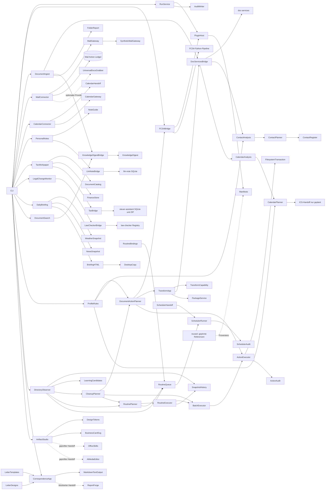

# ARCHITECTURE.md — Architecture and Boundaries

**English** | [Deutsch](./ARCHITECTURE-v0.34.de.md)

**Version:** 0.34  
**Updated:** 2026-08-22  
**Reason:** Added pinned legal‑source provider and local change monitor  
**Purpose:** Describes components, data flow and security boundaries.

## Overview

FolderHome is a new integration core. Existing components are not merged but described through pinned manifests and connected via new bridge code. The plugin host validates capabilities, side‑effects and gates before any execution may be scheduled.




## Areas

| Path | Responsibility |
|---|---|
| `src/folderhome/contracts/` | stable data and status contracts |
| `src/folderhome/plugin_host/` | manifest loading and fail‑closed validation |
| `src/folderhome/application/` | flow control without domain‑specific side‑effects |
| `src/folderhome/capabilities/audit/` | atomic, auditable run reports |
| `src/folderhome/bridges/` | installable adapters to separately versioned components |
| `bridges/` | provider documentation and integration boundaries |
| `reused/` | machine‑readable references, no copied source code |
| `manifests/` | declarative runtime and provenance contracts |
| `skills/` | agentically controllable, encapsulated capabilities |

## Phase‑1 Data Flow

```text
CLI-Anfrage → Manifestprüfung → Gate-Prüfung → synthetische Ausführung
           → RunReport → atomare JSON-Datei und/oder JSON-stdout
```


## Phase‑2 Data Flow

```text
CLI-Anfrage → FCSA-Manifest und Checkout-Pin prüfen → Konfiguration validieren
           → temporären Schattenzustand erzeugen → FCSA-Dry-Run
           → Aktionen in RunReport übersetzen → atomare JSON-Datei
```


FCSAs Dry‑Run normally places a confirmation in its `state_dir`. The FolderHome bridge replaces for the plan run exclusively `state_dir` and `trash_dir` with a temporary directory. Inbox folder, target folder and productive FCSA state remain unchanged; the temporary directory is removed after the run.

## Phase‑3 Data Flow

```text
Ordner + explizites Index-Gate
  → doc-services: Extraktion ohne Lernen und ohne OCR
  → DocumentRecord: Hash, Herkunft, Datenschutz- und Indexstatus
  → KnowledgeDigest.ingest(..., archive=False)
  → lokaler FolderHome-Zustandsordner
  → schreibgeschützte Suche / Themendossier / extraktiver Ordnerbericht
```


The source file is re‑hashed before indexing. If it no longer matches the extraction state, the bridge aborts fail‑closed. KnowledgeDigest also writes schema/WAL metadata in its public search method. FolderHome therefore uses a tightly encapsulated SQLite read adapter in mode `ro`/`immutable` and checks the pinned provider’s schema version first. Only indexing uses the public KnowledgeDigest ingest API; direct database writes do not exist in FolderHome.

The folder report is currently deterministic and extractive. It takes at most two or three sentences from documents with privacy status `clear`. At `review_required`, `blocked` or `not_checked` no content is copied. A free LLM synthesis and formatted DOCX/ODT output are later, separately gated provider steps.

## Phase‑4 Data Flow

```text
freigegebener Ingest
  → folderhome-catalog.json ohne Rohtext
  → natürliche Versionsanfrage
  → schreibgeschützte KnowledgeDigest-Suche
  → katalogisierte Quellen erneut hashen und extrahieren
  → explizites Dokumentdatum > Dateiname > Änderungsdatum
  → Satzvergleich zur neuesten Fassung
  → ungefreigte Archivierungsvorschläge
  → echter FCSA-Dry-Run pro älterer Fassung
```


The FolderHome catalog is an atomically written metadata bridge, not a second content index. A source changed after ingest no longer matches the document ID and SHA‑256 and blocks the version claim. “Latest version” means only: highest ordered according to the disclosed date signals. It makes no claim about effectiveness, termination or legal priority.

Archiving remains two‑stage: FolderHome suggests older versions with target folder and return path; subsequently the pinned FCSA pipeline must confirm in the Dry‑Run `duplicate_check` and `move`. Both layers remain `planned`, the gate remains undecided. Phase 4 contains no live move.

## Phase‑5 Profile Model

```text
household.json
  global < Bereich

<Name>.json
  Profil < Profilbereich

Auflösung: global → Bereich → Profil → Profilbereich
```


The more specific level wins. Two different values for the same rule key on the same level constitute a conflict and are rejected fail‑closed; filename or load order never decide. Supported are naming, archiving duration/folder, deletion duration/mode, target format, original handling, sorting target and scan interval. `hard_delete` is not representable; allowed are `disabled`, `review_only` and `recycle_bin`.

All profiles of a directory must carry the same declared OS account and expose `organizational_only=true`. Profiles drive preferences but no ACL, file permission or confidentiality for people in the same OS account.

## Phase‑6 Action Planning

```text
DocumentRecord + ResolvedProfilePolicy + target_root + as_of
  → Benennung sicher auswerten
  → Sortier-, Konvertierungs- und Originalschritte getrennt projizieren
  → Aufbewahrungsfristen gegen expliziten Stichtag prüfen
  → Zielkonflikte fail-closed markieren
  → DocumentPolicyActionPlan mit Regelprovenienz, Gate und Undo
  → unterstützte Archiv-/Papierkorbschritte im echten FCSA-Dry-Run bestätigen
```


The planner is a encapsulated Application Service. It creates neither folders nor files and uses no implicit current time. Every mutating step carries `filesystem.write`, an unfunded gate and a return path. Standard serializations adopt only the metadata of `DocumentRecord`, not its raw text.

FCSA is bound to `move` as well as `delete-to-trash`. The FCSA configuration sets `allow_hard_delete=false` and, as before, uses only temporary state and trash paths. Naming is encapsulated as a new internal `folderhome.document-actions` capability. Conversions are not attributed to FCSA: PDF and TXT are bound to the new `folderhome.document-transform` provider; other target formats remain without a vetted provider on `blocked`.

Sorting, archiving and trash can require different end targets for the same document. When such rules become due simultaneously, all affected steps are blocked and a separate human review step is added; filename or rule order do not silently resolve the conflict.

## Phase‑7 Document Transformation

```text
expliziter Quellordner
  → doc-services für textbasierte Quellen
  → PDF-/Bild-Passthrough ohne OCR
  → DocumentBundlePlan ohne Rohtext
  → expliziter output-write-Gate
  → erneute SHA-256-Prüfung aller Quellen
  → gekapseltes TXT-/PDF-Rendering im Speicher
  → atomare, nie überschreibende Veröffentlichung
  → DocumentBundleResult mit Ausgabehash und Seitenzahl
```


`application.document_transform` is responsible for selection, provider boundary, privacy, planning and gate. The reusable capability `capabilities.document_transform` contains only deterministic rendering and atomic publication. This allows the new core later to be adopted in Sovereign or a separate module without the FolderHome CLI.

For TXT only the content already extracted by doc‑services is bundled with relative document paths. For PDF existing PDF pages are assembled, images rasterized locally and other documents appended as newly set text. Treatment, privacy status and loss notice are visible per source in the plan. OCR is not an automatic fallback.

The provider writes only after an explicit gate into an already existing output folder, checks all source hashes immediately beforehand and uses a temporary target in the same directory with atomic never‑overwrite publication. A `DocumentBundleResult` can unlock the previously blocked original handling if provider, document ID, target path and output hash match. It does not execute the step itself.

## Phase‑8 Type Packages

```text
verschachtelter Quellordner
  → Endung deterministisch einer Gruppe zuordnen
  → PDF/Bilder als Passthrough, andere bekannte Typen über doc-services
  → eine Bundle-Planung pro Typgruppe
  → unbekannte Dateien mit Pfad, Hash und Grund festhalten
  → alle Quellen erneut hashen
  → Gruppendokumente im Speicher rendern
  → manifest.json mit Quellen, Verlustgrenzen und Ausgabehashes
  → ZIP mit festen Metadaten und stabiler Reihenfolge
  → atomare Never-overwrite-Veröffentlichung
```


Images collectively form `Bilder.pdf`, PDFs `PDFs.pdf`, TXT `TXT.txt` and Markdown `Markdown.txt`. Further extensions supported by doc‑services receive their own text group, e.g. `DOCX.txt`. Unknown extensions are not silently discarded nor handed to a guessed parser; they appear in the manifest as `unsupported`.

There is no persistent intermediate folder. Group outputs and the manifest are generated in memory and published as a single new ZIP. Fixed ZIP timestamps, ordering, permission bits and compression parameters make the same plan byte‑deterministic. The ZIP hash is placed in the external result, the hashes of the contained documents in the internal manifest; a self‑referencing ZIP hash inside the ZIP is deliberately avoided.

## Phase‑9 Folder Observation

```text
expliziter Quellordner + caller-supplied captured_at
  → relative Pfade, Größe, mtime_ns und SHA-256 erfassen
  → inhaltsfreien Snapshot deterministisch identifizieren
  → optional nach State-Gate unveränderlich in die Historie schreiben
  → zwei Snapshots desselben Roots vergleichen
  → added / removed / modified / metadata_changed unterscheiden
  → moved nur bei eindeutigem 1:1-Hash-Paar behaupten
  → Nutzerkorrektur nur mit früherem Ablagebeleg als candidate ausgeben
```


The snapshot contains no raw document text and uses no implicit system time. The caller must supply an ISO timestamp with timezone. When reading, the snapshot ID is recomputed from all metadata. Histories are created according to `--approve-state-write`, atomically published and never overwritten.

Identical file contents may appear multiple times. Therefore a file that is removed and added elsewhere counts as a move only if the hash appears exactly once in each set. Ambiguous duplicates remain separate `removed`/`added` events.

An observed move alone is not a learning signal. Only a matching earlier storage receipt links document hash, original path, profile, area and rule sources. Even then only a candidate with `automatic_promotion=false` is created; Phase 9 does not change any profile rule and moves no file.

## Phase‑10 Scan Runs

```text
watched-folders.json + watch_id + captured_at + state_dir
  → Beobachtung und Intervall strikt validieren
  → letzten identitätsgeprüften Snapshot für denselben Root bestimmen
  → aktuellen inhaltsfreien Snapshot bilden
  → Intervallfälligkeit, Diff und belegte Lernkandidaten berechnen
  → read-only DirectoryScanReport ausgeben
  → optional nach State-Gate genau einen neuen Checkpoint ergänzen
```


Relative source paths are resolved relative to the configuration file. An observation binds a root to profile and area but does not create a new access boundary. Disabled observations, unknown IDs, non‑monotonic timestamps, changed recursion settings or ambiguous last checkpoints block the run.

The interval is evaluated against the explicit timestamps of the last and current snapshots. A premature manual scan is allowed but is indicated with `interval_due=false`. Before a released write the last checkpoint is read again; an interim changed history blocks publication. The audit report still contains no raw document text and triggers no file action.

## Phase‑11 Action Execution and Undo

```text
Quelle + Profilregeln + as_of
  → Dokumentaktionsplan erneut deterministisch bilden
  → plan_id über alle content-free Planfelder berechnen
  → Freigabe gegen plan_id, Quellhash und geordnete action_ids prüfen
  → Zielkette vollständig preflighten; niemals überschreiben
  → unveränderliches Intent im lokalen State schreiben
  → jeden Move per Same-Volume-Link, Zielhashprüfung und Source-Unlink ausführen
  → Abschlussbericht + Ablagebeleg append-only schreiben
  → Undo nur gegen Ausführungs-ID, Zielpfad und unveränderten Zielhash
```


The approval may only encompass a contiguous prefix of executable plan actions. Phase 11 supports rename as well as targeted move steps; conversion, trash, review and blocked steps break the executable chain. Every target path is checked against plan type and `target_root`. Existing files, symlinks, changed sources and cross‑volume fallbacks block fail‑closed.

FCSA remains the pinned classification and Dry‑Run provider. Its current pipeline entry scans whole folders, writes processing memory and can change the target name on collisions; therefore it is not an exact live executor for an already approved single‑document plan. The actual executor appears in the report separately as `folderhome.filesystem-transaction`. This new encapsulated core classifies nothing but exclusively executes precisely planned single‑file moves without overwriting.

The audit path contains before the first file action `000-intent.json` and after success `100-completed.json`. On errors the existing chain is rolled back and an error event added. Undo writes its own intent and completion event. When reading, the completion report is checked against the earlier intent, so retroactively redirected paths are blocked. All contracts contain hashes and provenance, but no raw document text.

## Phase‑12 Folder‑wide Cleanup Batch

```text
expliziter Quellordner + Profil + Bereich + target_root + as_of
  → Dateien deterministisch sammeln; Symlinks auslassen
  → bekannte Formate read-only über doc-services extrahieren
  → pro Dokument denselben Phase-6-/Phase-11-Einzelplan bilden
  → unbekannte oder fehlerhafte Quellen sichtbar behalten
  → alle Zwischen- und Endziele ordnerweit vergleichen
  → gemeinsame Ziele, bestehende Ziele und Quelle-Ziel-Abhängigkeiten blockieren
  → FolderCleanupPlan mit SHA-256-Batch-ID ohne Rohtext
  → selektive Approval-Datei gegen Batch-, Plan-, Dokument- und Aktions-IDs
  → Batch-Intent, geordnete Einzeltransaktionen, Batch-Abschluss
```


The batch plan is not a loop over unchecked single actions. Only after all document plans are fixed are their target chains analyzed together. A conflict blocks each involved document, while independent documents remain individually selectable. The approval file may name a subset but must repeat for each document the exact plan, source hash and action prefix.

Batch execution runs selected documents in the order of the approval. Each entry uses the unchanged Phase‑11 transaction and its own audit. If a later entry fails, earlier executions are rolled back in reverse order via their recorded undo contracts. The batch audit distinguishes `executed`, `rolled_back` and `failed`; active storage receipts are collected only after full success.

## Phase‑13 Observation and Cleanup Routine

```text
Watch + letzter Checkpoint + Profilregeln + explizite Zeit
  → aktuellen Ordner read-only beobachten
  → changes: nur bei Fälligkeit added/modified/moved auswählen
  → full: vollständigen Bestand unabhängig vom Intervall auswählen
  → gefilterten ordnerweiten Cleanup-Plan bilden
  → FolderRoutinePlan ohne State- oder Dateischreibzugriff
  → exakte Batchfreigabe + Datei-Gate + State-Gate
  → Historie und beobachteten Ordner erneut identitätsprüfen
  → Batch ausführen
  → resultierenden Ordnerzustand als neuen Checkpoint ergänzen
  → Routineabschluss oder belegtes Rollback
```


The routine plan introduces no new file logic. It composes Phase‑10 observation with Phase‑12 batch planning and filters their inputs via the content‑free diff. The first change run considers the initial inventory; a not‑yet‑due run and a due run without relevant changes produce an empty cleanup plan. Metadata changes alone trigger no document processing.

Full mode is an explicit decision and ignores only interval due‑ness, not gates or conflicts. Targets within the observed root are disallowed to prevent a self‑reinforcing input loop. Before execution both the expected last checkpoint and the scan ID are re‑validated. The checkpoint is written only after a fully successful batch. If this final observation fails, the single actions are rolled back via their Phase‑11 undo contracts and the routine run is logged as `rolled_back` or `failed`.

## Phase‑14 Multi‑Watch Queue

```text
watched-folders.v1 + routine-bindings.v1 + Profile + explizite Zeit
  → alle aktivierten Watches deterministisch sortieren
  → pro Watch Zielwurzel und changes/full-Modus auflösen
  → Phase-13-Routinenplan read-only bilden
  → ready / not_due / empty / blocked zuordnen
  → Eingangsüberlappungen und Cross-Watch-Ziele gemeinsam prüfen
  → FolderRoutineQueue mit side_effects=[] und scheduler_registered=false
```


Binding file remains separate from the watch contract: observation defines source, profile, area and interval; the binding adds only target root, routine mode and active status. Relative targets are resolved against the location of the binding file. Missing or disabled bindings for an active watch remain visible as a blocked queue entry. Multiple bindings for the same watch and bindings on unknown watches are configuration errors.

The queue executes all Phase‑13 plans without file or state gate and writes nothing itself. It then checks the total set: overlapping input roots, a routine target in the input of another watch, and identical intermediate or final targets block all affected entries. The queue is callable for a later scheduler without inheriting scheduler rights or action approvals.

## Phase‑15 Portable Scheduler Handoff

```text
Zeitplan + Konfigurationspfade + Python/Working-Directory
  → stabile schedule_id
  → portable argv-Liste + Windows-Task-XML als read-only Plan
  → registration_performed=false

scheduler run + explizite Laufzeit + Scheduler-State-Gate
  → schedule_id gegen aktuellen Handoff neu berechnen
  → atomaren Lock nur unter scheduler-locks/<schedule_id> anlegen
  → aktuelle Konfigurationen laden
  → Phase-14-Queue read-only ausführen
  → append-only SchedulerRunReport schreiben
  → eigenen Lock entfernen
```


The handoff stores arguments as individual list elements and avoids a composite shell command. The Windows XML requires `LeastPrivilege`, uses `IgnoreNew` and limits a run to ten minutes. It is still only an artifact in the JSON plan: FolderHome offers no install or registration command in Phase 15.

The runner is the only new writing boundary. Its gate allows only operational state for lock and run report; queue, documents, target folder and checkpoint history remain unchanged. An existing lock yields exit code 30 and stays untouched. An own lock is removed after success or error. Queue results are emitted as exit code 0 (`idle`), 10 (`attention`) or 20 (`blocked`) externally and remain fully recorded in the report.

## Phase‑16 Document Contacts and Contact Register

```text
expliziter Dokumentordner + Profil + Bereich + lokale Sensitivitätsfreigabe
  → doc-services read-only extrahieren
  → nur eindeutig gelabelte Kontaktfelder und Zeilenevidenz normalisieren
  → Kandidaten derselben Zuständigkeit ordnerweit vergleichen
  → aktive Registerkontakte read-only über SQLite ro/immutable lesen
  → create / replace / noop / blocked mit stabiler Plan-ID vorschlagen
  → exakte Approval-Datei + State-Gate
  → Registerrevision und sämtliche ausgewählten Quellhashes erneut prüfen
  → Kontakte und append-only Ereignisse in einer SQLite-Transaktion schreiben
```


The responsibility key consists of organizational profile, area, purpose and optional contract object. Only a uniquely newest candidate per key may be executed. Different contacts with the same newest effective date block; older candidates remain visible as `noop`.

`review_required` originates from the handoff verification of the document provider. For purely local processing there is therefore an additional tight gate. `blocked` and `not_checked` also remain locked. The register only contains normalized contact fields, document identity, hash, path and evidence locations, not the remaining document text.

Contact change is atomic: the new contact is actively created and the previous one marked solely as `deletion_candidate`. There is neither SQL‑`DELETE` nor an automatic deletion action. Family profiles organize the register content but do not change the security boundary of the OS account.

## Phase‑17 Appointment Candidates and Calendar Handoff

```text
Kalenderkonfiguration + aufgelöste Profilregeln
  → Backend und Zeitzone mit fester Präzedenz bestimmen
expliziter Dokumentordner + lokale Sensitivitätsfreigabe
  → doc-services read-only extrahieren
  → gelabelte Titel-/Datum-/Zeit-/Ort-/Zeitzonenfelder normalisieren
  → Kandidaten mit Dokumenthash und Zeilenevidenz bilden
  → gleiche Startzeit verschiedener Termine als Konflikt blockieren
  → folderhome_local / uptoday_ics planen
  → routinika / google ohne geprüften Connector blockieren
  → exakte Approval-Datei an Plan-ID, Revision und Aktionen binden
  → Quellhash, Kalenderrevision und Ausgabekonflikte erneut prüfen
  → lokales Ereignis + Audit atomar oder ICS-Batch never-overwrite publizieren
```


General fallback is in `folderhome.calendar-config.v1` and can be overridden by `calendar.backend` or `calendar.timezone` from the existing profile inheritance. Example fallback `uptoday_ics` creates per candidate a stable target path, a UID and the hash of a deterministic RFC‑5545 content. The plan writes nothing. Only `calendar apply` with state and output gate publishes new files and logs them; an UpToday import does not occur.

Calendar skill 0.1.0 provides the selection principle, but due to lack of git pin, approval and secure store it is not a runtime provider. UpToday occupies the file‑based ICS channel and UID deduplication. Its database is not directly coupled. The old RoutineMaster/Routinika bridge is marked as unused and in need of retrofitting; FolderHome therefore claims no Routinika support. The new local calendar store and the ICS publisher are separate capabilities: SQLite events are added transactionally, ICS batches roll back their own unchanged files on partial failures. Both paths re‑check calendar revision and document hash and offer no automatic deletion.

## Phase‑18 FindCall and Call Plugins

```text
HungryCall-/Ringedingeding-Manifest + lokaler Checkout
  → Revision, Git-Sauberkeit und Runtime-Version prüfen
  → ausschließlich DryRunCallClient / FixtureTransport laden
  → CallPluginProbeResult ohne Netzwerk oder Telefon

FindCall-Auftrag + lokale Kandidaten + explizite Fixtures
  → administrative Safety-Grenze prüfen
  → Leistung und Entfernung vorfiltern
  → Priorität, Distanz und ID deterministisch ordnen
  → Fixture-Ergebnisse streng seriell auswerten
  → Status, Zeitfenster und Preisgrenze erhalten
  → beim ersten gültigen Ergebnis stoppen
```


Public FindCall contracts contain no HungryCall restaurants and no Ringedingeding polls. The new core only adopts the recorded serial cascade pattern. Each public candidate/attempt serialization masks the E.164 phone number. A provider is accepted only if it presents itself as a local simulation without network or telephone effects.

Medical appointments are purely administrative: specialty, location and time window are allowed, emergency or diagnostic content not. `inquiry_only` is the sole V1 authority; even a fixture with claimed commitment is rejected.

## Phase‑19 Account Statements and Recurring Costs

```text
expliziter Auszugsordner + Profil + lokale Sensitivitätsfreigabe
  → doc-services read-only extrahieren
  → deklarative Konto-/Saldo-/Buchungszeilen centgenau normalisieren
  → Anfangssaldo + Buchungen = Endsaldo prüfen
  → neue Auszüge gegen Finanzrevision und Referenzkonflikte planen
  → exakte Approval-Datei + State-Gate
  → Quellhash und Revision erneut prüfen
  → Konto, Auszug, Buchungen und Audit in einer SQLite-Transaktion ergänzen

lokaler Finanzstore + Konto + Datumsbereich
  → Auszugsbereiche vereinigen und Lücken sichtbar berechnen
  → angrenzende Saldenketten auf Kontinuität prüfen
  → Bewegungen und nur belegte Grenzsalden ausgeben

lokale Belastungen + Profil + Stichtag
  → centgleiche Gegenüber/Kategorie-Serien gruppieren
  → Monatsintervall konservativ prüfen
  → Abo-/Versicherungs-/Kostenkandidaten samt Beleg-IDs und Prognosefenster
```


The financial store contains normalized values and provenance, no raw document text. Booking references are unique per account; statements and audit lines are only appended. An adjacent statement with a conflicting opening balance already blocks the plan. Uncovered days remain gaps, and a period report sets boundary balances to `null` when the chain is not fully populated.

Recurring costs use integer cents and at least two monthly matching charges. `active_candidate` is only a snapshot heuristic status. Termination, contract existence or future debit are expressly not proven.

## Phase‑20 Household and Inventory

```text
expliziter Bestandsordner + Profil + lokale Sensitivitätsfreigabe
  → doc-services read-only extrahieren
  → deklarative Bestandsfelder exakt in Tausendstel der Einheit normalisieren
  → Gegenstand aus Profil, Bereich, Name und Einheit stabil identifizieren
  → gleiche Tagesbeobachtungen auf Widerspruch prüfen
  → gegen Inventarrevision planen
  → exakte Approval-Datei + State-Gate
  → Quellhash und Revision erneut prüfen
  → Ereignisse und Audit in einer SQLite-Transaktion ergänzen

Inventarstore + Profil + expliziter Stichtag
  → neueste belegte Beobachtung je Gegenstand bestimmen
  → Mindestbestand und Ablaufhorizont konservativ prüfen
  → Review-Kandidaten samt Ereignis-ID und Fehlmenge ausgeben
```


UpToday provides the already extracted domain terms article, area, location, unit, stock and minimum stock. Its existing engine is not loaded because of floating‑point numbers, a global DB singleton, direct `UPDATE`/`DELETE` and implicit daily date. FolderHome does not copy UpToday code, but encapsulates the new contract under `contracts.inventory`, `application.household_inventory` and `capabilities.inventory_store`.

A V1 file describes exactly one observation. Decimal values are stored without rounding as integer thousandths. The store has no inventory column that is silently overwritten: each approved entry is a new event with document ID, hash, path and line evidence. The current view is a query of the last recorded observation per item.

Understock, expired and soon‑to‑expire are review reasons, not orders. Family profiles filter views but create no access boundary within the same OS account.

## Phase‑21 Medication Plan and Confirmed Intake

```text
expliziter Medikamentenordner + Profil + lokale Sensitivitätsfreigabe
  → doc-services read-only extrahieren
  → dokumentierte Dosis, Zeit, Zeitzone, Wochentage und Gültigkeit normalisieren
  → Bestandsbezug über die gemeinsame Inventar-ID herstellen
  → gleiche Startversion desselben Zeitpunkts auf Widerspruch prüfen
  → gegen Medikamentenrevision planen
  → exakte Approval-Datei + State-Gate
  → Quellhash und Revision erneut prüfen
  → Zeitplanversion und Audit append-only ergänzen

Medikamentenstore + Profil + Tag + expliziter Auswertungszeitpunkt
  → gültige Planversionen ohne Schreibzugriff auswählen
  → stabile Dosis-ID und geplanten Zeitzonenzeitpunkt bilden
  → vorhandenes Einnahmeereignis getrennt zuordnen
  → optional lokalen Inventarstand nur als Evidenzkandidat vergleichen

Bestätigungsdatei + State-Gate
  → Revision, Zeitplan, Tag und Dosis-ID erneut prüfen
  → genau ein append-only Einnahmeereignis ergänzen
  → keine Bestands-, Kalender-, Nachrichten- oder Erinnerungsaktion
```


UpToday provides the separation of medication, schedule, daily dose and intake log as well as the idempotence principle. Its existing health engine is not loaded because daily views there generate logs, confirmations directly update inventory and time/state are handled implicitly. Public `gesundheit` skill and the declarative health‑assist bundle provide the boundaries “only provided information” and “organization only”.

FolderHome encapsulates new contracts under `contracts.medication`, the application logic under `application.medication_intake` and the store under `capabilities.medication_store`. Schedule versions and intake events are append‑only. Daily view is a pure query. `bei Bedarf` remains undermined in V1 and requires human review.

A confirmation documents an explicit user input, not an external effectiveness or intake proof. Diagnosis, prescription, dosage decision, interaction check, automatic reminder and inventory reduction are excluded.

## Phase‑25 Office, Media and Design Studio

```text
Sensitivitäts-Gate + Artefaktanfrage + vorhandenes Profil
  → jede Artefaktart einem expliziten Spezialisten zuordnen
  → Runtime, Revision und Qualitätsgates als Status ausweisen
  → keinen Skill, Renderer oder Medienprovider aufrufen

Sensitivitäts-Gate + Designanfrage
  → Schema, Schriftbezeichnungen und Textkontraste prüfen
  → JSON-Tokens, CSS-Variablen und SVG im Speicher vorschauen
  → nach eigenem Output-Gate drei neue Dateien hashgeprüft schreiben
  → jede konkrete SVG vor Druck oder Veröffentlichung visuell prüfen
```


`contracts.artifact_studio` defines artifact request, routes, plan, design request, preview and output report. `application.artifact_studio` contains only provider‑neutral routing and the new local design core. Presentation, spreadsheet, DOCX and media logic are not copied into FolderHome.

PPTX, spreadsheets and DOCX refer to their specialized skills. Missing workspace‑dependency loader, missing `soffice`, report‑forge version drift or a missing ODT renderer block the respective route. ai‑media‑editor is revision‑bound but is not imported or executed in the plan. `provider_invoked=false` and `side_effects=[]` remain fixed plan invariants.

The design core accepts only `#RRGGBB` colors, safe font names and single‑line business‑card data. Text pairs must achieve at least a 4.5:1 contrast. User data is escaped before SVG output. The three‑file batch never overwrites and on its own partial error only removes its own hash‑matching files.

## Phase‑26 Mail Connector

```text
Mailkonto mit Secret-Referenzen + Profil + Ingest-Anfrage
  → Konto, IMAP-Ordner, Provider-ID und Revision prüfen
  → ausschließlich Header-/Anhangsabruf read-only planen
  → Plan-ID und Planhash mit Lese-/Schreibgates binden
  → Nachrichten und Anhänge als providerneutrale Referenzen übernehmen

aktiver Kontakt + Korrespondenzvorschau + Mailkonto
  → Kontakt-ID, Empfänger, Profil, Vorschau-ID und Texthash exakt abgleichen
  → Entwurf read-only vorschauen
  → Empfänger, Entwurfshash und Idempotenzschlüssel gesondert freigeben
  → Versandversuch vor Transport im lokalen Ledger reservieren
```


`contracts.mail` defines accounts, endpoints, folders, messages, attachments, ingest, drafts, approvals and reports. `application.mail_connector` loads strict JSON contracts and connects exactly one contact with exactly one correspondence preview. `capabilities.mail_gateway` contains only the provider‑neutral seam, a synthetic no‑network gateway and the local SQLite idempotence ledger.

The ingest contract can neither move nor delete, mark or send. A real gateway must also declare the read‑only property and match exactly the planned provider. The UniversalDocsGrabber checkout is currently blocked due to revision and external changes. MailProcessor remains launcher; UniversalMailCleaner remains a separate mutating capability.

A draft preview does not invoke transport. An approval can bind only exactly one draft to exactly one recipient. The ledger reserves before transport fail‑closed; after an unclear abort it is not automatically retried. Phase 26 has exclusively `simulated` without network and without real email accepted. A real SMTP transport remains open.

## Phase‑27 Calendar Connectors

```text
Phase-17-Handoff + Kalenderkonto + Connectoranfrage
  → Profil, Backend, Kalender-ID und Providerrevision exakt abgleichen
  → Regelquelle, Evidenz, Zeitzone und Ereignis-UID unverändert übernehmen
  → create, update, delete und remind als getrennte Aktionen planen
  → UpToday an ICS delegieren, Routinika blockieren, Google zur Prüfung geben

synthetischer Plan + exakte Freigabe
  → Plan-ID, Planhash, Aktionen und Operationen erneut prüfen
  → nur create und optional remind an den No-Network-Gateway übergeben
  → synthetische Providerreferenz ausgeben, keinen Live-Kalender schreiben
```


`contracts.calendar_connectors` defines account, reminder, request, route, event, action, approval and provider reference. Configuration stores no credentials. `application.calendar_connectors` relies exclusively on the complete Phase‑17 plan and incorporates `backend_source` as well as `source_rule_ids`. `capabilities.calendar_connector_gateway` contains the provider seam and the synthetic acceptance provider.

UpToday is not imported; creation remains with the existing RFC‑5545 handoff. Routinika is only occupied by hashed bundle files and remains blocked without a live contract. Google is modeled as an agentic skill handoff with explicit calendar ID, empty participants, offset time, transparency and reminder payload, but is not invoked.

Update and delete remain blocked without an existing provider event reference. The synthetic gateway rejects duplicate idempotence keys in a run, has no network path and can never claim a real calendar entry.

## Phase‑28 Personal Notes

```text
menschliche Notizanfrage + explizite Referenzen
  → Profil und striktes Anfrageschema prüfen
  → llm-note-Historie read-only und ohne Schemainitialisierung lesen
  → Fragen und Vorschläge getrennt vom menschlichen Inhalt erzeugen
  → Plan an Inhaltshash und vollständige Store-Revision binden
  → exakte menschliche Freigabe und lokales State-Gate prüfen
  → über llm_note.NoteStore.write() genau eine Version ergänzen
  → Providerdaten read-only zurücklesen und Ausführung belegen
```


`contracts.personal_notes` defines request, references, guidance, plan, approval, version and report. `application.personal_notes` separates leadership and content and enforces the plan/state binding. `capabilities.personal_note_guide` is a provider‑neutral seam with a deterministic no‑network provider. `bridges.llm_note` checks checkout, revision, package version and schema.

Public `NoteStore` class initializes the SQLite schema in its constructor. Plan, list and history therefore use a tight read‑only adapter with `mode=ro&immutable=1`; only an approved apply run invokes `NoteStore.write()`. FolderHome does not create a second note database. Create, edit and revert are exclusively append‑only. A revert is a new version with the content of an earlier revision.

The human remains author. The guide may only provide questions and suggestions and sets `confirmed_content_changed=false`. Remote LLMs and external synchronization are not executable in Phase 28. Document and calendar references arise only from the request. Profiles are organizational; the OS account remains the security boundary.

## Phase‑29 Tax Worksheet

```text
Steuerbeleganfrage + Dokumentkatalog + optionaler Finanzstore + Profil
  → lokale Sensitivitätsfreigabe prüfen
  → Dokument-ID und aktuellen Quellhash belegen
  → optionale Finanzbuchung auf Profil und absoluten Centbetrag prüfen
  → Kandidat von menschlich bestätigter Eingabegruppe trennen
  → read-only Plan an Providercheckout und profilbezogenen Store binden
  → nach exakter Approval und State-Gate genau einen Beleg schreiben
  → privaten ZIP-Export separat planen und freigeben
```


`contracts.tax` defines receipt request, receipt plan, approvals and reports. `application.tax_workpaper` orchestrates only the existing document catalog, financial store and profiles. `bridges.tax_assistant` loads the unchanged provider at the manifest revision and uses its public receipt and export API.

The provider itself has no profile field. FolderHome therefore creates a separate provider store per profile under the shared local state. This prevents domain mixing of work documents but does not create an access barrier within the same OS account.

A category candidate is not executable. Only an explicit `confirmed_category` from the limited provider list can be saved after approval. This is still not a deductibility check. Export target, tax year, profile and store revision are bound in the export plan; existing targets are not overwritten. Network, official format, tax advice, ELSTER, ERiC and portal transmission are not implemented.

## Phase‑30 Weather and Newspaper Desktop Brief

```text
Briefinganfrage + Profil + lokale Sensitivitätsfreigabe
  → lokale Wetter- und Nachrichtensnapshots hashen und strikt laden
  → Abruf- und Publikationszeiten gegen explizites as_of prüfen
  → fresh/stale sowie Warnungen bestimmen
  → gewählte Kategorien deterministisch sortieren und begrenzen
  → escaptes HTML ausschließlich im Speicher planen
  → nach Render-Approval eine neue Zwischenausgabe schreiben
  → nach Desktop-Approval exakt diesen Hash in den Desktopordner kopieren
```


`contracts.daily_briefing` defines request, snapshots, articles, plan, approvals and reports. `application.daily_briefing` loads the inputs, evaluates the data status, renders HTML and executes the two local write paths. There is no briefing store and no imported BACH code.

A snapshot is a provider seam, not a timeliness claim. Age is calculated from `as_of` and retrieval timestamp; future data blocks, outdated data remains visible with `review_required`. Contents and URLs are escaped before HTML output; sources must use HTTPS without embedded credentials.

Clipboard and desktop target reside in separate folders and are never overwritten. Desktop delivery reads only the previously rendered file and checks its HTML hash. Live weather, live news and a recurring scheduler permission remain explicitly unimplemented.

## Phase‑31 Official Notice Understanding

```text
lokaler Bescheid + Profil + Sensitivitätsfreigabe + explizites as_of
  → gepinnten doc-services-Checkout prüfen
  → Text lokal ohne OCR extrahieren und Quellhash bestätigen
  → ausschließlich bekannte, ausdrücklich beschriftete Felder übernehmen
  → jedes Feld an Zeile, Dokument-ID und Quellhash binden
  → fehlende und widersprüchliche Angaben sichtbar halten
  → optional gedrucktes Fristdatum rein kalendarisch gegen as_of zählen
  → read-only Analyse ausgeben
  → nach Output-Gate neue Markdown-/JSON-Berichte schreiben
```


`contracts.official_notices` defines field evidence, conflicts, analysis and output report. `application.official_notices` keeps the label set tight, explicitly validates printed ISO dates and renders a never‑overwrite report. Existing `DocServicesBridge` provides only the revision‑bound local extraction.

Optional access date is solely a user‑provided value. Relative deadline wordings are not converted into dates. The difference between `as_of` and an explicitly printed deadline date is merely calendar arithmetic and not a legal deadline calculation. Ambiguous single fields are not arbitrarily resolved.

The OneDrive checkout was not loaded due to external changes, upstream lag and an incomplete general social‑law corpus. Phase 31 still performs no legal review and generates neither response nor objection. Phase 34 qualifies a separate clean checkout solely as a registry/source provider; this later bridge does not change the boundaries of the official notice analysis.

## Phase‑32 Administrative Drafts

```text
Entwurfsanfrage + Profil + Sensitivitätsfreigabe
  → bei Bescheidbezug Phase-31-Analyse aus unveränderter Quelle neu bilden
  → erwarteten Quellhash, Profil, Behörde und Empfänger abgleichen
  → Dokumentevidenz und user_provided-Angaben getrennt erfassen
  → Zweck fest an Widerspruchs-, Antwort- oder Antragsvorlage binden
  → Phase-24-Korrespondenzvorschau und Ausgabehashes wiederverwenden
  → ENTWURF-/Prüfhinweis im eigentlichen Brief erzwingen
  → Plan mit offenen Punkten und review_required ausgeben
  → nach exakter Inhaltsapproval neue Markdown-/TXT-Dateien schreiben
```


`contracts.administrative_drafts` defines request, fact provenance, plan, approval and output report. `application.administrative_drafts` connects the official notice analysis with `application.correspondence`; there is no second renderer and no draft store.

Official notice drafts bind the expected portable SHA‑256 in the request and the concrete analysis run in the plan. An objection draft requires an explicitly read legal remedy `Widerspruch`, unique official‑notice fields and the same recipient as the read authority. This is only a plausibility gate, not a legal decision.

Previews write nothing. The local output requires an approval for plan ID, markdown hash, TXThash, content check, understood missing legal review and local write. `send_supported`, `sent`, `eligibility_assessed` and `deadline_legally_calculated` remain incorrect.

## Phase‑33 Benefit and Funding Pre‑Screen

```text
Sensitivitätsfreigabe + bekanntes Profil
  → user_provided-Leistungsprofil und complete=false-Katalog laden
  → beide Dateien hashen und amtliche HTTPS-Quellen validieren
  → checked_at gegen explizites as_of und Altersgrenze prüfen
  → grobe Routingkriterien ohne implizite Fakten auswerten
  → Handoff, fehlende Angabe, Mismatch oder veraltete Quelle ausgeben
  → nicht modellierte Anforderungen immer sichtbar halten
  → optional neue Markdown-/JSON-Berichte hinter Output-Gate schreiben
```


`contracts.benefit_screening` defines profile facts, sources, criteria, programs, catalog, evaluations and reports. `application.benefit_screening` loads the strict JSON snapshots, checks source age and performs only local routing comparisons. There is no profile store, rule crawler or portal client.

A matching routing feature generates only `official_handoff_recommended`. Missing facts are not guessed; a mismatch does not mean “not eligible for benefit”. If a used source is too old, its criteria are not evaluated. The catalog must expose `complete=false` and, per program, all unmodeled requirements.

The three example handoffs refer to a social platform, KiZ guide and housing‑benefit‑plus calculator. FolderHome does not automatically open them nor transfer profile data. Entitlement, benefit amount, application and network remain outside the component.

## Phase‑34 Legal Change Monitor

```text
gepinntes law-checker-Manifest + sauberer Checkout
  → Paket-, Modul- und Registryidentität read-only qualifizieren
  → zwei lokale, datierte und unvollständige Rechtsquellensnapshots laden
  → amtliche Domain, Chronologie, Quellenalter und Wortlauthashes prüfen
  → Normabschnitte technisch als added, modified oder removed vergleichen
  → ausschließlich user_provided-Themen mit Änderungen schneiden
  → Profil-/Vertragsbezug nur als review_candidate ausgeben
  → Entwurf sichtbar von Verkündung und konsolidiertem Stand trennen
  → nach Output-Gate neue Markdown-/JSON-Dateien schreiben
```


`bridges.law_checker` imports no agent workflow and starts no fetcher. The bridge validates a clean git revision, package version, `ellmos.module.v2` identity as well as registry version and active keys. Provider remains unchanged; there is no claimed Python API for automatic legal review.

`contracts.legal_change_monitor` holds legal source, word hash, publication level, explicit interest, technical diff, test candidate and output separately. `application.legal_change_monitor` rechecks the three bound input files before comparison and output. Only official production domains are allowed. A synthetic fixture path is double‑marked and requires its own test gate.

A topic hit is not a determined impact. Draft, legal effect, transitional law, deadline calculation, official‑notice assessment and notification remain separate follow‑up steps. The local run uses no network and registers no scheduler.

## Phase‑24 Correspondence Studio

```text
Sensitivitäts-Gate + Anfrage + Vorlagen + Designs + vorhandenes Profil
  → Konfiguration und alle expliziten Designbindungen validieren
  → Anfragezweck und Vorlage exakt abgleichen
  → einfache Platzhalter gegen Variablenmenge prüfen
  → Design als Standard → Bereich → Zweck → Profil → Profil-Zweck auflösen
  → Markdown/TXT samt Hashes ausschließlich im Speicher vorschauen
  → DOCX/ODT-Handoffs ohne Provideraufruf sichtbar bewerten
  → nach eigenem Output-Gate beide neuen Dateien hashgeprüft schreiben
```


`contracts.correspondence` defines parties, letter design, template, request, preview, format handoff and output report. `application.correspondence` loads the JSON configuration, resolves the design, fills only validated variables and publishes the never‑overwrite batch. The core has no store and no dependency on a specific office or shipping provider.

Preview is read‑only, contains `llm_invoked=false` and writes nothing. The Markdown/TXT output path requires a second approval, pre‑checks both targets and on its own partial error deletes only files whose content still matches the expected hash. Existing files are not altered.

report‑forge is not invoked due to its inconsistent distribution/runtime version. DOCX and ODT are pure handoff contracts. Shipping, printing, upload, legal review and automatic deadline decision lie outside this component.

## Phase‑23 Insurance and Contract Cockpit

```text
explizite Cockpit-Anfrage + gemeinsamer FolderHome-State + Sensitivitäts-Gate
  → Dokumentensuche und Katalogquelle erneut hashprüfen
  → aktuelle/ältere Fassung und Archivierungsvorschläge übernehmen
  → Kontakte über Profil, Bereich und Vertragsobjekt filtern
  → Kosten nur über deklarierte Gegenparteien und Konten zuordnen
  → zukünftige Termine nur über deklarierte Kalenderbegriffe zuordnen
  → Kontoauszugsabdeckung für angegebene Konten und Zeitraum abfragen
  → fehlende oder mehrdeutige Evidenz sichtbar halten
  → JSON und Markdown als neue Dateien außerhalb des State schreiben
```


`contracts.contract_cockpit` defines the explicit join and the read‑only output. `application.contract_cockpit` assembles only existing FolderHome contracts. There is no new cockpit store.

A shared name is not a contract proof. Request fields for object, counterparty, calendar terms and accounts are therefore mandatory or intentionally empty mappings. The report contains component revisions and existing source or booking IDs, but no extracted raw document text. Archiving, contact change, calendar action, payment and bank access remain excluded; the cockpit run changes neither state nor source documents.

## Phase‑22 Health Dossier

```text
expliziter Gesundheitsordner + Profil + Stichtag + Sensitivitätsfreigabe
  → doc-services read-only und ohne OCR extrahieren
  → Providerbefund auf ausschließlich lokale Gesundheitsverarbeitung prüfen
  → Dokumentdatum, Typ, Fachbereich und gelabelte Aussagen erfassen
  → Aussage mit Dokument-ID, Hash, Relativpfad und Zeile verbinden
  → extraktive Zeitlinie deterministisch sortieren
  → direkte Feldkonflikte und Quellenabstände als Review-Kandidaten bilden
  → alle nicht übernommenen Quellen mit Status sichtbar halten
  → Markdown und JSON als neue Dateien außerhalb des Quellordners schreiben
```


The new core resides under `contracts.health` and `application.health_dossier`. It has no store and does not modify source or document index. The optional capability `health_report_handoff` describes only a possible DOCX/ODT handoff; it does not invoke a provider and blocks inconsistent provider identities.

doc‑services ROT is not generally overridden. After the explicit local gate only a provider finding whose all red‑finding lines are `Gesundheitsdaten` is allowed. Additional IBAN, token, credential or key findings remain blocked.

`Dokumentdatum` is the sole time basis. Filename and filesystem timestamp are not guessed as medical dating. Identically named `Dokumentierte Angabe: Feld = Wert` lines can form direct conflicts. Gaps between dated sources are treated as possible document gaps, never as treatment or care gaps. Diagnosis, recommendation and completeness are expressly not claimed.

## Local Application Boundary

Phase 35 provides a narrow UI over existing application services. `contracts.local_app` describes settings, OS identity and HTTP responses; `application.local_app` holds the fixed request allowlist; `local_server` translates it solely into a local `ThreadingHTTPServer`. Search and dossier remain calls to the existing document core.

```text
explizites app-serve-Gate
  → 127.0.0.1 und konkreter Port
  → Prozesskonto + kurzlebiges Sitzungstoken
  → exakter Host und Same-Origin
  → paketierte HTML/CSS/JS/SVG-Assets
  → allowlistete read-only Application-Services
  → keine Shell, freien Pfade, CORS oder externen Ressourcen
```


The token limits the local session but is not a user account. Profiles such as Lukas, Hanna and Simon provide only organizational context. File rights and the OS process account remain the permanent isolation. Writing or sensitive domain chains are not generically exposed over HTTP and retain their existing approvals and gates.

## Security Model

- Default deny for unknown or uncovered side‑effects.  
- A profile within an OS account is not a security boundary.  
- The existing end‑to‑end approvals process only synthetic documents.  
- Run reports contain provenance and decisions, but no secrets.  
- Standard serializations of `DocumentRecord` contain no raw text.  
- Local index write access requires an explicit approval.  
- External live adapters remain locked; the internal single‑file transaction requires plan, action, hash and filesystem approval.  
- A routine additionally requires a state approval and does not register an OS scheduler.  
- The multi‑watch queue is solely a plan artifact and declares `side_effects=[]` as well as `scheduler_registered=false`.  
- The scheduler runner may only write its own lock and append‑only run reports; installation, checkpoints and document actions remain excluded.  
- The contact register writes only after approval and state gate. Document and state roots may not overlap; automatic contact deletion and external sharing remain excluded.  
- The calendar plan declares `connector_invoked=false`, `automatic_calendar_write=false` and `completeness_guaranteed=false`. Execution requires approval and state gate, and ICS additionally an output gate; planned ICS targets may not overlap either document root or state.  
- FindCall loads no live transport and accepts only `simulated=true`, `network_used=false` and `phone_calls_placed=false`. Phone numbers remain masked in plan and report; a commitment is prohibited.  
- The financial import requires approval, current revision, source hash and state gate. There is no bank access, no payment, no deletion and no automatic contract or financial decision.  
- The inventory import requires approval, current revision, source hash and state gate. Events are append‑only; ordering, supplier contact, automatic deletion and completeness claim are excluded.  
- The medication import and any intake confirmation require a current revision and a state gate. Daily views do not write; diagnosis, dosage decision, automatic reminder and inventory change are excluded.  
- The health dossier reads only after local sensitivity approval and processes red provider findings only for exclusively health‑related findings. It writes only new, explicitly chosen markdown/JSON outputs and does not invoke any external provider.  
- The contract cockpit checks the sensitivity approval before the first component read access. Mappings are explicit; archives, contacts, calendar and finances remain read‑only and the shared state unchanged.  
- The correspondence studio checks the sensitivity gate before the request, separates preview and output and allows only new markdown/TXT files after its own gate. Office handoffs do not invoke any provider.  
- The artifact studio runs no skills or modules in plan runs. Design outputs require sensitivity and output gate; SVG generation is not a printing or publishing approval.  
- Mail accounts accept only secret references; unknown fields and embedded passwords block the configuration. Ingest guarantees an empty mailbox mutation list. Sending requires exact recipient, hash, network and idempotence binding; the current approval is purely synthetic.  
- Tax receipts require a current document hash, a human‑confirmed input group, exact approval and state gate. The private ZIP export also has its own approval and an output gate; tax advice, official format, network and portal remain excluded.  
- The daily brief reads only local, hash‑bound snapshots. Outdated data is marked; rendering and desktop copy require separate approvals. Live network and scheduler registration are omitted.  
- The official notice analysis takes only known, explicitly labeled entries with line and hash evidence. Relative deadline wordings are not converted; legal review, response and authority action remain omitted.  
- Administrative drafts use the existing correspondence core, keep document evidence and provided data separate and visibly carry `ENTWURF`. The output approval allows neither legal review nor shipping.  
- The benefit pre‑screen reads local `user_provided` facts and a `complete=false` catalog. Outdated sources block the route; official pre‑checks are only linked and receive no automatic data transfer.  
- The legal change monitor accepts in production only approved official HTTPS domains and binds all inputs via SHA‑256. Topic hits remain test candidates; legal effect, impact, deadlines, network and notification remain technically excluded.  
- The local app binds only to `127.0.0.1`, requires a start gate and a short‑lived token, checks host and origin and accepts only allow‑listed schemas. Provider errors do not expose internal paths; profiles are not emitted as access control.

---
