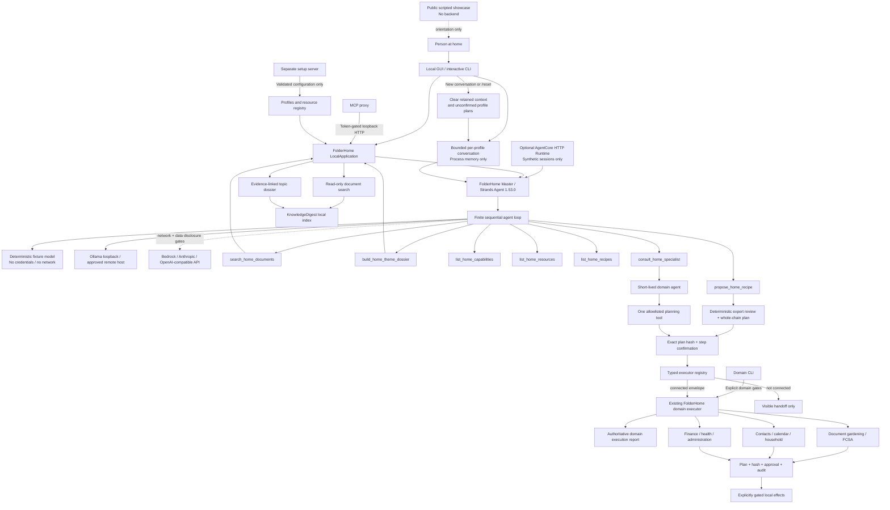

# FolderHome Architecture Diagram

[Open the publication-ready SVG](./ARCHITECTURE_DIAGRAM.svg) ·
[Open the rendered PNG](./ARCHITECTURE_DIAGRAM.png)


The diagram above is the **synthetic accident-demo view**, not an inventory of
every product endpoint. Its four adapters remain the four steps in that demo.
The Mermaid map below explains the broader application. See also the complete
[architecture and limits](../../ARCHITECTURE.md).

**Source:** the adjacent SVG is editable; PNG and `site/architecture.svg` are
derived exports. **Reviewed:** 9 September 2026. This is a UML-like runtime
component/approval map, not formal UML or evidence of current AWS availability.



## Boundaries shown in the diagram

- The required Strands Agents loop is the agentic decision layer, not a second
  implementation of document search.
- The public site is a transparent scripted walkthrough. The token-gated local
  accident demo and the optional AgentCore adapter invoke the real synthetic
  Strands journey; neither enables external effects.
- The AgentCore adapter implements the HTTP `/ping` and `/invocations`
  contract and isolates state by runtime session. The quota-bounded direct-code
  Runtime is deployed and was read back as `READY`, version 4, on 2026-08-26;
  the ARM64 non-root container remains an alternative packaging candidate.
- Local GUI and interactive CLI call the same master service; MCP forwards to
  the token-gated loopback HTTP app. Domain CLI commands may call application
  workflows directly. Setup runs separately and cannot confirm domain actions.
  The seven master tools only read or prepare; recipe preparation retains the
  complete reviewed chain and cannot grant execution permission.
- Interactive GUI and CLI sessions keep bounded model-visible history per
  organizational profile in process memory only. Resetting a conversation also
  discards that profile's unconfirmed plans, but no documents or completed
  receipts.
- Semantic expert selection belongs to the configured model. The application
  resolves selected endpoints deterministically and contains no keyword router.
- Specialist agents are created on demand with one planning endpoint. Personas
  are style-only and grant no capability or permission.
- The offline fixture, local/remote Ollama and optional hosted providers share
  the same bounded agent/tool contracts. Loopback Ollama is local inference;
  remote Ollama, Bedrock, Anthropic and OpenAI-compatible endpoints are not.
- Bedrock additionally requires separate approvals for network access and
  disclosure of local search results.
- Direct tools and specialist consultation perform no domain side effects. A
  separate hash-bound confirmation proves approval. Only a connected typed
  envelope may additionally produce an authoritative domain execution report.
- Without a private resource registry, connected coverage reuses personal
  notes, scheduled medication confirmation and the strictly local FindCall
  fixture. A configured registry adds 23 typed adapters covering the complete
  local document and assistance stack. A configured `mail.draft_account` adds
  the draft-only IMAP endpoint. Across all 33 endpoints, the full configuration
  reports 27 connected, one direct read-only, three planning-only and two
  visibly unconnected endpoints.
- Draft-only mail has no send path and requires `--approve-mail-draft`. External
  calendars and scheduler registration still need explicit connector
  configuration with live-effect approvals.
- Broader domain workflows retain their own sensitivity, state, output and
  side-effect gates.
- OS accounts and filesystem permissions form the security boundary.
  FolderHome profiles only organize household preferences.

## Reproduce the PNG

Install the project dev extra (`pip install -e ".[dev]"`). On Windows, use the
same explicitly selected Segoe UI/Consolas fonts for generation and checking:

```powershell
python deploy/render_architecture.py --source docs/submission/ARCHITECTURE_DIAGRAM.svg --output docs/submission/ARCHITECTURE_DIAGRAM.png --no-system-fonts --font-file C:/Windows/Fonts/segoeui.ttf --font-file C:/Windows/Fonts/segoeuib.ttf --font-file C:/Windows/Fonts/consola.ttf
```

Add `--check` to compare without writing. The renderer is `resvg-py==0.5.0`;
font substitutions on another platform can change pixels and require visual
review. No font files are redistributed. Synchronize the unchanged SVG bytes
to `site/architecture.svg` after editing; the repository parity test checks it.
The SVG remains the crisp, text-labelled fallback for PNG consumers. The site
offers a full-size link and a plain-text outline alongside the scaled preview;
use those for readable detail on narrow screens. No interaction or current cloud success
is inferred from a static export.
