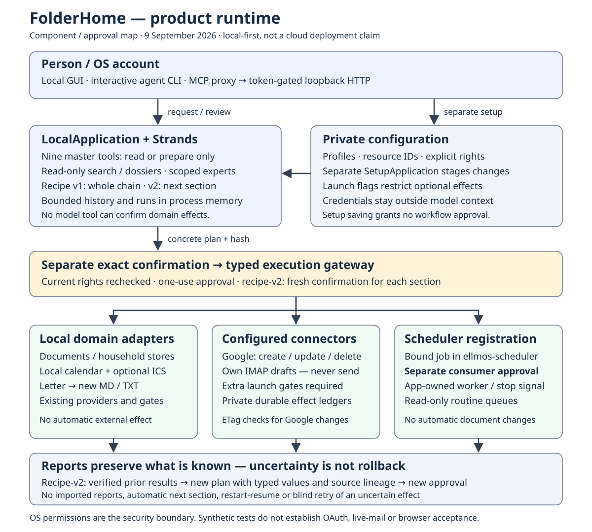
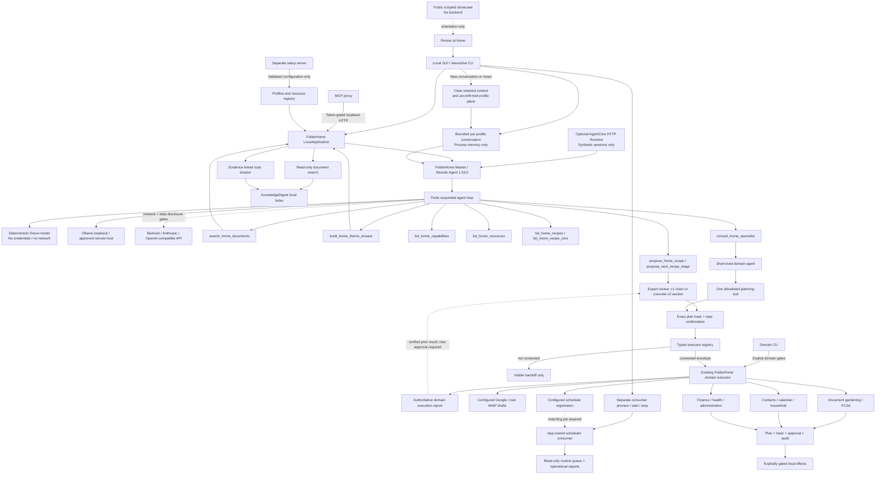

# FolderHome Architecture Diagrams

## Product runtime and approval boundaries

[Full-size product SVG](./PRODUCT_ARCHITECTURE.svg) ·
[Product PNG](./PRODUCT_ARCHITECTURE.png)



This **UML-like component/approval map** explains the current product, not an
AWS deployment. Read it top to bottom: entry points, local planning and private
configuration, separate exact approval, then domain effects and their reports.
Scheduler registration and consumer start have independent approvals. Recipe-v2
values flow back into a newly reviewed section; they never authorize it.

**Text alternative:** GUI and session CLI share `LocalApplication`; MCP proxies
to its token-gated HTTP service. Nine master tools only read or prepare. Private
resources and launch gates restrict connected adapters. Approval invokes existing
local workflows, the separately gated Google/mail adapters, or scheduler
registration. The app-owned scheduler consumer needs its own start approval.
Reports distinguish confirmed, failed, unattempted and uncertain outcomes.

The editable source is `PRODUCT_ARCHITECTURE.svg`; the PNG uses the pinned
renderer below. **Reviewed: 9 September 2026.** The map is deliberately a compact
product view, not an exhaustive class graph. On narrow screens, open the full-size
SVG or use this outline instead of shrinking labels. For v2 message order, use the
sequence diagram in [architecture and limits](../../ARCHITECTURE.md).

## Synthetic competition demo

[Open the publication-ready SVG](./ARCHITECTURE_DIAGRAM.svg) ·
[Open the rendered PNG](./ARCHITECTURE_DIAGRAM.png)


The diagram above is the **synthetic accident-demo view**, not an inventory of
every product endpoint. Its four adapters remain the four steps in that demo.
The Mermaid map below explains the broader application. See also the complete
[architecture and limits](../../ARCHITECTURE.md).

**Source:** the adjacent SVG is editable; PNG and `site/architecture.svg` are
derived exports. **Reviewed:** 9 September 2026. This is a UML-like runtime
component/approval map, not formal UML or evidence of current AWS availability.



## Boundaries shown in the diagram

- The required Strands Agents loop is the agentic decision layer, not a second
  implementation of document search.
- The public site is a transparent scripted walkthrough. The token-gated local
  accident demo and the optional AgentCore adapter invoke the real synthetic
  Strands journey; neither enables external effects.
- The AgentCore adapter implements the HTTP `/ping` and `/invocations`
  contract and isolates state by runtime session. The quota-bounded direct-code
  Runtime is deployed and was read back as `READY`, version 4, on 2026-08-26;
  the ARM64 non-root container remains an alternative packaging candidate.
- Local GUI and interactive CLI call the same master service; MCP forwards to
  the token-gated loopback HTTP app. Domain CLI commands may call application
  workflows directly. Setup runs separately and cannot confirm domain actions.
  The nine master tools only read or prepare; recipe preparation retains the
  reviewed v1 chain or v2 section and cannot grant execution permission.
- Interactive GUI and CLI sessions keep bounded model-visible history per
  organizational profile in process memory only. Resetting a conversation also
  discards that profile's unconfirmed plans and closes its recipe runs, but
  does not delete documents or completed receipts. Runs cannot resume across
  app restarts or accept imported execution reports.
- Semantic expert selection belongs to the configured model. The application
  resolves selected endpoints deterministically and contains no keyword router.
- Specialist agents are created on demand with one planning endpoint. Personas
  are style-only and grant no capability or permission.
- The offline fixture, local/remote Ollama and optional hosted providers share
  the same bounded agent/tool contracts. Loopback Ollama is local inference;
  remote Ollama, Bedrock, Anthropic and OpenAI-compatible endpoints are not.
- Bedrock additionally requires separate approvals for network access and
  disclosure of local search results.
- Direct tools and specialist consultation perform no domain side effects. A
  separate hash-bound confirmation proves approval. Only a connected typed
  envelope may additionally produce an authoritative domain execution report.
- Connected coverage depends on the private resource registry. The runtime
  executor catalog, not a static diagram count, identifies usable adapters.
  Notes, medication confirmation and the strictly local FindCall fixture remain
  available without a registry. Configured resources connect the document and
  assistance stack, own-mail drafts, Google calendar and scheduler registration.
- Draft-only mail has no send path and requires `--approve-mail-draft`. External
  Google supports creation and ETag-bound updates/deletions of confirmed own
  events. It needs private OAuth resources, `--approve-calendar-write` and exact
  confirmation; first login and live acceptance remain open. Its ledger retains
  confirmed versions and uncertainty rather than implying rollback.
- Scheduler registration requires `--approve-scheduler-write` and confirmation;
  a consumer needs a matching job, `--approve-scheduler-consumer` and its own
  confirmed preview. Stop/close signal only app-owned workers. Queues do not
  change documents or grant cleanup authority.
- Broader domain workflows retain their own sensitivity, state, output and
  side-effect gates.
- OS accounts and filesystem permissions form the security boundary.
  FolderHome profiles only organize household preferences.

## Reproduce the PNG

Install the project dev extra (`pip install -e ".[dev]"`). On Windows, use the
same explicitly selected Segoe UI/Consolas fonts for generation and checking:

```powershell
python deploy/render_architecture.py --source docs/submission/ARCHITECTURE_DIAGRAM.svg --output docs/submission/ARCHITECTURE_DIAGRAM.png --no-system-fonts --font-file C:/Windows/Fonts/segoeui.ttf --font-file C:/Windows/Fonts/segoeuib.ttf --font-file C:/Windows/Fonts/consola.ttf
python deploy/render_architecture.py --source docs/submission/PRODUCT_ARCHITECTURE.svg --output docs/submission/PRODUCT_ARCHITECTURE.png --no-system-fonts --font-file C:/Windows/Fonts/segoeui.ttf --font-file C:/Windows/Fonts/segoeuib.ttf --font-file C:/Windows/Fonts/consola.ttf
```

Add `--check` to compare without writing. The renderer is `resvg-py==0.5.0`;
font substitutions on another platform can change pixels and require visual
review. No font files are redistributed. Synchronize the unchanged SVG bytes
to `site/architecture.svg` after editing the **demo** SVG; the repository parity
test checks it. The product map is separate and does not replace the public
showcase's synthetic-demo illustration.
The SVG remains the crisp, text-labelled fallback for PNG consumers. The site
offers a full-size link and a plain-text outline alongside the scaled preview;
use those for readable detail on narrow screens. No interaction or current cloud success
is inferred from a static export.
