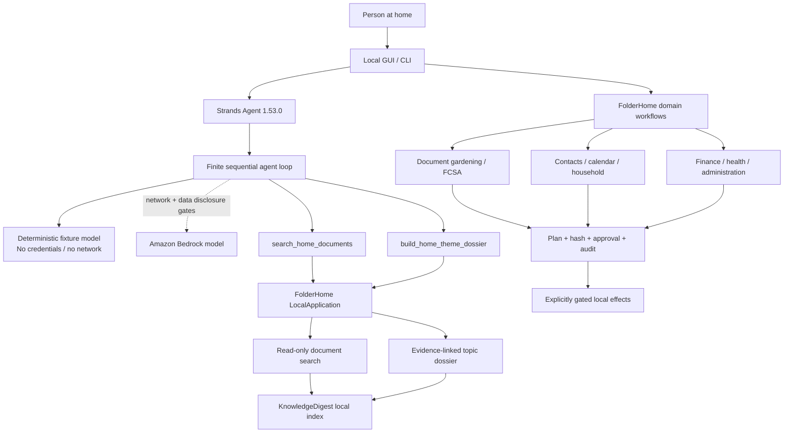

# FolderHome Architecture Diagram

## Boundaries shown in the diagram

- The required Strands Agents loop is the agentic decision layer, not a second
  implementation of document search.
- Both agent tools reuse the same `LocalApplication` services as the local UI.
- The offline fixture and optional Bedrock model share the same agent and tool
  contracts.
- Bedrock additionally requires separate approvals for network access and
  disclosure of local search results.
- The agent-facing tools are read-only. Broader domain workflows retain their
  own sensitivity, state, output and side-effect gates.
- OS accounts and filesystem permissions form the security boundary.
  FolderHome profiles only organize household preferences.
