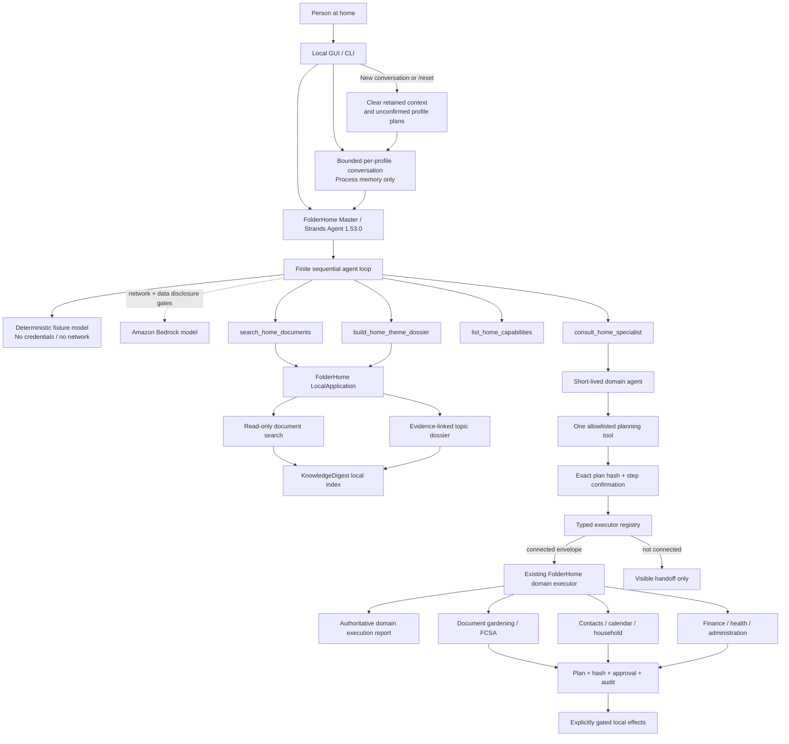

# FolderHome Architecture Diagram

## Boundaries shown in the diagram

- The required Strands Agents loop is the agentic decision layer, not a second
  implementation of document search.
- GUI and CLI call the same master service. Its direct document tools reuse the
  same `LocalApplication` services.
- Interactive GUI and CLI sessions keep bounded model-visible history per
  organizational profile in process memory only. Resetting a conversation also
  discards that profile's unconfirmed plans, but no documents or completed
  receipts.
- Semantic expert selection belongs to the configured model. The application
  resolves selected endpoints deterministically and contains no keyword router.
- Specialist agents are created on demand with one planning endpoint. Personas
  are style-only and grant no capability or permission.
- The offline fixture and optional Bedrock model share the same agent and tool
  contracts.
- Bedrock additionally requires separate approvals for network access and
  disclosure of local search results.
- Direct tools and specialist consultation perform no domain side effects. A
  separate hash-bound confirmation proves approval. Only a connected typed
  envelope may additionally produce an authoritative domain execution report.
- Without a private resource registry, connected coverage reuses personal
  notes, scheduled medication confirmation and the strictly local FindCall
  fixture. A configured registry adds 23 typed adapters covering the complete
  local document and assistance stack. All publish closed request schemas; this
  configuration reports 26 connected and three visibly unconnected endpoints.
- Only mail, external calendars and scheduler registration still need explicit
  external connector configuration with live-effect approvals.
- Broader domain workflows retain their own sensitivity, state, output and
  side-effect gates.
- OS accounts and filesystem permissions form the security boundary.
  FolderHome profiles only organize household preferences.
